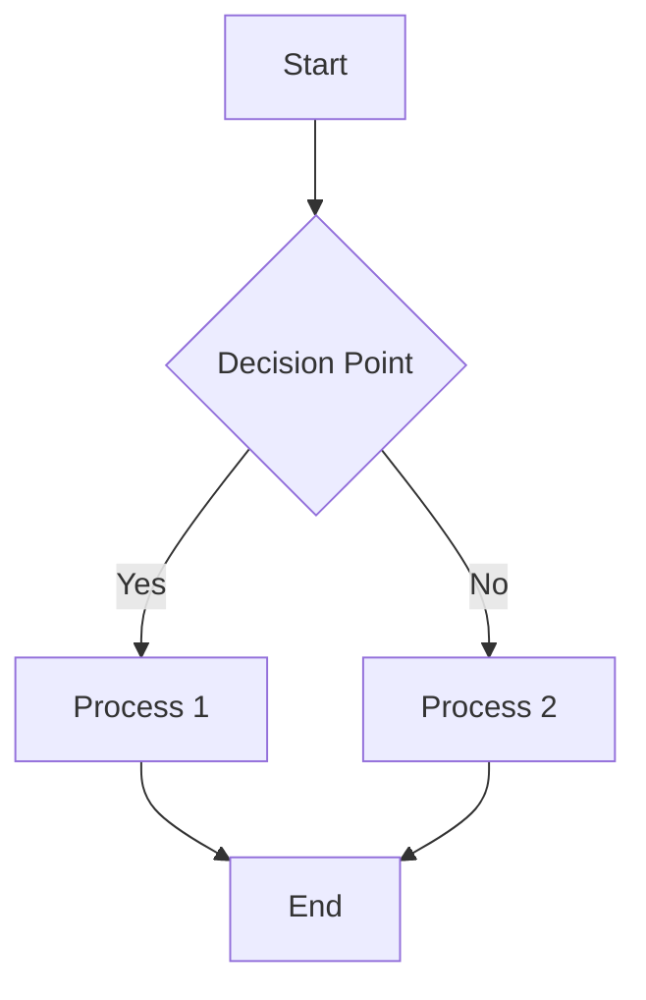
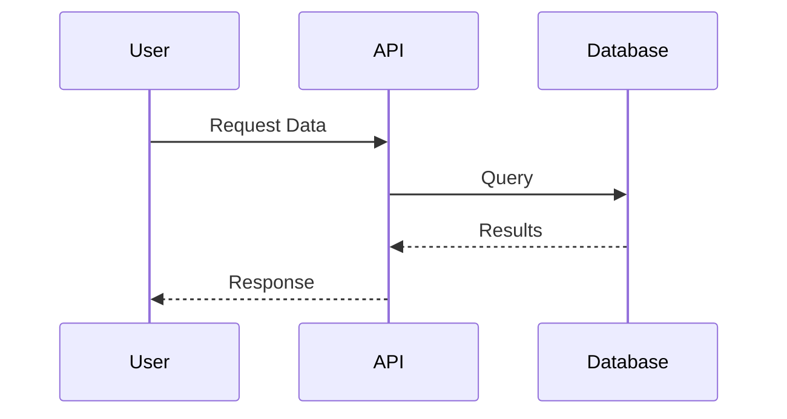
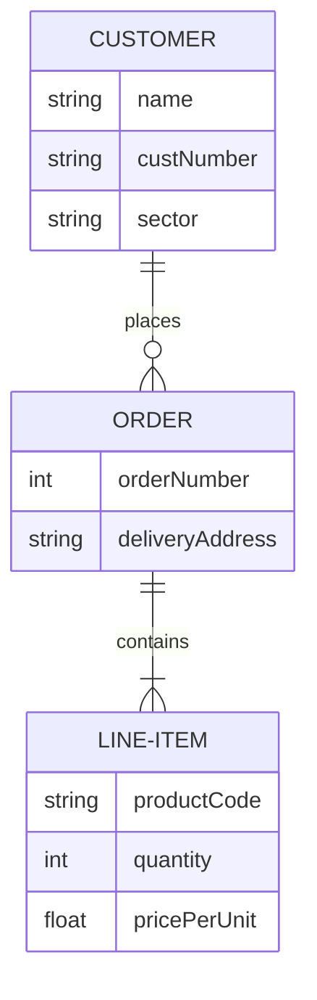

# Mermaid Diagram Creator & Validator

This skill provides comprehensive support for creating and validating Mermaid diagrams in markdown files. It ensures diagrams are syntactically correct and render properly.

## When to Use This Skill

**Use this skill when:**
- Creating new mermaid diagrams in markdown files
- Editing existing mermaid diagrams
- Validating mermaid diagram syntax
- User asks to create flowcharts, sequence diagrams, ER diagrams, or other mermaid visualizations
- Converting text descriptions to mermaid diagrams
- Fixing broken or invalid mermaid diagrams

**Always validate diagrams before completing documentation tasks.**

## Prerequisites

The skill automatically installs the Mermaid CLI globally if not found. However, Node.js and npm must be installed on your system.

**Required:**
- Node.js and npm (for Mermaid CLI installation)

**Automatically installed by the skill:**
- `@mermaid-js/mermaid-cli` (Mermaid CLI for validation)

## Instructions

### For Creating New Diagrams

1. **Analyze the requirement**: Understand what type of diagram is needed (flowchart, sequence, ER, etc.)
2. **Choose the right diagram type** based on the content:
   - `flowchart` or `graph` - for process flows, decision trees, system architectures
   - `sequenceDiagram` - for interactions between actors over time
   - `classDiagram` - for class relationships and inheritance
   - `erDiagram` - for entity-relationship database schemas
   - `stateDiagram` - for state machines and transitions
   - `gantt` - for project timelines and schedules
   - `pie` - for data visualization
   - `journey` - for user experience flows

3. **Create the diagram code** following mermaid syntax rules:
   - Use proper node naming (alphanumeric, underscores, no spaces for IDs)
   - Choose appropriate arrow types (`-->`, `---`, `-.->`, etc.)
   - Balance brackets and quotes
   - Use correct keywords for the diagram type

4. **Insert into markdown** using proper code fence:
   ```markdown
   ```mermaid
   flowchart TD
       A[Start] --> B{Decision?}
       B -->|Yes| C[Action 1]
       B -->|No| D[Action 2]
   ```
   ```

5. **Validate the diagram** (see validation section below)

### For Validating Existing Diagrams

1. **Identify the markdown file** containing the diagram
2. **Extract mermaid code blocks** from the file
3. **Run validation** on each diagram using the validation script
4. **Report results**:
   - If valid: Confirm success and continue
   - If invalid: Show specific errors and attempt automatic fixes
5. **Apply fixes** and re-validate until all diagrams are valid

## Validation Process

Use the provided validation script to check diagram syntax:

```bash
# Validate a specific file
./scripts/validate_mermaid.sh <markdown-file>

# Or validate all markdown files in a directory
./scripts/validate_mermaid.sh docs/
```

The validation script will:
- Extract all mermaid code blocks from markdown files
- Test each diagram using `mmdc` (Mermaid CLI)
- Report syntax errors with line numbers and descriptions
- Attempt automatic fixes for common issues
- Re-validate after fixes

## Common Diagram Types & Examples

### Flowcharts


### Sequence Diagrams


### ER Diagrams


## Error Correction Rules

The skill automatically fixes common mermaid syntax errors:

1. **Missing arrows**: Adds appropriate arrows between nodes
2. **Unbalanced brackets**: Fixes mismatched `[` `]` `(` `)` `{` `}`
3. **Invalid node names**: Sanitizes node IDs to valid characters
4. **Incorrect keywords**: Fixes common typos in diagram type declarations
5. **Malformed connections**: Corrects arrow syntax and directions

## Best Practices

- **Node naming**: Use descriptive names for nodes, keep IDs short
- **Direction**: Choose appropriate diagram direction (TD, LR, TB, RL)
- **Styling**: Use subgraphs for grouping related elements
- **Comments**: Add comments in mermaid code for complex logic
- **Validation**: Always validate before committing documentation changes

## Assets

This skill includes reusable scripts in the `scripts/` directory:
- `validate_mermaid.sh` - Comprehensive validation and error correction
- `create_diagram_template.sh` - Generate diagram templates for common types
- `extract_mermaid_blocks.py` - Extract mermaid code from markdown files

## Integration with Documentation Workflow

When working on documentation:
1. Create or edit mermaid diagrams
2. Run validation automatically
3. Fix any issues found
4. Commit only validated diagrams

This ensures all diagrams in the documentation are syntactically correct and will render properly.
