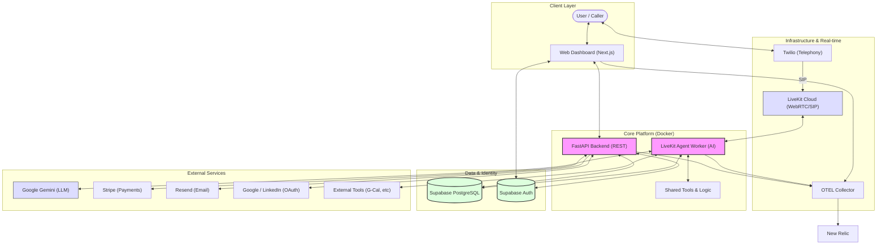

# AI Voice Agent Platform

A production-grade multi-tenant SaaS platform for managing AI voice agents with LiveKit real-time communication, dynamic tool integration, and comprehensive billing/RBAC systems.

## 🚀 Quick Start

### Prerequisites

- Node.js 18+
- Python 3.11+
- Docker and Docker Compose
- Supabase account (for database)
- LiveKit Cloud account (for real-time voice)
- Google Cloud account (for OAuth + Gemini API)

### Automated Setup

```bash
# Clone repository
git clone <repository-url>
cd ai-voice-agent-platform

# Run setup script
./scripts/setup.sh

# Run database migrations
cd backend
alembic upgrade head

# Seed notification events
python scripts/seed_notification_events.py

# Start development containers
cd ..
./start.sh start dev
```

### Manual Setup

1. **Clone and setup environment**

   ```bash
   git clone <repository-url>
   cd ai-voice-agent-platform
   ```

2. **Frontend Development (Non-containerized)**

   ```bash
   cd frontend
   npm install
   cp .env.local.example .env.local
   # Edit .env.local with your configuration
   npm run dev
   ```

3. **Backend Development (Non-containerized)**

   ```bash
   cd backend
   # Create virtual environment
   python -m venv .venv
   source .venv/bin/activate  # On Windows: .venv\Scripts\activate
   pip install -r requirements.txt
   cp .env.example .env
   # Edit .env with your configuration
   python main.py
   ```

4. **Worker Development (Non-containerized)**

   ```bash
   cd worker
   python -m venv .venv
   source .venv/bin/activate
   pip install -r requirements.txt
   cp .env.example .env
   # Edit .env with your configuration
   python -m livekit.agents.cli --dev
   ```

5. **Supabase Realtime Setup (Required for auto-refresh tokens)**

    ```bash
    # Run SQL script in Supabase Dashboard → SQL Editor
    # The script is located at: scripts/setup-supabase-realtime.sql
    # This enables real-time updates on agent_tools and agents tables
    ```

6. **Using Docker for Development (Containerized)**

    ```bash
    # Copy and configure environment file
    cp .env.example .env
    # Edit .env with your configuration

    # Run all services with development settings (hot reloading)
    ./start.sh start dev

    # Run all services with production settings
    ./start.sh start prod
    ```

## 🏗️ Architecture



### Frontend (Next.js)

- **Framework**: Next.js 15 with App Router
- **Language**: TypeScript
- **Styling**: Tailwind CSS
- **Components**: Shadcn/ui
- **State Management**: React Context
- **Routing**: App Router with protected routes

### Backend (FastAPI)

- **Framework**: Python FastAPI
- **Database**: Supabase (PostgreSQL with RLS)
- **Authentication**: JWT with OAuth (Google, LinkedIn)
- **Multi-tenancy**: Organization-based isolation with Row-Level Security
- **Billing**: Stripe integration with credit-based billing
- **RBAC**: Role-based access control with fine-grained permissions

### Worker (LiveKit)

- **Framework**: LiveKit Agents SDK
- **LLM Integration**: Gemini Realtime API
- **Tool System**: Dynamic tool loading and wrapping
- **Real-time Communication**: Voice streaming via WebRTC
- **Tool Wrapping**: Automatic wrapper creation for LLM compatibility

### Infrastructure

- **Containerization**: Docker & Docker Compose
- **Scalability**: Horizontal scaling ready
- **Observability**: OpenTelemetry with Collector architecture
- **Monitoring**: New Relic integration

## 📁 Project Structure

```
ai-voice-agent-platform/
├── frontend/                 # Next.js application
│   ├── src/
│   │   ├── app/             # App Router pages
│   │   │   ├── (dashboard)/  # Protected dashboard
│   │   │   └── auth/          # Authentication
│   │   ├── components/      # React components
│   │   ├── contexts/        # React Context providers
│   │   ├── hooks/          # Custom React hooks
│   │   ├── lib/            # Utilities and API client
│   │   ├── services/        # Business logic services
│   │   └── types/          # TypeScript definitions
│   ├── Dockerfile          # Production Docker config
│   ├── Dockerfile.dev      # Development Docker config
│   └── package.json
├── backend/                 # FastAPI application
│   ├── src/
│   │   ├── auth/            # Authentication and RBAC
│   │   ├── billing/         # Stripe billing integration
│   │   ├── notifications/    # Email notification system
│   │   ├── organization/     # Organization management
│   │   ├── voice_agents/    # Voice agent API endpoints
│   │   └── shared/         # Shared utilities
│   ├── config/              # Configuration management
│   ├── alembic/             # Database migrations
│   ├── tests/               # Backend tests
│   ├── Dockerfile           # Production Docker config
│   ├── Dockerfile.dev       # Development Docker config
│   └── requirements.txt
├── worker/                  # LiveKit worker service
│   ├── src/
│   │   ├── worker.py        # Main entry point
│   │   └── default_system_prompt.py
│   ├── .docs/              # Worker documentation
│   ├── test_livekit_wrapping.py  # Tool wrapping tests
│   ├── Dockerfile
│   ├── Dockerfile.dev
│   └── requirements.txt
├── shared/                  # Shared code (backend + worker)
│   ├── voice_agents/         # Voice agent services and models
│   │   ├── service.py       # Voice agent CRUD
│   │   ├── tool_service.py  # Tool management
│   │   ├── tools/          # Tool implementations
│   │   └── models.py       # Data models
│   ├── config/              # Shared configuration
│   └── common/             # Common utilities
├── docs/                   # Documentation
│   ├── 00_introduction/     # Project overview
│   ├── 01_architecture/     # System architecture
│   ├── 02_implementation/  # Implementation details
│   ├── 03_development_guides/  # Development guides
│   ├── 04_operations/       # Operations & deployment
│   ├── 05_business/        # Business requirements
│   ├── legacy/             # Historical documentation
│   └── new_docs/          # Old documentation (to be migrated)
├── docker-compose.yml       # Production Docker Compose
├── docker-compose.dev.yml   # Development Docker Compose
├── start.sh                # Container management script
├── AGENTS.md               # AI agent guidelines
└── README.md
```

## 📦 Features

### Core Platform

- ✅ Multi-tenant SaaS architecture with organization-based isolation
- ✅ Row-Level Security (RLS) for data isolation
- ✅ Role-Based Access Control (RBAC) with fine-grained permissions
- ✅ Password-based authentication with strong password policies
- ✅ Google OAuth integration
- ✅ Stripe billing integration with credit-based subscriptions
- ✅ Email notification system (Resend.com)
- ✅ OpenTelemetry observability (traces, metrics, logs)

### Voice Agent System

- ✅ AI voice agents with LiveKit real-time communication
- ✅ **Dynamic system prompt generation from organization and agent context**
- ✅ **System prompt preview in agent configuration UI**
- ✅ Dynamic tool loading from database
- ✅ LiveKit tool wrapping for LLM compatibility
- ✅ Tool function-level enable/disable
- ✅ Google Calendar tool implementation
- ✅ Agent greeting on room entry
- ✅ OAuth token management for tools
- ✅ Two-tier tool service (safe API, full worker)
- ✅ Real-time UI synchronization (Supabase Realtime)
- ✅ Auto-refresh of OAuth tokens before expiry

### Developer Experience

- ✅ Docker containerization (dev & prod)
- ✅ Docker Compose orchestration
- ✅ Automated setup script
- ✅ OpenTelemetry manual instrumentation
- ✅ Type-safe APIs (Pydantic, TypeScript)
- ✅ Comprehensive documentation
- ✅ Pre-commit hooks (Black, isort, ESLint)

### Testing & Quality

- ✅ Pytest for backend testing
- ✅ Playwright for E2E testing
- ✅ Code formatting (Black, Prettier)
- ✅ Linting (Flake8, ESLint)
- 🚧 Comprehensive test coverage

### Infrastructure

- ✅ Supabase database (PostgreSQL)
- ✅ LiveKit Cloud integration
- ✅ Google Realtime API (Gemini)
- ✅ OpenTelemetry Collector architecture
- ✅ Environment-based configuration
- 🚧 Kubernetes deployment manifests
- 🚧 CI/CD pipeline

## 🎯 Key Features

### Voice Agent System

**Dynamic Tool Loading**: Tools are loaded from database at runtime, enabling:

- Runtime tool configuration without code deployment
- Per-organization tool customization
- Easy addition of new tools

**Two-Tier Tool Service**:

- **API Layer**: Returns safe metadata (no OAuth tokens)
- **Worker Layer**: Returns full tool instances with all secrets

**LiveKit Tool Wrapping**: Innovative wrapper pattern solves:

- Tool methods have `self` parameter (for state)
- LiveKit requires functions without `self`
- Solution: Dynamic wrapper creation with `exec()`

**Agent Greeting**: Automatic greeting when agent enters room eliminates awkward silence.

### Multi-Tenancy

**Shared Database + Shared Schema**:

- `organization_id` column on all tenant tables
- Row-Level Security (RLS) policies enforce isolation
- Tenant context injected via middleware

**RBAC System**:

- Predefined roles: platform_admin, org_admin, member, billing
- Platform admins can create custom roles
- Fine-grained permissions: `resource.action` format
- One role per user per organization

### Billing & Credits

**Stripe Integration**:

- Plan-based subscriptions (monthly/annual)
- Credit allocation on payment
- Webhook-driven status updates
- Idempotent event handling

**Credit Management**:

- Track usage, top-ups, and adjustments
- Enforce restrictions on low balance
- Low credit alerts via notifications

### Observability

**OpenTelemetry Stack**:

- Manual instrumentation for precise control
- Collector architecture for centralized processing
- CORS-enabled for browser telemetry
- New Relic integration for visualization

## 🔄 Development Priorities

1. **Voice Agent Enhancements**:

   - Multi-LLM support (OpenAI, Claude, etc.)
   - Conversation state persistence
   - Advanced error handling and recovery
   - Agent analytics dashboard

2. **Tool Expansion**:

   - More tool implementations (CRM, messaging, custom APIs)
   - Tool composition and chaining
   - Tool dependencies and versioning
   - Tool health monitoring

3. **Testing**:

   - Comprehensive test coverage (>80%)
   - E2E test scenarios for voice agents
   - Performance testing (load, stress)
   - Integration tests for tool wrapping

4. **Operations**:

   - CI/CD pipeline (GitHub Actions)
   - Kubernetes deployment manifests
   - Production runbooks
   - Monitoring and alerting setup

5. **Features**:
   - Agent analytics dashboard
   - Conversation history and playback
   - Tool usage metrics
   - Advanced RBAC permissions
   - Multi-language support

## 📚 Documentation

### Documentation Structure

```
docs/
├── 00_getting_started/     # Getting started guides
│   ├── project_overview.md       # Platform overview and features
│   ├── quick_start.md           # Quick start with Docker
│   ├── setup.md                # Detailed setup guide
│   └── introduction.md          # Platform introduction
├── 01_architecture/          # System architecture
│   ├── overview.md              # High-level system design
│   ├── system_architecture.md    # Complete architecture
│   ├── frontend_architecture.md  # Frontend design
│   ├── backend_architecture.md   # Backend design
│   ├── database_schema.md        # Database schema
│   └── twilio_call_flow.md     # Call handling flow
├── 02_features/             # Platform features (NEW)
│   ├── voice_agents/           # Voice agents system
│   ├── authentication_rbac/     # Authentication & RBAC
│   ├── multi_tenancy/          # Multi-tenant support
│   ├── billing/                # Billing and payments
│   ├── notifications/           # Email notifications
│   └── observability/         # Monitoring & metrics
├── 03_implementation/       # Implementation details
│   ├── tool_system.md          # Tool architecture
│   ├── livekit_tool_wrapping.md  # Tool wrapping details
│   ├── tool_calling_challenges.md  # Problems & solutions
│   ├── dynamic_tool_architecture.md  # Dynamic tool loading
│   ├── tool_implementation_summary.md  # Implementation summary
│   ├── payment_flow.md        # Payment workflows
│   ├── stripe_integration.md    # Stripe integration
│   └── polymorphic_relationships.md  # Database patterns
├── 03_development/          # Development workflows (NEW)
│   ├── getting_started.md      # Quick start for developers
│   ├── frontend/              # Frontend development
│   ├── backend/               # Backend development
│   ├── worker/                # Worker development
│   └── shared_module/         # Shared code guide
├── 04_development_guides/  # Development guidelines
│   ├── development_setup.md    # Local dev setup
│   ├── api_guidelines.md      # API standards
│   ├── database_migrations.md  # Migration best practices
│   └── testing.md            # Testing strategies
├── 05_operations/           # Operations & deployment
│   ├── environment_configuration.md  # Environment setup
│   ├── stripe_management.md   # Stripe tool
│   └── docker_deployment.md  # Container deployment
└── 05_business/             # Business requirements
    ├── prd.md                 # Product requirements
    └── SUMMARY.md              # Business summary
```

### Key Documentation

- **[Documentation Summary](docs/SUMMARY.md)** - Complete documentation index
- **[Getting Started](docs/00_getting_started/)** - Quick start and setup guides
- **[Feature Documentation](docs/02_features/)** - Comprehensive feature guides
- **[Development Guides](docs/03_development/)** - Developer workflows
- **[System Architecture](docs/01_architecture/system_architecture.md)** - Complete architecture
- **[AGENTS.md](AGENTS.md)** - AI agent coding guidelines

### Component Documentation

- **[Frontend README](frontend/README.md)** - Next.js application
- **[Backend README](backend/README.md)** - FastAPI application
- **[Worker README](worker/README.md)** - LiveKit worker service
- **[Shared Module README](shared/README.md)** - Shared code architecture

## 🔧 Quick Reference

### Starting Services

```bash
# Development containers
./start.sh start dev

# Production containers
./start.sh start prod

# View logs
./start.sh logs dev

# Stop services
./start.sh stop dev
```

### Database Migrations

```bash
cd backend
alembic upgrade head              # Apply all migrations
alembic revision -m "message"   # Create new migration
alembic downgrade -1             # Rollback one migration
```

### Supabase Realtime Setup (One-time)

```bash
# Run SQL script in Supabase Dashboard → SQL Editor
# File location: scripts/setup-supabase-realtime.sql
# This enables real-time updates for tool status and token auto-refresh
```

### Testing

#### Backend Tests (Pytest)
```bash
cd <project-root>

# Set up test environment (run once per session)
source ./test-env.sh

# Run all backend tests
pytest backend/tests/

# Run specific module tests
pytest backend/tests/organization/
pytest backend/tests/notifications/

#Run specific test file
pytest backend/tests/organization/test_service.py

# Run specific test
pytest backend/tests/organization/test_service.py::TestOrganizationService::test_create_organization_success -v

# Run with coverage
pytest --cov

```

#### Frontend Unit Tests (Vitest)
```bash
cd <project-root>/frontend
# Run all tests
npm run test

# Run with coverage
npm run test:coverage

# Run in watch mode
npm run test -- --watch

# Run with UI
npm run test:ui

# Run specific test file
npm run test -- tests/lib/test-utils.test.ts

# Run specific test
npm run test -- tests/lib/test-utils.test.ts -t "cn utility"

# Run tests in a directory
npm run test -- tests/lib/
npm run test -- tests/services/
npm run test -- tests/hooks/

# Run tests without watching (CI mode)
npm run test:run
```

#### End-to-End Tests (Playwright + Isolated Stack)
```bash
cd <project-root>

# This script handles building an isolated stack, initializing the DB, and running Playwright tests.
./scripts/run-e2e.sh

# Optional: Record all videos for E2E tests
./scripts/run-e2e.sh --video-on

# E2E test results are saved to: e2e/reports/report.html
```

**Note**: Always source `./test-env.sh` before running tests. This sets up the Python paths for all modules (backend/src, shared). Run tests from project root directory for best results.

### Code Quality

```bash
# Backend
cd backend
black .                    # Format code
isort .                    # Sort imports
flake8 src/                 # Lint

# Frontend
cd frontend
npm run lint                # Run ESLint
npx tsc --noEmit         # Type check
```

## 🚀 Deployment Checklist

### Pre-Deployment

- [ ] **Environment Configuration**
  - [ ] Copy `.env.example` to `.env`
  - [ ] Configure Supabase credentials (`NEXT_PUBLIC_SUPABASE_URL`, `NEXT_PUBLIC_SUPABASE_ANON_KEY`)
  - [ ] Configure OAuth provider credentials (Google, Microsoft, etc.)
  - [ ] Set `ENCRYPTION_KEY` for production
  - [ ] Configure token refresh timing (default: 5 min check, 15 min window)
  - [ ] Review and adjust for environment (dev/staging/prod)

 - [ ] **Database Setup**
  - [ ] Run database migrations: `alembic upgrade head`
     - This creates/updates tables including `agent_tools` and `agents`
  - [ ] Run Supabase Realtime setup: `scripts/setup-supabase-realtime.sql`
     - Run in Supabase SQL Editor (ONE-TIME setup after tables exist)
     - Verify output shows `agent_tools` and `agents` tables in publication
  - [ ] Verify `last_refreshed_at` column exists in `agent_tools` table

- [ ] **Docker Configuration**
  - [ ] Verify Docker Compose files have token refresh environment variables
  - [ ] Build images: `./start.sh build dev` (or `prod`)
  - [ ] Test containers start: `./start.sh start dev`

- [ ] **Local Testing**
  - [ ] Start backend: `cd backend && python main.py`
  - [ ] Start frontend: `cd frontend && npm run dev`
  - [ ] Test token refresh service starts successfully
    - Check logs: "Token refresh service started"
    - Check logs: "Checking X tools for token refresh"
  - [ ] Test real-time subscriptions
    - Navigate to agent detail page
    - Make database change (enable/disable tool)
    - Verify UI updates automatically without page refresh
    - Check browser console for change notifications

### Production Deployment

- [ ] **Environment Variables**
  - [ ] Set production values in environment variables or secrets manager
  - [ ] Token refresh timing: 10 min check, 20 min window (recommended)
  - [ ] OAuth credentials from production accounts
  - [ ] Supabase production project
  - [ ] `ENCRYPTION_KEY` from secure secret management (not hardcoded)

- [ ] **Infrastructure**
  - [ ] Configure DNS records
  - [ ] Set up SSL/TLS certificates
  - [ ] Configure load balancer (if multiple instances)
  - [ ] Set up monitoring (Prometheus, Datadog, etc.)
  - [ ] Set up alerting (Sentry, PagerDuty, etc.)

- [ ] **Security**
  - [ ] Verify Supabase RLS policies meet production requirements
  - [ ] Ensure `.env` files are not committed to version control
  - [ ] Rotate secrets regularly (OAuth credentials, encryption keys)
  - [ ] Enable audit logging for sensitive operations

- [ ] **Performance**
  - [ ] Configure appropriate refresh intervals based on OAuth provider token lifetimes
  - [ ] Monitor API rate limits to OAuth providers
  - [ ] Set up database connection pooling
  - [ ] Enable CDN for static assets
  - [ ] Configure caching strategy

### Post-Deployment Verification

- [ ] **Functionality**
  - [ ] Verify backend health endpoint returns 200: `curl http://your-domain/health`
  - [ ] Verify frontend loads: Navigate to production URL
  - [ ] Test user authentication flow
  - [ ] Test OAuth authentication with a tool (e.g., Gmail)
  - [ ] Verify tool configuration persists in database
  - [ ] Verify token refresh service is running
  - [ ] Verify real-time UI updates work without page refresh

- [ ] **Token Refresh Service**
  - [ ] Check logs: "Token refresh service started"
  - [ ] Authenticate a tool (e.g., Gmail)
  - [ ] Wait for token expiry (or simulate by adjusting `expires_at` in database)
  - [ ] Verify backend logs: "Token refreshed successfully for tool [name]"
  - [ ] Verify `last_refreshed_at` timestamp is updated in database
  - [ ] Verify frontend UI shows "authenticated" status automatically

- [ ] **Real-Time Subscriptions**
  - [ ] Open browser DevTools Console
  - [ ] Navigate to agent detail page
  - [ ] Make a database change (enable/disable tool or wait for token refresh)
  - [ ] Verify console log: "Tool updated in database: { eventType: 'UPDATE', ... }"
  - [ ] Verify UI updates automatically (no page refresh needed)
  - [ ] Check tool status badge changes immediately

- [ ] **Monitoring & Observability**
  - [ ] Monitor backend logs for token refresh activity
  - [ ] Check for token refresh errors (watch logs for 24-48 hours)
  - [ ] Monitor memory usage (long-running background task)
  - [ ] Verify graceful shutdown works (restart container)
  - [ ] Check database performance during refresh operations
  - [ ] Verify no memory leaks in frontend (real-time subscriptions)

- [ ] **Error Handling**
  - [ ] Test with expired tokens (should refresh automatically)
  - [ ] Test with invalid `refresh_token` (should log warning, not crash)
  - [ ] Test network failures (should retry or log error, not crash)
  - [ ] Test with multiple OAuth providers (Google, Microsoft, etc.)
  - [ ] Test concurrent tool refreshes

### Rollback Plan

If deployment fails:

- [ ] Stop new deployment: `./start.sh stop prod`
- [ ] Switch back to previous version (if using blue-green deployment)
- [ ] Restore database backup (if schema changes were applied)
- [ ] Revert environment variables
- [ ] Clear Redis cache (if using)
- [ ] Verify application starts successfully

### Ongoing Operations

- [ ] **Daily**
  - [ ] Monitor token refresh success rate (should be near 100%)
  - [ ] Check for refresh failures in logs
  - [ ] Verify `last_refreshed_at` timestamps are recent
  - [ ] Monitor OAuth API usage rate limits

- [ ] **Weekly**
  - [ ] Review logs for patterns or anomalies
  - [ ] Check database growth
  - [ ] Verify real-time subscriptions remain stable
  - [ ] Review security alerts

- [ ] **Monthly**
  - [ ] Review OAuth token lifetime and adjust refresh windows
  - [ ] Check for deprecated OAuth provider versions
  - [ ] Review and rotate secrets (encryption keys, OAuth credentials)
  - [ ] Update dependencies (backend/frontend)

---

## 🤝 Contributing

1. Follow the established code style and linting rules
2. Use TypeScript for frontend, type hints for backend
3. Add tests for new features
4. Update documentation as needed
5. Use conventional commit messages

See [AGENTS.md](AGENTS.md) for detailed coding guidelines.

## 📄 License

[Add your license information here]

---

## 🛟 Support

For questions and support:

- Review the documentation in `docs/`
- Check [Worker Documentation](worker/README.md) for voice agent details
- Check [Shared Module Documentation](shared/README.md) for shared code
- Review [Development Guidelines](AGENTS.md) for coding standards
- Check existing issues
- Create a new issue if needed

Built with ❤️ using Next.js, FastAPI, LiveKit, and modern web technologies.
