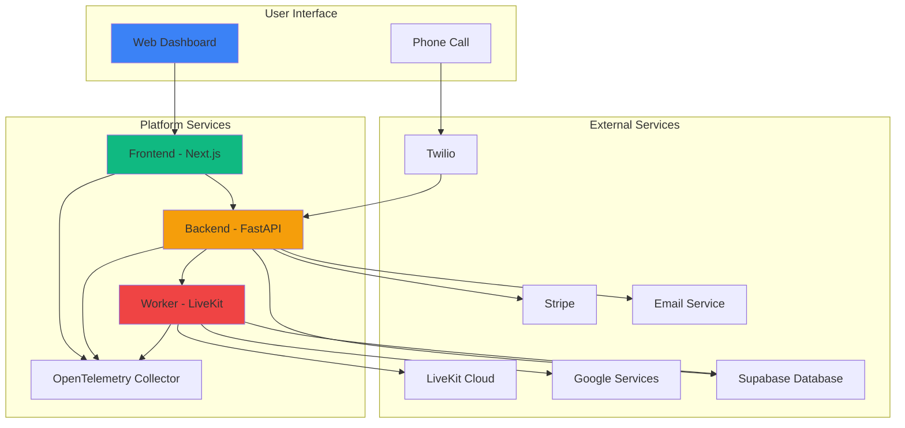

# Platform Overview

## What Is the AI Voice Agent Platform?

The AI Voice Agent Platform is a production-grade, multi-tenant SaaS platform that enables organizations to create and manage AI-powered voice agents with real-time tool integration.

## Core Value Proposition

Organizations can:

- **Create AI Voice Agents**: Configure intelligent agents with custom system prompts
- **Integrate External Tools**: Connect agents to business systems (Google Calendar, CRM, APIs)
- **Handle Voice Calls**: Real-time voice communication powered by LiveKit
- **Manage Teams**: Multi-tenant architecture with role-based access control
- **Track Usage**: Credit-based billing with Stripe integration
- **Scale Securely**: Built with enterprise-grade security and observability

## Key Use Cases

### 1. Customer Support

- AI agents handle common customer inquiries
- Integrate with ticketing systems (Zendesk, Freshdesk)
- Schedule callbacks and appointments
- Transfer to human agents when needed

### 2. Appointment Scheduling

- Google Calendar integration
- Automated booking and reminders
- Rescheduling and cancellations
- Calendar availability checks

### 3. Order Processing

- E-commerce platform integration
- Order status inquiries
- Returns and exchanges
- Inventory checks

### 4. Lead Qualification

- Capture lead information
- Qualify based on criteria
- Schedule sales demos
- Route to appropriate team members

## Platform Architecture at a Glance

## High-Level Components

### Frontend (Next.js)

- **Purpose**: User interface for managing organizations, agents, tools, and billing
- **Technologies**: Next.js 15, TypeScript, Tailwind CSS, Shadcn/ui
- **Key Features**:
  - Multi-tenant organization management
  - Voice agent configuration
  - Tool management with function-level control
  - Billing and subscription management
  - Role-based access control UI

### Backend (FastAPI)

- **Purpose**: REST API server handling authentication, billing, and orchestration
- **Technologies**: Python 3.11+, FastAPI, Supabase
- **Key Features**:
  - Authentication and authorization
  - Tool management API
  - Voice agent CRUD operations
  - OAuth integration
  - Stripe webhook handling
  - Multi-tenancy enforcement

### Worker (LiveKit)

- **Purpose**: Runs AI voice agents in real-time conversations
- **Technologies**: LiveKit Agents SDK, Google Gemini Realtime API
- **Key Features**:
  - Dynamic tool loading from database
  - Tool wrapping for LLM compatibility
  - Real-time voice streaming
  - Session management
  - Error handling and recovery

### Shared Module

- **Purpose**: Code shared between backend and worker
- **Contains**:
  - Voice agent models and services
  - Tool implementations
  - Database models
  - Configuration management

### Infrastructure

- **Database**: Supabase (PostgreSQL with Row-Level Security)
- **Real-time**: LiveKit Cloud for voice/video
- **Payments**: Stripe for billing and subscriptions
- **Email**: Resend.com for transactional emails
- **Observability**: OpenTelemetry with New Relic integration
- **Containers**: Docker & Docker Compose

## Key Innovations

### 1. LiveKit Tool Wrapping

Our innovative wrapper pattern solves the challenge of making tool methods work with LLMs by creating dynamic wrapper functions that:

- Remove `self` parameter (for instance state)
- Preserve exact parameter signatures
- Delegate to bound methods with all parameters
- Work with LiveKit's `@function_tool` decorator

This allows **any** tool with **any** signature to work seamlessly with LLMs.

### 2. Two-Tier Tool Service

Different tool data for different security needs:

- **API Layer**: Returns safe metadata (no OAuth tokens, API keys)
- **Worker Layer**: Returns full tool instances with all secrets

This keeps sensitive data secure while enabling powerful tool functionality.

### 3. Dynamic Tool Loading

Tools are loaded from database at runtime, enabling:

- Runtime configuration without code deployment
- Per-organization tool customization
- Easy addition of new tools
- Tool versioning and updates

### 4. Multi-Tenant with RLS

Strong data isolation using:

- `organization_id` column on all tenant tables
- Row-Level Security policies in database
- Tenant context injection via middleware
- No cross-tenant data leakage possible

### 5. Agent Greeting

Automatic greeting when agent enters room:

- Eliminates awkward silence
- Personalized with agent name
- Sets clear user expectation
- Improves user experience

## Technology Stack

| Layer              | Technology                | Purpose                         |
| ------------------ | ------------------------- | ------------------------------- |
| **Frontend**       | Next.js 15                | React framework with App Router |
| **Frontend**       | TypeScript                | Type-safe JavaScript            |
| **Frontend**       | Tailwind CSS              | Utility-first CSS               |
| **Frontend**       | Shadcn/ui                 | Reusable UI components          |
| **Backend**        | FastAPI                   | Async web framework             |
| **Backend**        | Python 3.11+              | Backend runtime                 |
| **Backend**        | Supabase Client           | Database client                 |
| **Database**       | PostgreSQL (via Supabase) | Persistent storage              |
| **Worker**         | LiveKit Agents SDK        | Real-time voice/video           |
| **Worker**         | Google Gemini Realtime    | AI LLM                          |
| **Authentication** | Supabase Auth             | User authentication             |
| **Payments**       | Stripe                    | Billing & subscriptions         |
| **Email**          | Resend.com                | Transactional emails            |
| **Observability**  | OpenTelemetry             | Tracing, metrics, logs          |
| **Containers**     | Docker & Docker Compose   | Containerization                |
| **Real-time**      | LiveKit Cloud             | Voice/video infrastructure      |
| **Phone**          | Twilio                    | Telephony provider              |

## Who Is This For?

### Target Users

**Business Owners**

- Want voice agents for customer support
- Need appointment scheduling automation
- Require information retrieval from business systems
- Need scalable, multi-tenant solution

**Developers**

- Want to build custom tools for voice agents
- Need flexible API for integrations
- Require multi-tenant architecture
- Want production-ready codebase

**Organizations**

- Need multi-tenant platform with RBAC
- Require strong data isolation
- Want credit-based billing
- Need comprehensive observability

### Use Case Examples

**Customer Support Agent**

- Answer common questions
- Look up customer information
- Schedule follow-up calls
- Transfer to human agents
- Track interactions in CRM

**Appointment Setter**

- Check calendar availability
- Book appointments
- Send confirmation emails
- Reschedule meetings
- Handle cancellations

**Order Processing Agent**

- Check order status
- Process returns
- Update shipping information
- Recommend products
- Handle billing inquiries

**Lead Qualification Agent**

- Capture lead information
- Ask qualifying questions
- Schedule demos
- Route to sales team
- Update CRM records

## Platform Capabilities

### Voice Agent System ✅

- AI-powered voice conversations
- Dynamic tool loading from database
- Tool wrapping for LLM compatibility
- Agent greeting on room entry
- Function-level tool control
- OAuth token management
- Two-tier tool service

### Multi-Tenancy ✅

- Organization-based isolation
- Row-Level Security (RLS)
- Tenant context injection
- Flexible organization management
- Multi-organization support per user

### Authentication & Authorization ✅

- Password-based authentication
- Google OAuth integration
- JWT tokens
- RBAC system with fine-grained permissions
- Predefined roles (platform_admin, org_admin, member, billing)
- Custom role creation (platform admin only)

### Billing & Payments ✅

- Stripe integration
- Credit-based subscriptions
- Plan-based pricing tiers
- Webhook-driven status updates
- Idempotent event handling
- Usage tracking

### Notifications ✅

- Email notifications (Resend.com)
- User invites
- Password reset
- Email verification
- Subscription status changes
- Credit depletion alerts
- Billing failure notifications

### Observability ✅

- OpenTelemetry tracing
- Metrics collection
- Log aggregation
- New Relic integration
- Distributed tracing across services
- Performance monitoring

### Developer Experience ✅

- Type-safe APIs (Pydantic, TypeScript)
- Docker containerization
- Pre-commit hooks
- Comprehensive documentation
- OpenTelemetry manual instrumentation
- Code quality tools (Black, isort, ESLint)

## Platform Roadmap

### Completed ✅

- Multi-tenant architecture
- RBAC system
- Stripe billing
- Email notifications
- Voice agent core system
- LiveKit tool wrapping
- Google Calendar tool
- OpenTelemetry observability
- Docker deployment

### In Progress 🚧

- Additional tool implementations
- Comprehensive testing
- Agent analytics dashboard

### Planned 📋

- Multi-LLM support (OpenAI, Claude, etc.)
- Conversation history and playback
- Tool composition and chaining
- Tool dependencies and versioning
- Advanced error handling
- Multi-language support
- Kubernetes deployment manifests
- CI/CD pipeline
- Agent analytics and metrics
- Conversation recording and transcription
- Custom voice and TTS options

## Next Steps

1. **New Developers**: Read [Quick Start Guide](quick_start.md)
2. **Setup**: Follow [Setup Guide](setup_guide.md)
3. **Architecture**: Review [System Architecture](../01_architecture/system_architecture.md)
4. **Features**: Explore feature-specific documentation in `02_features/`
5. **Development**: See [Development Guides](../03_development/)

## Support

- **Documentation**: See `docs/` folder
- **Backend**: Check [Backend README](../../backend/README.md)
- **Frontend**: Check [Frontend README](../../frontend/README.md)
- **Worker**: Check [Worker README](../../worker/README.md)
- **Shared Module**: Check [Shared README](../../shared/README.md)
- **Development**: See [AGENTS.md](../../AGENTS.md)

---

**Built with ❤️ for the future of AI-powered voice interactions.**
