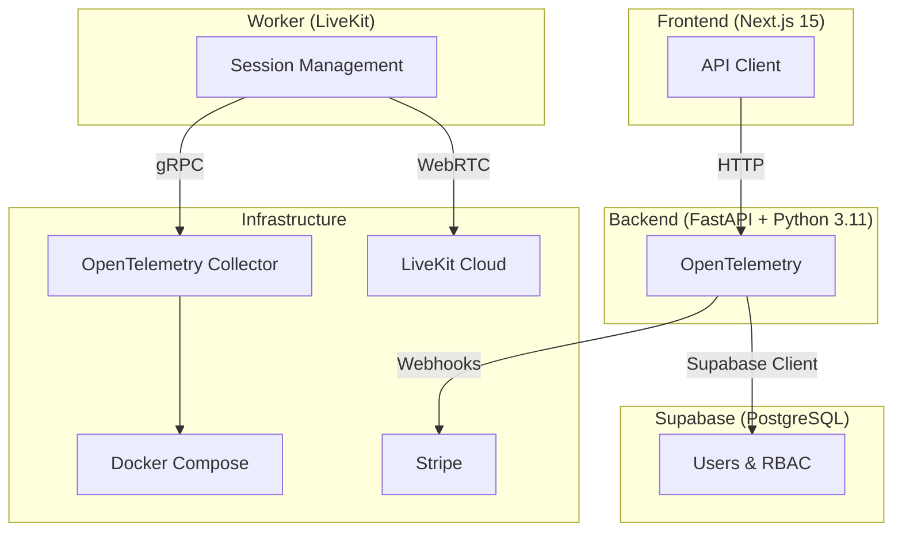
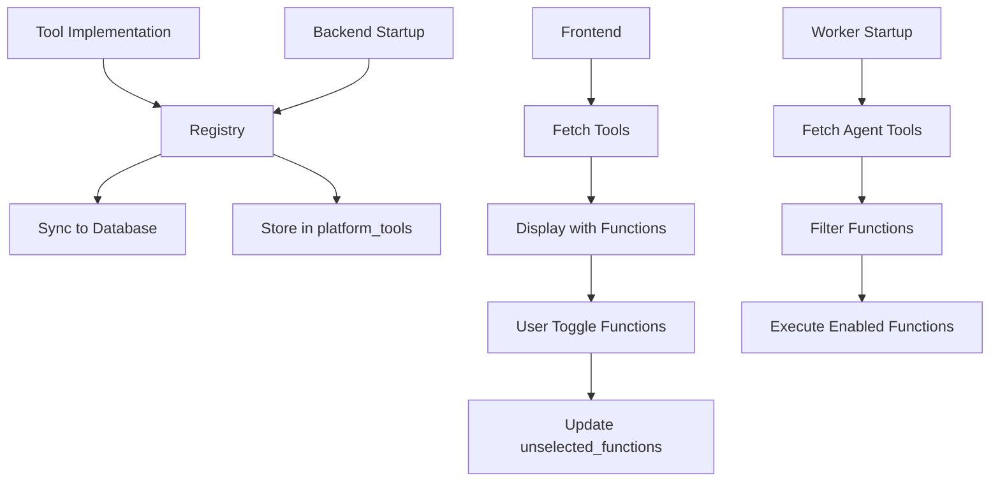
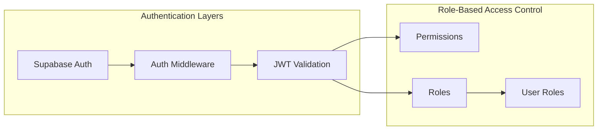
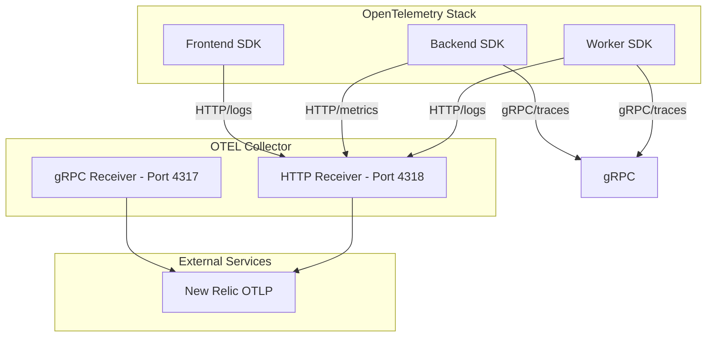

# Architecture Overview

The AI Voice Agent Platform is a production-grade, multi-tenant SaaS system built with modern technologies for managing AI-powered voice agents with real-time tool integration.

## High-Level Architecture



## Core Components

### 1. Frontend (Next.js 15)

**Purpose**: User interface for managing organizations, agents, tools, and billing

**Key Technologies**:
- Next.js 15 with App Router
- React 18+ with TypeScript
- Tailwind CSS for styling
- Shadcn/ui components
- OpenTelemetry instrumentation

**Directory Structure**:
```
frontend/src/
├── app/                      # Next.js App Router
│   ├── (dashboard)/          # Protected dashboard routes
│   │   ├── organization/     # Organization management
│   │   ├── billing/          # Billing and subscriptions
│   │   └── settings/        # User settings
│   └── auth/                # Authentication (login, signup, OAuth)
├── components/              # Reusable UI components
│   ├── auth/               # Auth-related components
│   ├── billing/            # Billing components
│   ├── dashboard/          # Dashboard components
│   ├── organizations/       # Organization components
│   └── ui/                # Generic UI components (Shadcn)
├── contexts/               # React Context providers
│   ├── auth-context.tsx    # Authentication state
│   ├── organization-context.tsx  # Current organization
│   └── theme-context.tsx    # UI theme
├── hooks/                  # Custom React hooks
│   ├── use-billing-info.ts
│   ├── use-organization-by-id.ts
│   ├── use-rbac.ts
│   └── ...
├── lib/                    # Utilities and API client
│   ├── api/                # API client wrapper
│   └── opentelemetry.ts    # OTEL instrumentation
├── services/               # Business logic services
│   ├── auth-service.ts
│   ├── billing-service.ts
│   └── agent-service.ts
└── types/                  # TypeScript type definitions
```

**Key Features**:
- Multi-tenant organization management
- Voice agent creation and configuration
- Tool configuration with function-level enable/disable
- Google OAuth integration for calendar tools
- Billing and subscription management
- RBAC with role-based permissions

### 2. Backend (FastAPI)

**Purpose**: REST API for frontend, tool management, OAuth callbacks, and worker orchestration

**Key Technologies**:
- FastAPI with Python 3.11+
- Supabase (PostgreSQL) as database
- OpenTelemetry for observability
- Alembic for database migrations

**Directory Structure**:
```
backend/src/
├── auth/                   # Authentication endpoints
│   ├── routes.py           # OAuth, login, signup
│   ├── models.py           # User, session models
│   └── middleware.py       # JWT, session validation
├── rbac/                   # Role-Based Access Control
│   ├── permissions/        # Permission definitions
│   ├── roles/             # Role definitions
│   └── user_roles/         # User-role assignments
├── organization/            # Organization CRUD
├── billing/                 # Billing management
├── notifications/           # Email notification system
└── voice_agents/           # Voice agent management
    ├── tool_routes.py      # Tool API endpoints
    ├── agent_routes.py     # Agent CRUD endpoints
    ├── routes.py          # Main router aggregation
    └── service.py         # Business logic
```

**Key Features**:
- RESTful API with OpenAPI documentation
- Tool registration and synchronization
- OAuth flow for Google Calendar
- Agent management with tool assignment
- OpenTelemetry tracing and metrics export
- CORS and security middleware
- Health check endpoints

### 3. Worker (LiveKit)

**Purpose**: LiveKit worker for handling real-time voice agent calls and tool execution

**Key Technologies**:
- LiveKit Agents Python SDK
- Google Gemini Realtime Model
- OpenTelemetry instrumentation

**Directory Structure**:
```
worker/src/
└── worker.py              # Main worker entry point
```

**Worker Flow**:
```mermaid
sequenceDiagram
    participant Room as LiveKit Room
    participant Backend as FastAPI
    participant Worker as LiveKit Worker
    participant Agent as Gemini Model
    participant Tool as Calendar Tool

    Backend->>Room: Join call with agent_id and session_id
    Room->>Worker: JobContext received
    Worker->>Backend: Fetch agent tools from database
    Worker->>Worker: Wrap each @function_tool with config injection
    Worker->>Agent: Pass wrapped functions to RealtimeModel
    Agent->>Tool: Execute function when called
    Tool->>Agent: Return result (e.g., calendar events)
    Agent->>Room: Stream audio response to user
    Note over Room->>Backend: Session end signal
```

**Key Features**:
- Dynamic tool discovery from database
- Per-agent tool configuration
- Config injection via `context.userdata`
- Function enable/disable via `unselected_functions`
- Stale function name handling
- Session snapshot management

### 4. Database (Supabase PostgreSQL)

**Purpose**: Persistent storage for all platform data

**Schema Overview**:

#### Core Tables

**organizations**
```sql
id UUID PRIMARY KEY
name TEXT NOT NULL UNIQUE
slug TEXT NOT NULL UNIQUE
description TEXT
website TEXT
is_active BOOLEAN DEFAULT TRUE
created_at TIMESTAMP DEFAULT NOW()
updated_at TIMESTAMP DEFAULT NOW()
```

**voice_agents**
```sql
id UUID PRIMARY KEY
organization_id UUID REFERENCES organizations(id)
name TEXT NOT NULL
phone_number TEXT
system_prompt TEXT
is_active BOOLEAN DEFAULT TRUE
created_at TIMESTAMP DEFAULT NOW()
updated_at TIMESTAMP DEFAULT NOW()
```

**platform_tools**
```sql
id UUID PRIMARY KEY
name TEXT UNIQUE NOT NULL
description TEXT
config_schema JSONB
tool_functions_schema JSONB
auth_type TEXT
is_active BOOLEAN DEFAULT TRUE
created_at TIMESTAMP DEFAULT NOW()
updated_at TIMESTAMP DEFAULT NOW()
```

**agent_tools**
```sql
id UUID PRIMARY KEY
agent_id UUID REFERENCES voice_agents(id)
tool_id UUID REFERENCES platform_tools(id)
config JSONB
sensitive_config TEXT ENCRYPTED
unselected_functions TEXT[]
is_enabled BOOLEAN DEFAULT TRUE
created_at TIMESTAMP DEFAULT NOW()
updated_at TIMESTAMP DEFAULT NOW()
```

For detailed database schema, see [Database Schema](database_schema.md).

### 5. Tool Architecture

**Core Concept**: Tools are modular components that can be attached to voice agents.

#### Tool Registration Flow



#### Tool Implementation Pattern

```python
from livekit.agents import function_tool, RunContext
from shared.voice_agents.tools.base.base_tool import BaseTool

class ExampleTool(BaseTool):
    @property
    def metadata(self) -> ToolMetadata:
        return ToolMetadata(
            name="example_tool",
            description="Tool description",
            requires_auth=True,
            auth_type="oauth2"
        )

    @function_tool()
    async def example_function(
        self,
        context: RunContext,
        param1: str,
        param2: int = 10
    ) -> dict:
        """Tool function description."""
        # Access config from context
        config = context.userdata.get("tool_config", {})
        sensitive_config = context.userdata.get("sensitive_config", {})

        # Tool implementation
        result = await perform_operation(config, sensitive_config, param1, param2)
        return result
```

### 6. Authentication & Authorization

#### Multi-Layer Security



**Authentication Flow**:
1. User authenticates via Supabase OAuth or credentials
2. Supabase JWT returned
3. Middleware validates JWT on protected routes
4. User context includes profile and roles

**RBAC Implementation**:
- **Permissions**: Fine-grained permissions (e.g., `org:manage`, `agent:create`)
- **Roles**: Hierarchical (platform_admin > org_admin > regular_user)
- **Assignment**: Users can have multiple roles across organizations
- **Middleware**: Decorator-based permission checking on protected routes

### 7. OpenTelemetry Observability

**Architecture**:



**Configuration**:
- **File**: `otel-collector-config.yml`
- **Collector**: OpenTelemetry Collector Contrib
- **Receivers**: `otlp` (gRPC), `http` (HTTP)
- **Processors**: `batch` - batches telemetry data
- **Exporters**: `otlp/newrelic` - exports to New Relic

## Data Flow

1. **User Setup**: User creates account via frontend → Backend creates org/user in Supabase
2. **Agent Creation**: User configures voice agent → Backend stores in database
3. **Tool Integration**: User configures tools for agent → Backend stores tool associations
4. **Call Initiation**: User triggers outbound call → Backend validates and initiates
5. **Room Creation**: Backend creates LiveKit room → Worker receives dispatch
6. **Agent Execution**: Worker loads tools, creates agent → Agent handles voice call
7. **Tool Calling**: Agent calls tool → Worker executes via wrapped methods
8. **Response**: Tool returns data → Agent speaks response to user
9. **Billing**: Backend tracks usage → Stripe handles payments

## Technology Stack

| Component | Technology | Version | Purpose |
|-----------|-----------|---------|---------|
| Frontend | Next.js | 15 | UI framework |
| Backend | FastAPI | Latest | API framework |
| Backend Runtime | Python | 3.11+ | Server runtime |
| Database | Supabase (PostgreSQL) | - | Data storage |
| ORM | Supabase Client | - | Database client |
| Authentication | Supabase Auth | - | User auth |
| Voice SDK | LiveKit Agents | >=1.3.10 | Voice/video |
| LLM | Google Gemini | - | AI model |
| Observability | OpenTelemetry | Latest | Tracing & metrics |
| Metrics Exporter | New Relic OTLP | - | External metrics |
| Containerization | Docker Compose | - | Local dev |

## Key Design Decisions

### 1. LiveKit Integration
**Decision**: Use LiveKit's native `@function_tool()` decorator
**Rationale**:
- LiveKit provides automatic schema extraction from decorated functions
- Worker can pass decorated functions directly to LLM models
- No need to manually convert between internal and external formats

### 2. Tool Schema Storage
**Decision**: Store function schemas in `platform_tools.tool_functions_schema` (JSONB)
**Rationale**:
- Single source of truth for function definitions
- Enables frontend to display available functions
- Allows per-function enable/disable via `agent_tools.unselected_functions`
- Supports future tool discovery without code changes

### 3. Multi-Tenancy
**Decision**: Organization-based isolation via foreign key relationships
**Rationale**:
- Clear data ownership
- Users belong to organizations
- Agents and tools scoped to organizations
- RBAC checks organization membership

### 4. OAuth State Management
**Decision**: Store OAuth tokens in `agent_tools.sensitive_config` (encrypted)
**Rationale**:
- Tokens are sensitive (access_token, refresh_token)
- Per-agent configuration allows multiple agents with different tokens
- Encryption via Supabase's encryption capabilities
- Avoids user-level token storage conflicts

## API Endpoints Summary

### Tool Management
- `POST /api/v1/tools/platform` - Create platform tool (admin)
- `GET /api/v1/tools/platform?only_active=true` - List active tools
- `POST /api/v1/tools/agent` - Configure tool for agent
- `GET /api/v1/tools/agent/{agent_id}` - Get agent tools
- `PUT /api/v1/tools/agent/{agent_tool_id}` - Update agent tool config
- `GET /api/v1/tools/auth/{tool_name}?agent_id={id}` - Start OAuth flow
- `GET /api/v1/tools/callback` - Handle OAuth callback

### Agent Management
- `POST /api/v1/agents` - Create agent
- `GET /api/v1/agents/organization/{org_id}` - List org agents
- `GET /api/v1/agents/{agent_id}` - Get agent details
- `PUT /api/v1/agents/{agent_id}` - Update agent
- `DELETE /api/v1/agents/{agent_id}` - Delete agent

### Authentication
- `POST /api/v1/auth/signup` - User registration
- `POST /api/v1/auth/signin` - User login
- `POST /api/v1/auth/oauth` - Supabase OAuth
- `GET /api/v1/auth/user` - Get current user

### Billing
- `GET /api/v1/billing/plans` - List subscription plans
- `POST /api/v1/billing/checkout` - Create checkout session
- `POST /api/v1/billing/portal` - Create customer portal
- `POST /api/v1/billing/credits` - Purchase credits
- `GET /api/v1/billing/summary` - Get billing summary

## Security Considerations

### Authentication Flow
- Supabase handles password hashing and JWT tokens
- OAuth flow with state parameter (agent_id, tool_name) to prevent CSRF
- Sensitive config (OAuth tokens) encrypted at rest

### Authorization
- RBAC middleware checks permissions before route handlers
- Organization ownership verification for resource access
- Platform admin role for tool creation

### Data Encryption
- `agent_tools.sensitive_config` column encryption for OAuth tokens
- Encryption/decryption via shared security utilities

## Related Documentation

- [System Architecture Details](system_architecture.md) - Complete system architecture
- [Frontend Architecture](frontend_architecture.md) - Frontend details
- [Backend Architecture](backend_architecture.md) - Backend details
- [Database Schema](database_schema.md) - Complete database schema
- [Voice Agents Architecture](voice_agents.md) - Voice agent system details
- [Tool System](../03_implementation/tool_system.md) - Tool implementation details
- [RBAC System](../02_core_systems/rbac_system.md) - Role-based access control
- [Billing System](../02_core_systems/billing_system.md) - Billing and payments
