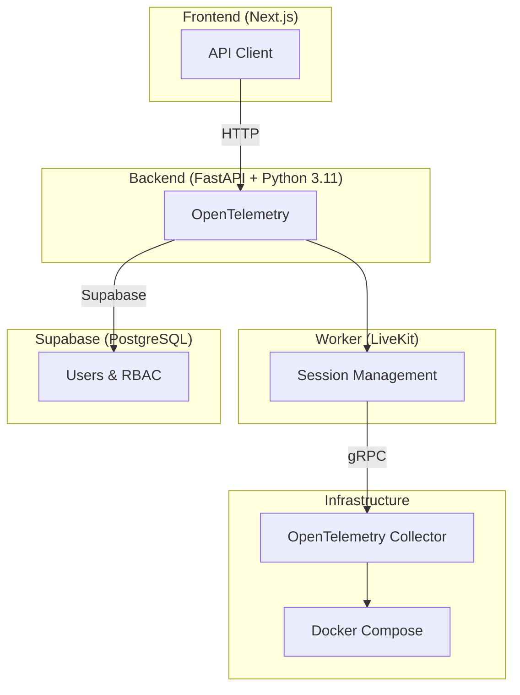
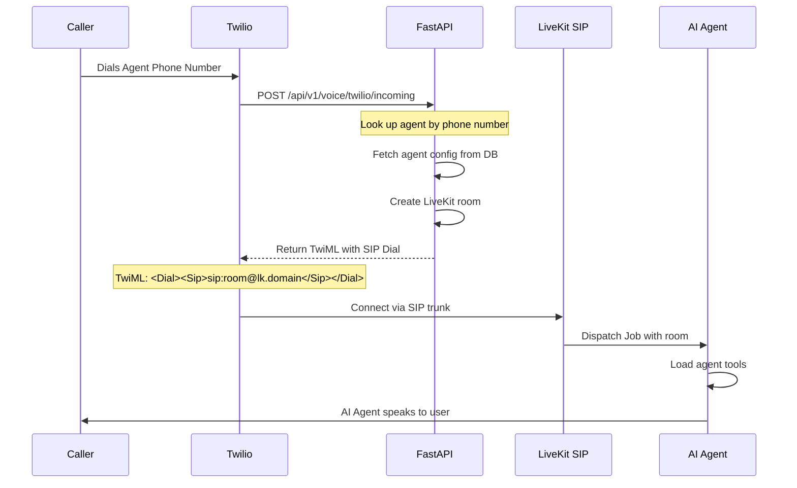
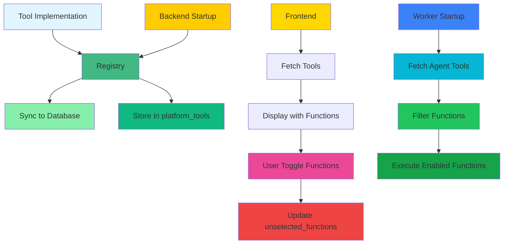
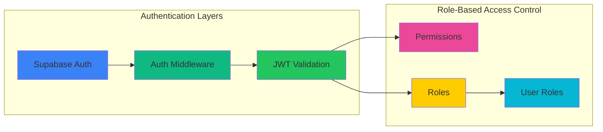
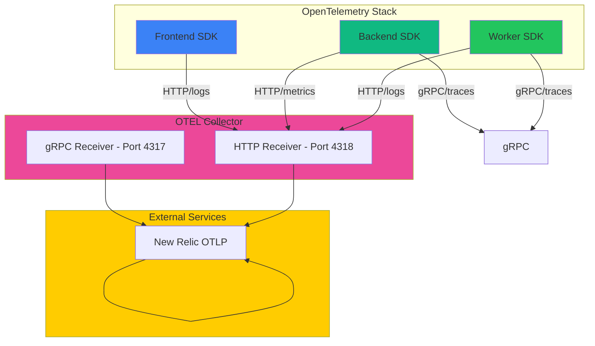
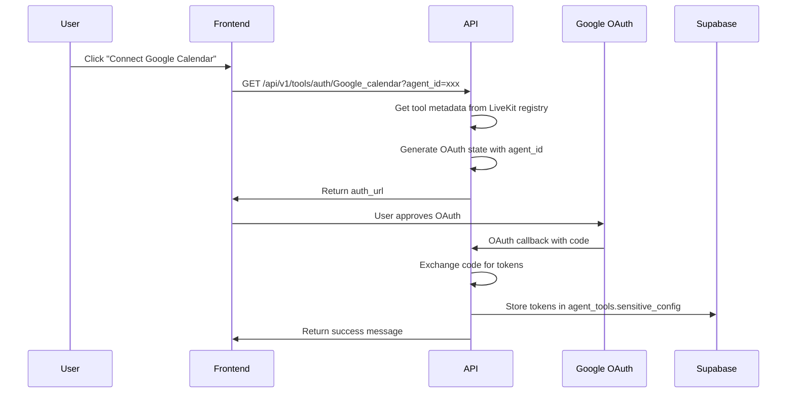

# AI Voice Agent Platform - Architecture Overview

## System Architecture

This platform is a multi-tenant SaaS application for managing AI voice agents with tool integration and authentication.



## Incoming Call Flow (Twilio → LiveKit)

The platform uses Twilio for phone number provisioning and incoming call handling, then bridges calls to LiveKit for AI agent processing.

### Call Flow Diagram



### Twilio Webhook Endpoint

**Location**: `backend/src/voice_agents/voice_routes.py`

**Endpoint**: `POST /api/v1/voice/twilio/incoming`

**Process**:
1. Twilio sends POST request when someone calls your Twilio phone number
2. Backend looks up agent by phone number via `voice_agent_service.get_agent_by_phone()`
3. Backend returns TwiML (Twilio Markup Language) response with `<Dial><Sip>` element
4. Twilio bridges the call to LiveKit SIP domain
5. LiveKit creates room and dispatches job to worker
6. Worker joins room with AI agent and handles the call

**Key Configuration**:
- `LIVEKIT_SIP_DOMAIN`: LiveKit SIP domain for bridging
- `voice_agents.phone_number`: Phone number associated with agent
- `voice_routes.py`: Handles Twilio webhook and returns TwiML

**Example TwiML Response**:
```xml
<?xml version="1.0" encoding="UTF-8"?>
<Response>
    <Dial>
        <Sip>sip:+1234567890@your-livekit-sip-domain.livekit.cloud</Sip>
    </Dial>
</Response>
```

This design separates telephony (Twilio) from AI processing (LiveKit), allowing the platform to:
- Use Twilio for phone numbers and incoming call routing
- Use LiveKit for real-time AI voice interaction
- Bridge calls via SIP protocol

## Core Components

### 1. Frontend (Next.js)

**Purpose:** User interface for managing organizations, agents, tools, and billing

**Key Technologies:**
- Next.js 15 with App Router
- React 18+ with TypeScript
- Tailwind CSS for styling
- OpenTelemetry instrumentation

**Architecture:**
```
frontend/
├── src/
│   ├── app/                    # Next.js App Router
│   │   ├── (dashboard)/        # Protected dashboard routes
│   │   │   ├── organization/   # Organization management
│   │   │   ├── billing/         # Billing and subscriptions
│   │   │   └── settings/        # User settings
│   │   └── auth/              # Authentication (login, signup, OAuth)
│   ├── components/              # Reusable UI components
│   ├── contexts/                 # React Context providers
│   │   ├── auth-context.tsx     # Authentication state
│   │   ├── organization-context.tsx  # Current organization
│   │   └── theme-context.tsx    # UI theme
│   ├── hooks/                   # Custom React hooks
│   ├── lib/                     # Utilities and API client
│   │   ├── api/               # API client wrapper
│   │   └── opentelemetry.ts    # OTEL instrumentation
│   └── services/                # Business logic services
│       ├── auth-service.ts
│       ├── billing-service.ts
│       └── agent-service.ts
└── types/                      # TypeScript type definitions
```

**Key Features:**
- Multi-tenant organization management
- Voice agent creation and configuration
- Tool configuration with function-level enable/disable
- Google OAuth integration for calendar tools
- Billing and subscription management
- RBAC with role-based permissions

---

### 2. Backend (FastAPI + Python 3.11)

**Purpose:** REST API for frontend, tool management, OAuth callbacks, and worker orchestration

**Key Technologies:**
- FastAPI with Python 3.11
- Supabase (PostgreSQL) as database
- OpenTelemetry for observability
- Alembic for database migrations

**Architecture:**
```
backend/
├── src/
│   ├── auth/                    # Authentication endpoints
│   │   ├── routes.py          # OAuth, login, signup
│   │   ├── models.py          # User, session models
│   │   └── middleware.py      # JWT, session validation
│   ├── rbac/                    # Role-Based Access Control
│   │   ├── permissions/       # Permission definitions
│   │   ├── roles/            # Role definitions
│   │   └── user_roles/        # User-role assignments
│   ├── organization/             # Organization CRUD
│   ├── billing/                  # Billing management
│   └── voice_agents/             # Voice agent management
│       ├── tool_routes.py     # Tool API endpoints
│       ├── agent_routes.py    # Agent CRUD endpoints
│       ├── routes.py          # Main router aggregation
│       ├── service.py         # Business logic
│       └── livekit_service.py # LiveKit integration
├── shared/                      # Shared business logic
│   ├── config/              # Configuration (Supabase, settings, OTEL)
│   ├── common/              # Shared utilities
│   └── voice_agents/       # Core voice agent logic
│       ├── tool_models.py      # Pydantic models
│       ├── tool_service.py     # Tool data access layer
│       ├── service.py          # Agent business logic
│       ├── tools/
│       │   ├── base/
│       │   │   ├── base_tool.py           # BaseTool interface
│       │   │   └── registry_livekit.py  # LiveKit native registry
│       │   └── implementations/
│       │       └── google_calendar.py  # Google Calendar tool
│       └── session_service.py              # Call session management
├── main.py                     # FastAPI app entry point
├── requirements.txt              # Python dependencies
└── Dockerfile                  # Container configuration
```

**Key Features:**
- RESTful API with OpenAPI documentation
- Tool registration and synchronization
- OAuth flow for Google Calendar
- Agent management with tool assignment
- OpenTelemetry tracing and metrics export
- CORS and security middleware
- Health check endpoints

---

### 3. Worker (LiveKit Python)

**Purpose:** LiveKit worker for handling real-time voice agent calls and tool execution

**Key Technologies:**
- LiveKit Agents Python SDK
- Google Gemini Realtime Model
- OpenTelemetry instrumentation

**Architecture:**
```
worker/
├── src/
│   └── worker.py              # Main worker entry point
├── requirements.txt              # Python dependencies
└── Dockerfile                  # Container configuration
```

**Worker Flow:**
```mermaid
sequenceDiagram
    participant Room as LiveKit Room
    participant Backend as FastAPI
    participant Worker as LiveKit Worker
    participant Agent as Gemini Model
    participant Tool as Calendar Tool

    Backend->>Room: Join call with agent_id and session_id
    Room->>Worker: JobContext received
    Worker->>Backend: Fetch agent tools from database
    Worker->>Worker: Wrap each @function_tool with config injection
    Worker->>Agent: Pass wrapped functions to RealtimeModel
    Agent->>Tool: Execute function when called
    Tool->>Agent: Return result (e.g., calendar events)
    Agent->>Room: Stream audio response to user
    Note over Room->>Backend: Session end signal
```

**Key Features:**
- Dynamic tool discovery from database
- Per-agent tool configuration
- Config injection via `context.userdata`
- Function enable/disable via `unselected_functions`
- Stale function name handling
- Session snapshot management

---

### 4. Database (Supabase PostgreSQL)

**Purpose:** Persistent storage for all platform data

**Schema Overview:**

#### Key Tables

**platform_tools**
```sql
CREATE TABLE platform_tools (
    id UUID PRIMARY KEY,
    name TEXT UNIQUE NOT NULL,
    description TEXT,
    config_schema JSONB,
    tool_functions_schema JSONB,           -- NEW: Stores function schemas
    auth_type TEXT,                           -- Not in DB yet
    auth_config JSONB,                         -- Not in DB yet
    is_active BOOLEAN DEFAULT TRUE,
    created_at TIMESTAMP DEFAULT NOW(),
    updated_at TIMESTAMP DEFAULT NOW()
);
```

**agent_tools**
```sql
CREATE TABLE agent_tools (
    id UUID PRIMARY KEY,
    agent_id UUID REFERENCES voice_agents(id),
    tool_id UUID REFERENCES platform_tools(id),
    config JSONB,
    sensitive_config TEXT ENCRYPTED,
    unselected_functions TEXT[],          -- NEW: Disabled functions
    is_enabled BOOLEAN DEFAULT TRUE,
    created_at TIMESTAMP DEFAULT NOW(),
    updated_at TIMESTAMP DEFAULT NOW()
);
```

**voice_agents**
```sql
CREATE TABLE voice_agents (
    id UUID PRIMARY KEY,
    organization_id UUID REFERENCES organizations(id),
    name TEXT NOT NULL,
    phone_number TEXT,
    system_prompt TEXT,
    is_active BOOLEAN DEFAULT TRUE,
    created_at TIMESTAMP DEFAULT NOW(),
    updated_at TIMESTAMP DEFAULT NOW()
);
```

**organizations**
```sql
CREATE TABLE organizations (
    id UUID PRIMARY KEY,
    name TEXT NOT NULL,
    business_details TEXT,
    created_at TIMESTAMP DEFAULT NOW(),
    updated_at TIMESTAMP DEFAULT NOW()
);
```

**users**, **roles**, **permissions**, **user_roles** - RBAC tables
**subscriptions**, **billing_events** - Billing tables

---

### 5. Tool Architecture

**Core Concept:** Tools are modular components that can be attached to voice agents.

#### Tool Registration Flow



#### Tool Implementation Pattern

```python
from livekit.agents import function_tool, RunContext
from shared.voice_agents.tools.base.base_tool import BaseTool, ToolMetadata

class ExampleTool(BaseTool):
    @property
    def metadata(self) -> ToolMetadata:
        return ToolMetadata(
            name="Example_tool",
            description="Tool description",
            requires_auth=True,
            auth_type="oauth2",
            auth_config={...},
            config_schema={...}
        )

    @function_tool()
    async def example_function(
        self,
        context: RunContext,
        param1: str,
        param2: int = 10
    ) -> dict:
        """
        Tool function description.

        Args:
            context: LiveKit RunContext with tool_config and sensitive_config
            param1: Description
            param2: Description with default
        """
        # Access config from context
        config = context.userdata.get("tool_config", {})
        sensitive_config = context.userdata.get("sensitive_config", {})

        # Tool implementation
        result = await perform_tool_operation(config, sensitive_config, param1, param2)

        return result
```

#### LiveKit Native Registry

**Location:** `shared/voice_agents/tools/base/registry_livekit.py`

**Approach:** Extract function schemas using `inspect` instead of AST parsing.

**Key Methods:**
- `register_tools_from_package()` - Discover tool classes dynamically
- `_extract_function_methods()` - Find `@function_tool` decorated methods
- `_extract_schema_from_function()` - Build function schemas from signature
- `sync_with_db()` - Update database with function schemas
- `get_tool_class()` - Retrieve tool class for OAuth
- `get_tool_functions()` - Get function objects for worker

**Advantages over AST approach:**
- No source file parsing
- Uses Python's built-in introspection
- More robust and follows LiveKit design
- Can access decorator metadata if available

---

### 6. Authentication & Authorization

#### Multi-Layer Security



**Authentication Flow:**
1. User authenticates via Supabase OAuth or credentials
2. Supabase JWT returned
3. Middleware validates JWT on protected routes
4. User context includes profile and roles

**RBAC Implementation:**
- **Permissions:** Fine-grained permissions (e.g., `org:manage`, `agent:create`)
- **Roles:** Hierarchical (platform_admin > org_admin > regular_user)
- **Assignment:** Users can have multiple roles across organizations
- **Middleware:** Decorator-based permission checking on protected routes

---

### 7. Tool Configuration & Function Selection

**Frontend Component:** `frontend/src/app/(dashboard)/organization/page.tsx`

**Function Display Logic:**
```typescript
const renderToolConfig = (tool: PlatformTool, agentTool?: AgentTool) => {
    const functions = tool.tool_functions_schema?.functions || [];
    const toolUnselectedFunctions = unselectedFunctions[tool.id] || [];
    const isToolEnabled = agentTool?.is_enabled || false;

    return (
        <div>
            {/* Always show functions, regardless of tool enablement */}
            {functions.length > 0 && (
                <div>
                    <div>Available Functions</div>
                    <div>({functions.length} total, {functions.length - toolUnselectedFunctions.length} enabled)</div>
                    {functions.map((func) => (
                        <FunctionCard
                            name={func.name}
                            description={func.description}
                            parameters={func.parameters?.properties}
                            isEnabled={!toolUnselectedFunctions.includes(func.name)}
                            isToolEnabled={isToolEnabled}
                        />
                    ))}
                </div>
            )}
        </div>
    );
};
```

**Toggle Function Logic:**
```typescript
const handleToggleFunction = async (
    toolId: string,
    functionName: string,
    isEnabled: boolean
) => {
    // If enabling (checkbox checked), add to unselected list
    if (isEnabled) {
        newUnselected = [...currentUnselected, functionName];
    }
    // If disabling (checkbox unchecked), remove from unselected list
    else {
        newUnselected = currentUnselected.filter(fn => fn !== functionName);
    }

    // Update database
    await agentService.updateAgentTool(agentToolId, {
        unselected_functions: newUnselected
    });
};
```

---

### 8. OpenTelemetry Observability

**Architecture:**



**Configuration:**
- **File:** `otel-collector-config.yml`
- **Collector:** OpenTelemetry Collector Contrib
- **Receivers:** `otlp` (gRPC), `http` (HTTP)
- **Processors:** `batch` - batches telemetry data
- **Exporters:** `otlp/newrelic` - exports to New Relic

**Environment Variables:**
```bash
# Traces
OTEL_EXPORTER_OTLP_TRACES_ENDPOINT=http://127.0.0.1:4318/v1/traces
OTEL_EXPORTER_OTLP_TRACES_PROTOCOL=grpc
NEXT_PUBLIC_OTEL_ENABLED=true

# Metrics
OTEL_EXPORTER_OTLP_METRICS_ENDPOINT=http://127.0.0.1:4318/v1/metrics
OTEL_EXPORTER_OTLP_METRICS_PROTOCOL=http://protobuf

# Logs
OTEL_EXPORTER_OTLP_LOGS_ENDPOINT=http://127.0.0.1:4318/v1/logs
OTEL_EXPORTER_OTLP_LOGS_PROTOCOL=http://protobuf
```

**Instrumentation:**
- Frontend: Manual instrumentation in `src/lib/opentelemetry.ts`
- Backend: Auto-instrumentation in `config/opentelemetry.py`
- Worker: Uses LiveKit's built-in OTEL support

---

### 9. Google OAuth Integration

**Flow:**



**Tool Configuration in Database:**
```json
{
  "config": {
    "calendar_id": "primary"
  },
  "sensitive_config": {
    "access_token": "ya29.0.AHx...",
    "refresh_token": "1//0xX...",
    "expires_at": 1234567890.123
  }
}
```

---

### 10. Deployment Architecture

**Docker Compose Services:**

```yaml
services:
  otel-collector:
    image: otel/opentelemetry-collector-contrib:latest
    ports:
      - "4317:4317"   # gRPC (traces, logs)
      - "4318:4318"   # HTTP (metrics)
    volumes:
      - ./otel-collector-config.yml:/etc/otelcol-contrib

  frontend-dev:
    image: frontend-dev
    ports:
      - "3000:3000"
    environment:
      - NEXT_PUBLIC_OTEL_ENABLED=true
      - NEXT_PUBLIC_OTEL_EXPORTER_OTLP_METRICS_ENDPOINT=http://otel-collector:4317
    volumes:
      - ./frontend:/app

  backend-dev:
    image: backend-dev
    ports:
      - "8000:8000"
    environment:
      - OTEL_ENABLED=true
      - OTEL_EXPORTER_OTLP_METRICS_ENDPOINT=http://otel-collector:4317
      - OTEL_EXPORTER_OTLP_LOGS_ENDPOINT=http://otel-collector:4318
    volumes:
      - ./:/app

  worker-dev:
    image: worker-dev
    environment:
      - GEMINI_API_KEY=${GEMINI_API_KEY}
      - LIVEKIT_URL=${LIVEKIT_URL}
      - LIVEKIT_API_KEY=${LIVEKIT_API_KEY}
    volumes:
      - ./shared:/app/shared
```

---

### 11. Technology Stack Summary

| Component | Technology | Version | Purpose |
|-----------|-----------|---------|---------|
| Frontend | Next.js | 15.5 | UI framework |
| Backend | FastAPI | Latest | API framework |
| Backend Runtime | Python | 3.11 | Server runtime |
| Database | Supabase (PostgreSQL) | - | Data storage |
| ORM | Supabase Client | - | Database client |
| Authentication | Supabase Auth | - | User auth |
| Voice SDK | LiveKit Agents | >=1.3.10 | Voice/video |
| LLM | Google Gemini | - | AI model |
| Observability | OpenTelemetry | Latest | Tracing & metrics |
| Metrics Exporter | New Relic OTLP | - | External metrics |
| Containerization | Docker Compose | - | Local dev |
| API Protocol | REST + gRPC | - | Frontend uses REST, worker uses gRPC |

---

### 12. File Structure Summary

```
ai-voice-agent-platform/
├── .docs/                    # Architecture documentation
├── backend/                   # FastAPI backend
├── frontend/                  # Next.js frontend
├── worker/                    # LiveKit worker
├── shared/                    # Shared business logic
│   ├── config/              # Configuration
│   ├── common/              # Utilities
│   └── voice_agents/      # Core domain logic
│       ├── tools/
│       │   ├── base/         # Tool base classes & registries
│       │   └── implementations/ # Tool implementations
│       ├── tool_models.py   # Pydantic models
│       ├── tool_service.py   # Tool data access
│       ├── service.py        # Agent business logic
│       └── session_service.py # Session management
├── docker-compose.yml          # Service orchestration
├── docker-compose.dev.yml      # Development config
├── Dockerfile                 # Backend Docker config
└── .env                      # Environment variables
```

---

## Key Design Decisions

### 1. LiveKit Integration
**Decision:** Use LiveKit's native `@function_tool()` decorator instead of custom tool abstractions
**Rationale:**
- LiveKit provides automatic schema extraction from decorated functions
- Worker can pass decorated functions directly to LLM models
- No need to manually convert between internal and external formats

### 2. Tool Schema Storage
**Decision:** Store function schemas in `platform_tools.tool_functions_schema` (JSONB)
**Rationale:**
- Single source of truth for function definitions
- Enables frontend to display available functions
- Allows per-function enable/disable via `agent_tools.unselected_functions`
- Supports future tool discovery without code changes

### 3. Registry Approach
**Decision:** Use LiveKit native registry instead of AST parsing
**Rationale:**
- More robust - uses Python's built-in introspection
- Follows LiveKit's intended design patterns
- No fragile source file parsing or AST manipulation
- Cleaner, more maintainable code

### 4. Multi-Tenancy
**Decision:** Organization-based isolation via foreign key relationships
**Rationale:**
- Clear data ownership
- Users belong to organizations
- Agents and tools scoped to organizations
- RBAC checks organization membership

### 5. OAuth State Management
**Decision:** Store OAuth tokens in `agent_tools.sensitive_config` (encrypted)
**Rationale:**
- Tokens are sensitive (access_token, refresh_token)
- Per-agent configuration allows multiple agents with different tokens
- Encryption via Supabase's encryption capabilities
- Avoids user-level token storage conflicts

---

## API Endpoints Summary

### Tool Management
- `POST /api/v1/tools/platform` - Create platform tool (admin)
- `GET /api/v1/tools/platform?only_active=true` - List active tools
- `POST /api/v1/tools/agent` - Configure tool for agent
- `GET /api/v1/tools/agent/{agent_id}` - Get agent tools
- `PUT /api/v1/tools/agent/{agent_tool_id}` - Update agent tool config
- `GET /api/v1/tools/auth/{tool_name}?agent_id={id}` - Start OAuth flow
- `GET /api/v1/tools/callback` - Handle OAuth callback

### Agent Management
- `POST /api/v1/agents` - Create agent
- `GET /api/v1/agents/organization/{org_id}` - List org agents
- `GET /api/v1/agents/{agent_id}` - Get agent details
- `PUT /api/v1/agents/{agent_id}` - Update agent
- `DELETE /api/v1/agents/{agent_id}` - Delete agent

### Authentication
- `POST /api/v1/auth/signup` - User registration
- `POST /api/v1/auth/signin` - User login
- `POST /api/v1/auth/oauth` - Supabase OAuth
- `GET /api/v1/auth/user` - Get current user

---

## Security Considerations

### 1. Authentication Flow
- Supabase handles password hashing and JWT tokens
- OAuth flow with state parameter (agent_id, tool_name) to prevent CSRF
- Sensitive config (OAuth tokens) encrypted at rest

### 2. Authorization
- RBAC middleware checks permissions before route handlers
- Organization ownership verification for resource access
- Platform admin role for tool creation

### 3. Data Encryption
- `agent_tools.sensitive_config` column encryption for OAuth tokens
- Encryption/decryption via shared security utilities

---

## Performance & Scalability

### 1. Database Optimization
- Connection pooling via Supabase client
- Indexed queries (id, name, organization_id)
- Batch operations in tool registry sync

### 2. Worker Scaling
- Stateless worker instances can be horizontally scaled
- Session management prevents duplicate tool executions
- Config caching reduces database lookups

### 3. Frontend Optimization
- Next.js static generation and caching
- API client with request/response interceptors
- React context providers prevent unnecessary re-renders

---

## Development Workflow

### 1. Making Changes
1. Modify code in appropriate service (backend, frontend, worker, shared)
2. Update types in `shared` if schema changes
3. Test locally with Docker Compose
4. Run linting/type checking if configured

### 2. Database Migrations
1. Create migration file: `backend/alembic/versions/YYYYMMDDHHMMSS_description.py`
2. Apply migration: `docker-compose exec backend alembic upgrade head`
3. Verify changes in database

### 3. Testing
- Unit tests for business logic
- Integration tests for API endpoints
- Manual testing via UI
- Log inspection via Docker logs

---

## Future Enhancements

### Potential Improvements
1. **Dynamic Tool Discovery**: Auto-discover new tools without code changes
2. **Tool Marketplace**: Third-party tools can register themselves
3. **Advanced RBAC**: Team-level permissions, resource-based access
4. **Audit Logging**: Track all tool executions for compliance
5. **Multi-LLM Support**: Allow agents to use different LLM providers
6. **Tool Versioning**: Support multiple versions of tools simultaneously
7. **Function Composition**: Allow tools to call other tools
8. **Circuit Breaking**: Prevent failed tools from cascading failures
9. **Rate Limiting**: Per-tool and per-user rate limits
10. **Tool Analytics**: Usage statistics and optimization insights
