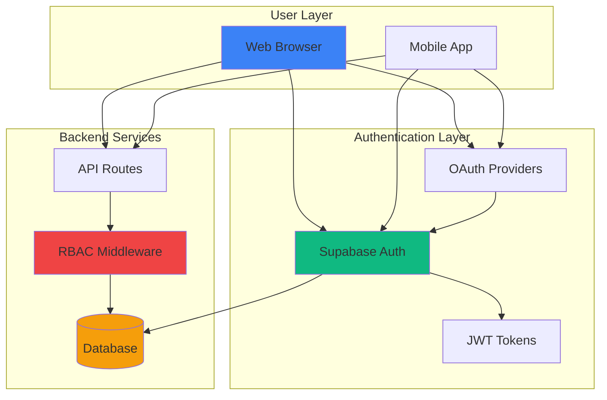
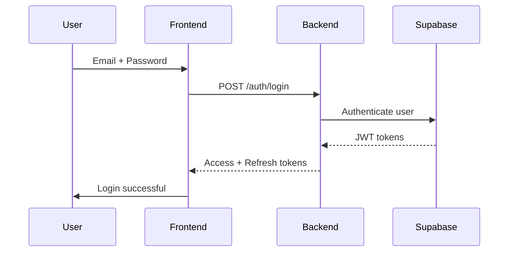
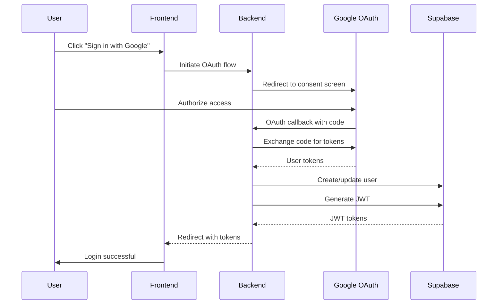
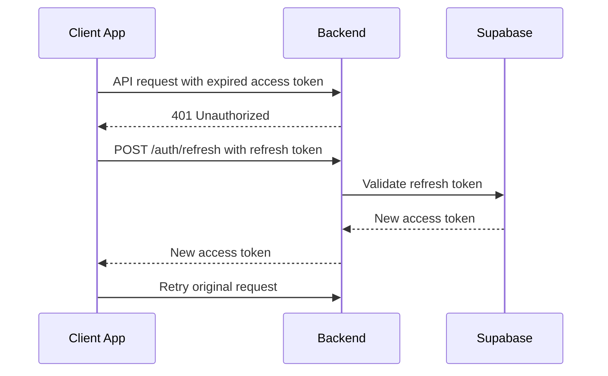
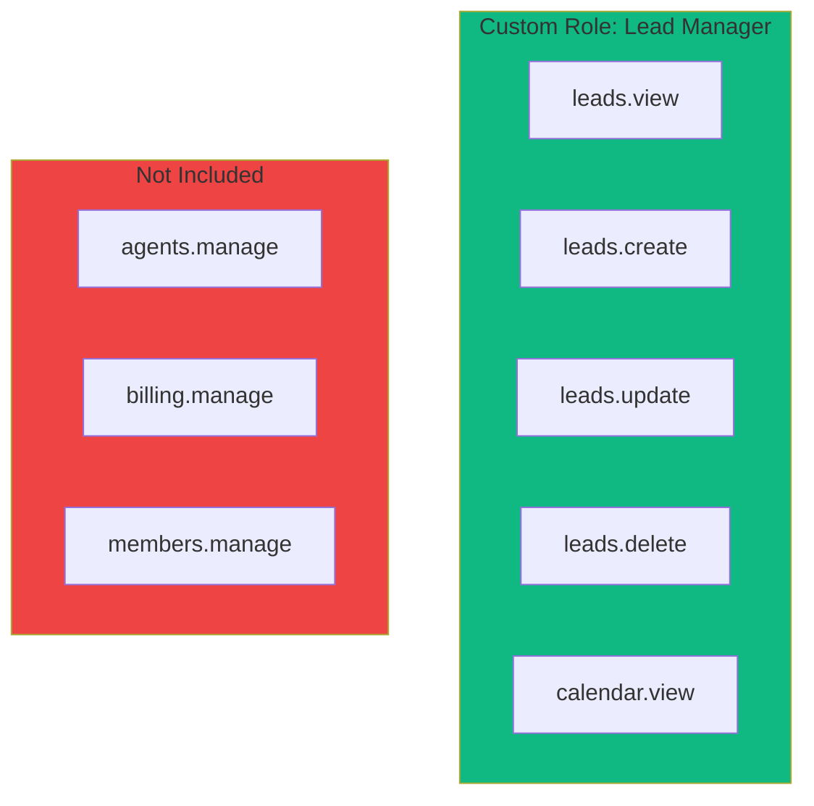
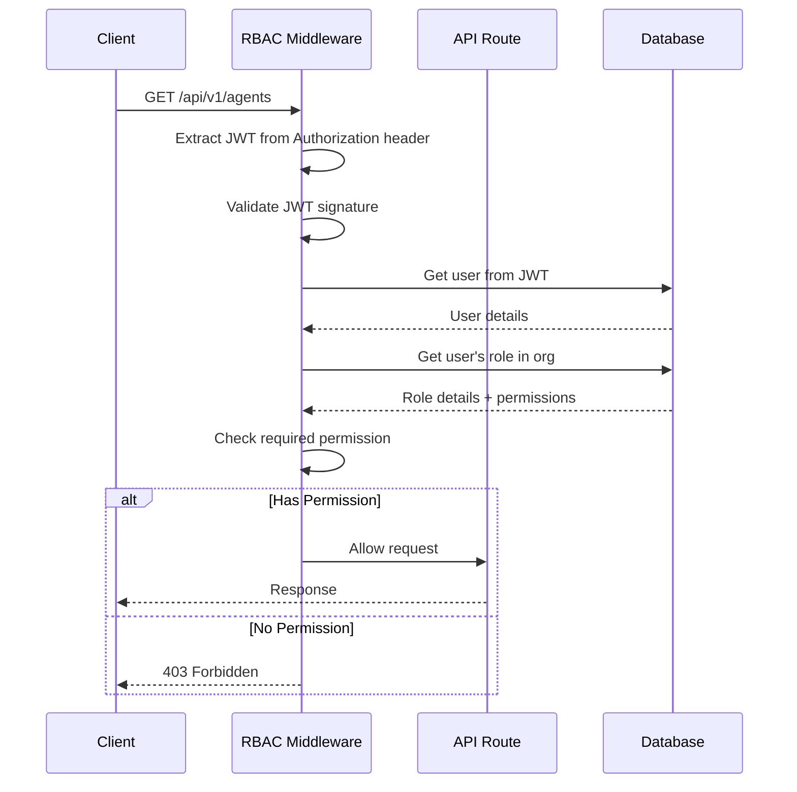
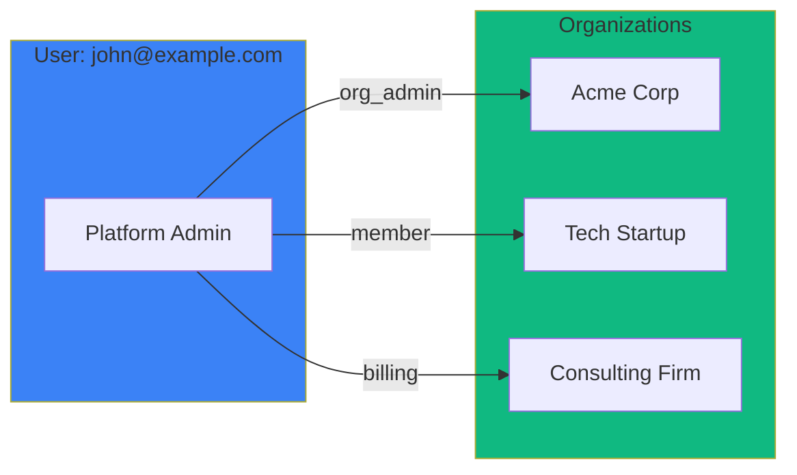
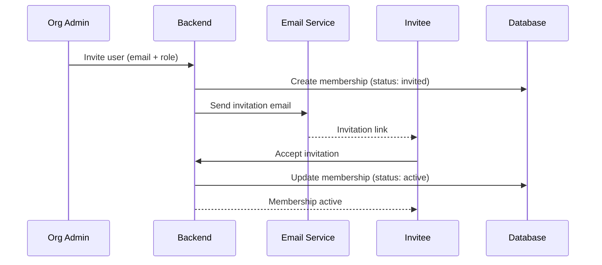

# Authentication & RBAC Feature

## Overview

The platform provides comprehensive authentication and authorization through a combination of Supabase Auth, password-based authentication, OAuth integration (Google), and a fine-grained Role-Based Access Control (RBAC) system.

## What It Provides

- ✅ **Multiple Authentication Methods**: Password-based and Google OAuth
- ✅ **Secure Session Management**: JWT tokens with refresh tokens
- ✅ **Multi-Tenant Support**: Users can belong to multiple organizations
- ✅ **Role-Based Access Control**: Fine-grained permissions per user per organization
- ✅ **Predefined Roles**: Built-in roles for common scenarios
- ✅ **Custom Roles**: Platform admins can create custom roles
- ✅ **Organization Isolation**: Users only access their organization's data
- ✅ **Email Verification**: Secure account verification
- ✅ **Password Reset**: Secure password reset flow

## Architecture



## Authentication Methods

### 1. Password-Based Authentication

**Flow**:


**Implementation**:
- Passwords hashed using secure algorithm (bcrypt/Argon2)
- Supabase handles password validation
- Returns JWT access token (short-lived) + refresh token
- Tokens stored securely (httpOnly cookies recommended)

**Endpoints**:
```
POST /api/v1/auth/signup     User registration
POST /api/v1/auth/login      User login
POST /api/v1/auth/logout     User logout
POST /api/v1/auth/verify-email     Email verification
POST /api/v1/auth/forgot-password   Password reset request
POST /api/v1/auth/reset-password    Password reset
```

### 2. Google OAuth

**Flow**:


**Benefits**:
- No password to remember
- Verified email address
- Single Sign-On (SSO) support
- Faster onboarding

**Endpoints**:
```
GET  /api/v1/auth/oauth/google     Initiate Google OAuth
GET  /api/v1/auth/callback/google   Handle Google OAuth callback
```

### 3. Session Management

**Token Types**:

| Token Type | Purpose | Lifetime | Storage |
|------------|---------|-----------|---------|
| **Access Token** | API authentication | 15-60 minutes | Memory/Session |
| **Refresh Token** | Get new access token | 7-30 days | Secure storage (httpOnly cookie) |

**Refresh Flow**:


## Role-Based Access Control (RBAC)

### Concepts

**Permission**: Fine-grained capability (e.g., `agents.create`, `billing.view`)
**Role**: Collection of permissions (e.g., `org_admin` has many permissions)
**Assignment**: Users have one role per organization

### Predefined Roles

#### platform_admin
- **Scope**: Platform-wide
- **Access**: Can manage platform configuration
- **Permissions**:
  - Create/edit/delete any role
  - Manage platform tools
  - View all organizations
  - Platform-level operations

#### org_admin
- **Scope**: Single organization
- **Access**: Full control within organization
- **Permissions**:
  - Manage organization settings
  - Invite/manage members
  - Create agents
  - Manage tools
  - Manage billing
  - All `member` permissions

#### member
- **Scope**: Single organization
- **Access**: Standard team member
- **Permissions**:
  - View organization data
  - View agents
  - View tools (without sensitive config)
  - View billing summary

#### billing
- **Scope**: Single organization
- **Access**: Billing management only
- **Permissions**:
  - View billing details
  - Update payment methods
  - View invoices
  - Manage subscriptions

### Custom Roles

Platform admins can create custom roles with specific permissions:



### Permission Format

Permissions follow pattern: `resource.action`

**Examples**:
- `agents.create` - Create voice agents
- `agents.update` - Update agent configuration
- `agents.delete` - Delete agents
- `agents.view` - View agent details
- `tools.manage` - Manage tool configuration
- `tools.view` - View tool metadata
- `billing.view` - View billing information
- `billing.manage` - Manage billing and subscriptions
- `members.invite` - Invite team members
- `members.manage` - Manage member roles

### User-Organization Relationship

```mermaid
erDiagram
    USER ||--|{ MEMBERSHIP : belongs to
    ORGANIZATION ||--|{ MEMBERSHIP : has members
    ROLE ||--|{ MEMBERSHIP : assigned to
    ROLE ||--|{ ROLE_PERMISSION : has permissions
    PERMISSION ||--|{ ROLE_PERMISSION : belongs to

    USER {
        uuid id
        string email
        string full_name
        boolean is_platform_admin
    }
    ORGANIZATION {
        uuid id
        string name
        string slug
        numeric credit_balance
    }
    ROLE {
        uuid id
        string name
        string description
        boolean is_platform_role
    }
    PERMISSION {
        uuid id
        string key
        string description
    }
    MEMBERSHIP {
        uuid id
        uuid user_id
        uuid org_id
        uuid role_id
        string status
        timestamp joined_at
    }
```

**Key Rule**: One role per user per organization (enforced by UNIQUE constraint)

## Authorization Flow

### API Request Authorization



### Permission Check Implementation

**Backend**:
```python
from shared.rbac.decorators import require_permission

@router.get("/agents")
@require_permission("agents.view")
async def get_agents(org_id: str):
    """Only users with agents.view permission can access."""
    # Business logic
    pass
```

**Database (RLS)**:
```sql
-- Row-Level Security Policy
CREATE POLICY "org_select_for_members" ON organizations
FOR SELECT USING (
    EXISTS (
        SELECT 1 FROM memberships
        WHERE memberships.org_id = organizations.id
        AND memberships.user_id = auth.uid()::uuid
        AND memberships.status = 'active'
    )
);
```

### Frontend Guards

```typescript
import { useRBAC } from '@/hooks/use-rbac';

function AgentManagement() {
    const { hasPermission } = useRBAC();

    return (
        <div>
            {hasPermission('agents.create') && (
                <Button>Create Agent</Button>
            )}
            {hasPermission('agents.update') && (
                <Button>Update Agent</Button>
            )}
        </div>
    );
}
```

## Organization Management

### Multi-Organization Support

Users can belong to multiple organizations:



**User Perspective**:
- John is `org_admin` at Acme Corp (full control)
- John is `member` at Tech Startup (view only)
- John is `billing` at Consulting Firm (billing access only)

### Organization Membership Status

| Status | Description | Actions Allowed |
|--------|-------------|-----------------|
| `invited` | User invited but not yet joined | Can accept invitation |
| `active` | User is active member | Full permissions per role |
| `suspended` | User temporarily suspended | No access to org |

### Invitation Flow



## API Endpoints

### Authentication

```
POST /api/v1/auth/signup              User registration
POST /api/v1/auth/login               User login
POST /api/v1/auth/logout              User logout
POST /api/v1/auth/verify-email        Email verification
POST /api/v1/auth/forgot-password     Password reset request
POST /api/v1/auth/reset-password      Password reset
POST /api/v1/auth/refresh            Refresh access token
GET  /api/v1/auth/oauth/google       Initiate Google OAuth
GET  /api/v1/auth/callback/google     Google OAuth callback
GET  /api/v1/auth/me                Get current user
```

### Organization Management

```
POST   /api/v1/organizations               Create organization
GET    /api/v1/organizations/{id}        Get organization
PUT    /api/v1/organizations/{id}        Update organization
DELETE /api/v1/organizations/{id}        Delete organization
```

### Membership Management

```
GET    /api/v1/organizations/{org_id}/members        List members
POST   /api/v1/organizations/{org_id}/members/invite  Invite member
PUT    /api/v1/organizations/{org_id}/members/{id}    Update member role/status
DELETE /api/v1/organizations/{org_id}/members/{id}    Remove member
POST   /api/v1/members/accept/{token}               Accept invitation
```

### Role & Permission Management

```
GET    /api/v1/roles                      List roles
GET    /api/v1/roles/{id}               Get role details
POST   /api/v1/roles                   Create role (platform admin)
PUT    /api/v1/roles/{id}               Update role (platform admin)
DELETE /api/v1/roles/{id}               Delete role (platform admin)
GET    /api/v1/permissions               List permissions
POST   /api/v1/permissions             Create permission (platform admin)
```

## Security Features

### Password Security

- Secure hashing (bcrypt/Argon2)
- Minimum password requirements
- Rate limiting on login attempts
- Brute-force protection

### Token Security

- JWT tokens with short expiration
- Refresh tokens rotation
- Token revocation on logout
- Secure token storage (httpOnly cookies recommended)

### CSRF Protection

- OAuth state parameter
- Same-site cookie attributes
- CSRF tokens for state-changing operations

### Row-Level Security (RLS)

- Database-level access control
- Organization isolation enforced at DB layer
- No cross-tenant data leakage possible
- Defense in depth (app + DB layers)

### Audit Logging

Track critical operations:
- User login/logout
- Role changes
- Permission changes
- Billing events
- Organization deletions

## Configuration

### Authentication Settings

Environment variables:
```bash
# Supabase Auth
SUPABASE_URL=https://your-project.supabase.co
SUPABASE_ANON_KEY=your-anon-key
SUPABASE_SERVICE_KEY=your-service-key

# JWT Settings
JWT_SECRET_KEY=your-jwt-secret
JWT_ACCESS_TOKEN_EXPIRE_MINUTES=15
JWT_REFRESH_TOKEN_EXPIRE_DAYS=30

# OAuth
GOOGLE_OAUTH_CLIENT_ID=your-client-id
GOOGLE_OAUTH_CLIENT_SECRET=your-client-secret
GOOGLE_OAUTH_REDIRECT_URI=https://your-app.com/auth/callback/google

# Password Policy
MIN_PASSWORD_LENGTH=8
REQUIRE_UPPERCASE=true
REQUIRE_LOWERCASE=true
REQUIRE_NUMBER=true
REQUIRE_SPECIAL_CHAR=true
```

### RBAC Configuration

Database seeds predefined roles:
- platform_admin
- org_admin
- member
- billing

Custom roles created by platform admins via UI.

## Troubleshooting

### Login Fails

**Check**:
1. Email/password correct
2. Account is verified (check email)
3. Account is not suspended
4. Rate limiting not triggered

### OAuth Callback Fails

**Check**:
1. OAuth redirect URI matches registered value
2. OAuth client ID/secret correct
3. User authorized access
4. Network connectivity to OAuth provider

### Permission Denied

**Check**:
1. User has active membership in organization
2. User's role includes required permission
3. JWT token is valid (not expired)
4. Role status is active (not suspended)

### Invitation Not Received

**Check**:
1. Email address is correct
2. Email not in spam folder
3. Email service (Resend) is configured
4. Invitation token is valid (not expired)

## Best Practices

### For Users

- Use strong, unique passwords
- Enable 2FA when available
- Log out from shared devices
- Monitor organization membership list
- Report suspicious activity

### For Developers

- Always validate JWT tokens on protected routes
- Use RBAC decorators for permission checks
- Implement RLS policies in database
- Log authentication/authorization failures
- Use httpOnly cookies for refresh tokens
- Validate OAuth state parameter
- Implement rate limiting on auth endpoints

### For Administrators

- Create custom roles based on least privilege
- Regularly audit user permissions
- Review membership list for unauthorized users
- Monitor failed login attempts
- Keep OAuth credentials secure
- Rotate secrets regularly

## Related Documentation

- [Multi-Tenancy Feature](../multi_tenancy/overview.md) - Organization management
- [API Guidelines](../../04_development/api_guidelines.md) - API development standards
- [Database Schema](../../01_architecture/database_schema.md) - Database structure
- [Development Guides](../../03_development/) - Development workflows

## Next Steps

1. **Set Up Authentication**: Configure Supabase Auth
2. **Configure OAuth**: Set up Google OAuth integration
3. **Seed RBAC**: Run database seeds for predefined roles
4. **Test Flows**: Verify signup, login, OAuth, and RBAC
5. **Implement Guards**: Add RBAC checks to frontend/backend

---

For detailed implementation guides, see [Development Guides](../../03_development/).
