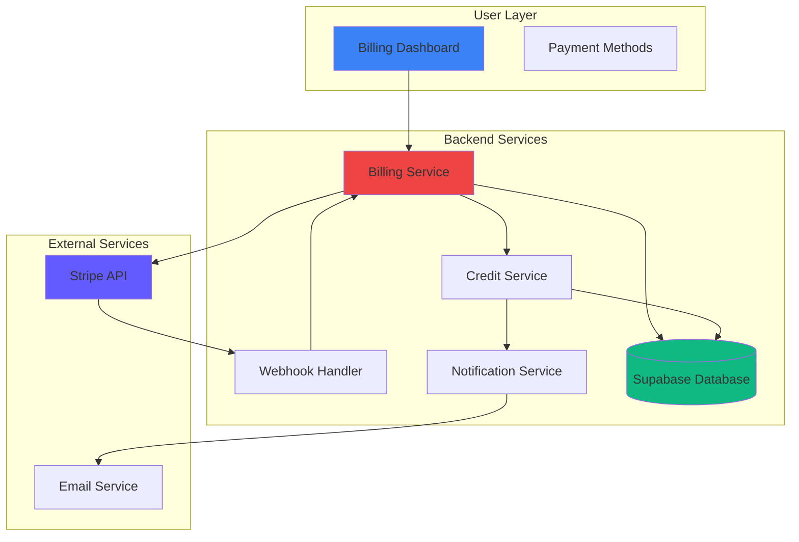
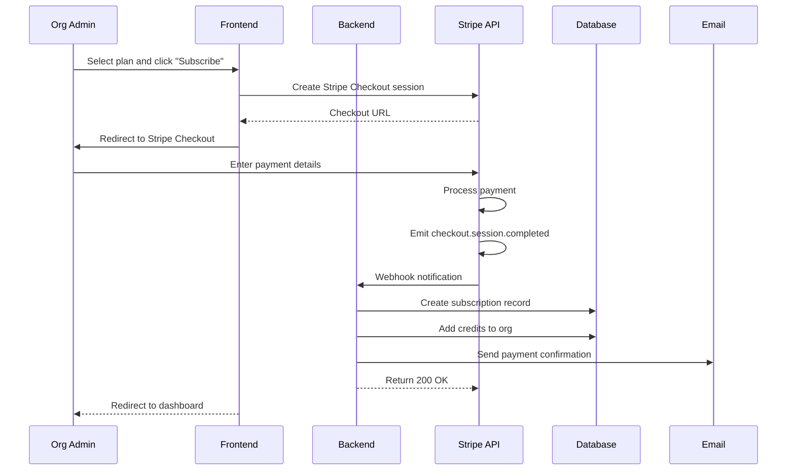
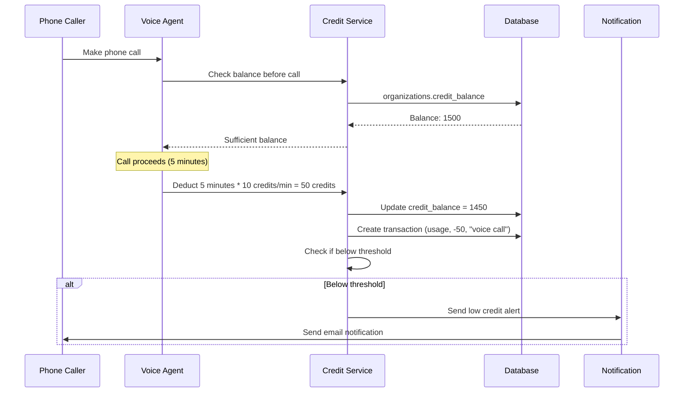
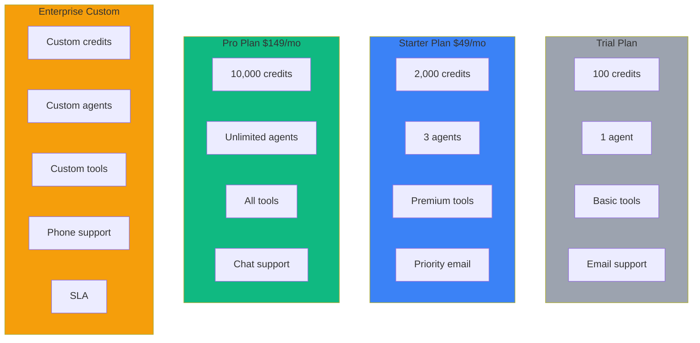

# Billing & Payments Feature

## Overview

The billing system manages subscriptions, payments, and credit-based usage tracking through Stripe integration. Organizations purchase plans, receive credits, and consume credits through platform usage (voice agent calls, tool execution, etc.).

## What It Provides

- ✅ **Stripe Integration**: Secure payment processing
- ✅ **Subscription Plans**: Multiple pricing tiers (trial, starter, pro, enterprise)
- ✅ **Credit Management**: Track usage and credit balance
- ✅ **Automatic Billing**: Recurring monthly/annual charges
- ✅ **Webhook Handling**: Real-time payment status updates
- ✅ **Idempotent Processing**: Safe webhook handling
- ✅ **Usage Tracking**: Monitor credit consumption
- ✅ **Low Credit Alerts**: Notifications when credits are running low
- ✅ **Invoice Management**: Track payment history
- ✅ **Proration**: Proportional billing for plan changes

## Architecture



## Core Concepts

### Plans

Plans define pricing and included resources:

| Plan | Price/Month | Included Credits | Features |
|------|-------------|------------------|-----------|
| **Trial** | Free | 100 | 1 agent, basic tools |
| **Starter** | $49 | 2,000 | 3 agents, premium tools |
| **Pro** | $149 | 10,000 | Unlimited agents, all tools |
| **Enterprise** | Custom | Custom | Dedicated support, custom integrations |

**Plan Attributes**:
- Price (monthly/annual)
- Included credits
- Agent limit
- Tool access level
- Support tier
- Billing interval (monthly/annual)

### Subscriptions

Subscription tracks organization's billing status:

**Status Flow**:
```
trialing → active → past_due → (cancel) → canceled
                     ↓
                  incomplete
```

**Status Descriptions**:
- `trialing`: Free trial period
- `active`: Subscription is active and payments are current
- `past_due`: Payment failed, subscription past due date
- `canceled`: Subscription canceled, access ends at period end
- `incomplete`: Initial payment failed

### Credits

Credits are consumed for platform usage:

**Credit Sources**:
- Plan renewal (monthly allocation)
- Top-up purchases
- Adjustments (manual/admin actions)

**Credit Consumption**:
- Voice agent calls (per minute)
- Tool execution (per call)
- SMS notifications (per message)
- Additional features

**Credit Tracking**:
```sql
organizations.credit_balance       -- Current balance
credit_transactions              -- Transaction history
  - amount (positive or negative)
  - type (usage, topup, adjustment)
  - reason
  - metadata
```

## Payment Flows

### Subscription Creation



### Webhook Handling

**Webhook Events**:

| Event | Description | Backend Action |
|-------|-------------|-----------------|
| `checkout.session.completed` | Payment successful | Create subscription, add credits |
| `invoice.payment_succeeded` | Recurring payment | Add credits, update status |
| `invoice.payment_failed` | Payment failed | Update status to past_due, send alert |
| `customer.subscription.updated` | Subscription changed | Update plan, prorate |
| `customer.subscription.deleted` | Subscription canceled | Update status to canceled |

**Idempotent Processing**:
```python
async def handle_webhook(event: StripeEvent):
    # Store processed event IDs
    if await is_event_processed(event.id):
        logger.info(f"Event {event.id} already processed")
        return

    # Process event
    await process_event(event)

    # Mark as processed
    await mark_event_processed(event.id)
```

**Retry Logic**:
- If processing fails, return non-2xx
- Stripe retries webhook delivery
- Implement exponential backoff
- Alert on repeated failures

### Credit Usage



## Pricing Model

### Credit Pricing

| Action | Credit Cost | Description |
|---------|-------------|-------------|
| Voice call (per minute) | 10 credits | Including agent and LLM processing |
| Tool execution (per call) | 5 credits | Any tool function called by agent |
| SMS notification | 2 credits | Outbound SMS message |
| Additional features | Variable | Future features |

### Plan Comparison



## API Endpoints

### Billing Management

```
GET    /api/v1/organizations/{org_id}/billing           Get billing summary
POST   /api/v1/organizations/{org_id}/subscriptions    Create subscription
GET    /api/v1/organizations/{org_id}/subscriptions    Get subscription
PUT    /api/v1/organizations/{org_id}/subscriptions    Update subscription
DELETE /api/v1/organizations/{org_id}/subscriptions    Cancel subscription
```

### Credit Management

```
GET    /api/v1/organizations/{org_id}/credits          Get credit balance
GET    /api/v1/organizations/{org_id}/transactions   Get credit transactions
POST   /api/v1/organizations/{org_id}/credits/topup  Manual credit top-up
```

### Stripe Webhooks

```
POST   /api/v1/stripe/webhook                       Stripe webhook handler
```

### Payment Methods

```
GET    /api/v1/organizations/{org_id}/payment-methods   List payment methods
POST   /api/v1/organizations/{org_id}/payment-methods   Add payment method
DELETE /api/v1/organizations/{org_id}/payment-methods/{id}  Remove payment method
```

### Invoices

```
GET    /api/v1/organizations/{org_id}/invoices        List invoices
GET    /api/v1/organizations/{org_id}/invoices/{id} Get invoice details
GET    /api/v1/organizations/{org_id}/invoices/{id}/download  Download invoice PDF
```

## Database Schema

### Key Tables

**subscriptions**
```sql
CREATE TABLE subscriptions (
    id uuid PRIMARY KEY DEFAULT gen_random_uuid(),
    org_id uuid REFERENCES organizations(id),
    plan_id uuid REFERENCES plans(id),
    stripe_subscription_id text UNIQUE,
    stripe_customer_id text,
    status text, -- trialing, active, past_due, canceled
    start_date timestamptz,
    end_date timestamptz,
    cancel_at_period_end boolean DEFAULT false,
    created_at timestamptz DEFAULT now(),
    updated_at timestamptz DEFAULT now()
);
```

**credit_transactions**
```sql
CREATE TABLE credit_transactions (
    id uuid PRIMARY KEY DEFAULT gen_random_uuid(),
    org_id uuid REFERENCES organizations(id),
    amount numeric NOT NULL, -- positive for topups, negative for usage
    type text NOT NULL, -- usage, topup, adjustment
    reason text,
    metadata jsonb,
    created_at timestamptz DEFAULT now()
);
```

**stripe_event_logs**
```sql
CREATE TABLE stripe_event_logs (
    id uuid PRIMARY KEY DEFAULT gen_random_uuid(),
    stripe_event_id text UNIQUE NOT NULL,
    event_type text NOT NULL,
    processed boolean DEFAULT false,
    processed_at timestamptz,
    error_message text,
    created_at timestamptz DEFAULT now()
);
```

## Security & Reliability

### Webhook Security

1. **Signature Verification**:
   ```python
   import stripe

   # Verify webhook signature
   sig_header = request.headers.get('Stripe-Signature')
   event = stripe.Webhook.construct_event(
       payload, sig_header, STRIPE_WEBHOOK_SECRET
   )
   ```

2. **Idempotency**:
   - Store processed event IDs
   - Check before processing
   - Prevent duplicate credit additions

3. **Retry Handling**:
   - Return 2xx for successful processing
   - Return 4xx/5xx to trigger retry
   - Implement exponential backoff
   - Alert on repeated failures

### Credit Enforcement

```python
async def deduct_credits(org_id: str, amount: int, reason: str):
    """Deduct credits with insufficient balance check."""
    balance = await get_credit_balance(org_id)

    if balance < amount:
        raise InsufficientCreditsError(
            f"Insufficient credits: {balance} < {amount}"
        )

    await update_credit_balance(org_id, balance - amount)
    await create_transaction(org_id, -amount, 'usage', reason)

    # Check if below threshold
    if balance - amount < LOW_CREDIT_THRESHOLD:
        await send_low_credit_alert(org_id)
```

### Data Integrity

- Database transactions for credit operations
- Audit logging for all billing changes
- Regular reconciliation with Stripe
- Backup and recovery procedures

## Monitoring & Alerts

### Key Metrics

- Subscription conversion rate
- Churn rate
- Average revenue per user (ARPU)
- Credit consumption rate
- Payment success rate
- Webhook processing success rate

### Alerts

- Payment failures
- High churn risk
- Unusual credit consumption
- Webhook processing failures
- API errors from Stripe

## Configuration

### Environment Variables

```bash
# Stripe Configuration
STRIPE_API_KEY=sk_live_xxxxxxxxx
STRIPE_PUBLISHABLE_KEY=pk_live_xxxxxxxxx
STRIPE_WEBHOOK_SECRET=whsec_xxxxxxxxx
STRIPE_WEBHOOK_ENDPOINT=https://your-api.com/api/v1/stripe/webhook

# Billing Settings
DEFAULT_PLAN_ID=trial
LOW_CREDIT_THRESHOLD=500  # Alert when below this amount
CREDIT_COST_PER_VOICE_MINUTE=10
CREDIT_COST_PER_TOOL_CALL=5

# Retry Settings
WEBHOOK_MAX_RETRIES=3
WEBHOOK_RETRY_DELAY_MS=5000
```

## Billing Operations

### Stripe Management Tool

The platform includes a CLI tool for managing Stripe products and prices:

```bash
# Run from backend directory
python scripts/stripe_manager.py

# Commands:
- list-plans      List all Stripe plans
- create-plan     Create new plan
- update-plan     Update plan pricing
- sync-plans       Sync Stripe plans to database
```

**Features**:
- List products and prices
- Create/update products
- Sync with database
- Test webhook delivery

### Manual Adjustments

Admin can manually adjust credits:

```python
async def manual_credit_adjustment(
    org_id: str,
    amount: int,
    reason: str,
    admin_id: str
):
    """Admin action to adjust credits."""
    # Credit compensation
    # Usage correction
    # Promotional credits
    await update_credit_balance(org_id, current_balance + amount)
    await create_transaction(
        org_id,
        amount,
        'adjustment',
        reason,
        admin_id=admin_id
    )
    await send_credit_adjustment_email(org_id, amount, reason)
```

## Troubleshooting

### Payment Not Processing

**Check**:
1. Stripe API keys are correct (live vs test mode)
2. Webhook endpoint is publicly accessible
3. Webhook signature verification is working
4. Database has space for new records
5. Network connectivity to Stripe

### Credits Not Adding

**Check**:
1. Webhook event is being received
2. Event is not already processed
3. Database transaction is committing
4. Credit amount is positive
5. Organization ID is correct

### Webhook Failures

**Check**:
1. Stripe-Signature header is present
2. Webhook secret matches environment
3. Payload is valid JSON
4. Database is not locked
5. Application is not crashing

### Incorrect Credit Balance

**Check**:
1. Credit transactions table is accurate
2. No duplicate transactions
3. Webhook idempotency is working
4. Reconcile with Stripe dashboard

## Best Practices

### For Users

- Set up automatic payments
- Monitor credit consumption
- Choose appropriate plan tier
- Update payment methods before expiration
- Respond to low credit alerts promptly

### For Developers

- Always verify webhook signatures
- Implement idempotent processing
- Use database transactions
- Log all billing operations
- Test with Stripe test mode first
- Monitor webhook processing errors
- Implement retry logic with backoff

### For Administrators

- Review billing reports regularly
- Investigate high churn rates
- Analyze credit consumption patterns
- Monitor webhook delivery success rates
- Keep Stripe keys secure
- Test payment flows regularly

## Related Documentation

- [Payment Flow](../../03_implementation/payment_flow.md) - Detailed payment workflows
- [Stripe Integration](../../03_implementation/stripe_integration.md) - Implementation details
- [Product Requirements](../../05_business/prd.md) - Business requirements
- [Database Schema](../../01_architecture/database_schema.md) - Database structure

## Next Steps

1. **Set Up Stripe**: Create Stripe account and configure products
2. **Configure Webhooks**: Set up webhook endpoint
3. **Test Flows**: Test subscription creation, payments, webhooks
4. **Monitor**: Set up monitoring and alerts
5. **Optimize**: Adjust pricing based on usage patterns

---

For detailed implementation guides, see [Development Guides](../../03_development/).
