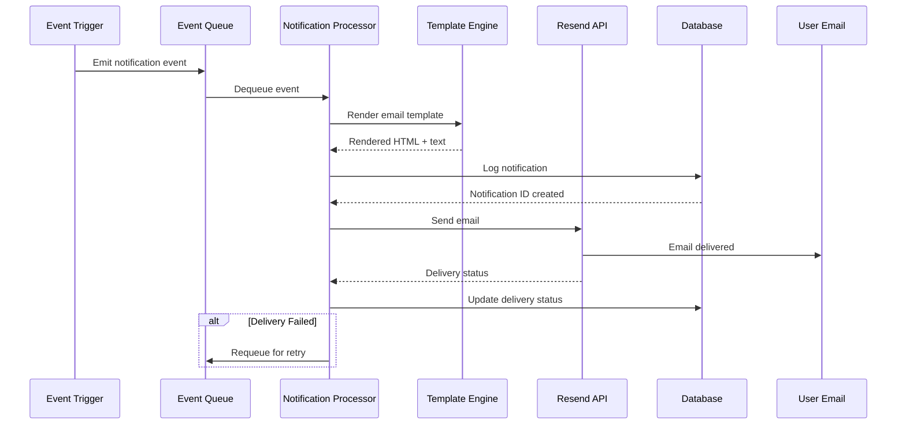
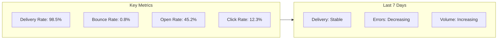

# Notifications Feature

## Overview

The notification system delivers transactional emails to users for critical events like account verification, password resets, team invitations, subscription changes, and credit alerts. The system integrates with Resend.com for reliable email delivery.

## What It Provides

- ✅ **Email Notifications**: Transactional emails for all critical events
- ✅ **Resend Integration**: Reliable email delivery via Resend.com
- ✅ **Event Types**: Multiple notification categories
- ✅ **Templated Emails**: Consistent, branded email templates
- ✅ **Retry Logic**: Automatic retry on delivery failures
- ✅ **Tracking**: Email delivery status and tracking
- ✅ **Multi-language Support**: Extensible for international users
- ✅ **HTML & Text**: Both HTML and plain text formats

## Architecture

```mermaid
graph TB
    subgraph Platform["Platform Services"]
        Auth[Auth Service]
        Billing[Billing Service]
        Credit[Credit Service]
        Org[Organization Service]
    end

    subgraph Notification["Notification System"]
        Queue[Event Queue]
        Processor[Notification Processor]
        Templates[Email Templates]
        Notif[(Notification Logs)]
    end

    subgraph External["External Services"]
        Resend[Resend.com API]
    end

    subgraph User["User Layer"]
        User[Email Inbox]
    end

    Auth --> Queue
    Billing --> Queue
    Credit --> Queue
    Org --> Queue

    Queue --> Processor
    Processor --> Templates
    Processor --> Notif
    Processor --> Resend
    Resend --> User

    Notif --> Processor

    style Processor fill:#ef4444
    style Resend fill:#10b981
    style Queue fill:#3b82f6
```

## Event Types

### Account Events

| Event | Description | Recipients |
|-------|-------------|-------------|
| `email.verification` | Verify email address after signup | New user |
| `password.reset_request` | Request to reset password | User |
| `password.reset_success` | Password successfully reset | User |
| `account.created` | New account created | User |

### Organization Events

| Event | Description | Recipients |
|-------|-------------|-------------|
| `org.invite` | User invited to organization | Invitee |
| `org.invite_accepted` | Invitation accepted | Inviter |
| `org.member_removed` | Member removed from org | Removed user |
| `org.role_changed` | Member role changed | Affected member |

### Billing Events

| Event | Description | Recipients |
|-------|-------------|-------------|
| `subscription.created` | New subscription created | Org admins |
| `subscription.updated` | Subscription plan changed | Org admins |
| `subscription.canceled` | Subscription canceled | Org admins |
| `invoice.payment_succeeded` | Payment successful | Org admins |
| `invoice.payment_failed` | Payment failed | Org admins |
| `credit.low` | Credits below threshold | Org admins |
| `credit.topup` | Manual credit top-up | Org admins |

## Notification Flow

### Event-Driven Notification



### Event Emission

Services emit notification events:

```python
# Email Verification
async def send_verification_email(user_id: str):
    event = NotificationEvent(
        type='email.verification',
        user_id=user_id,
        data={
            'verification_token': generate_token(),
            'expires_in_hours': 24
        }
    )
    await emit_notification_event(event)

# Password Reset
async def send_password_reset(user_id: str):
    event = NotificationEvent(
        type='password.reset_request',
        user_id=user_id,
        data={
            'reset_token': generate_token(),
            'expires_in_hours': 1
        }
    )
    await emit_notification_event(event)

# Org Invitation
async def send_org_invite(org_id: str, email: str, role_id: str):
    event = NotificationEvent(
        type='org.invite',
        email=email,
        data={
            'org_name': get_org_name(org_id),
            'role_name': get_role_name(role_id),
            'invite_token': generate_invite_token(org_id, email, role_id)
        }
    )
    await emit_notification_event(event)
```

### Email Templates

Templates use Jinja2 for dynamic content:

**Subject Lines**:
```html
{{ greeting }} {{ user_name }}!

    Verify your email address

    Reset your password

```

**HTML Body**:
```html
<!DOCTYPE html>
<html>
<head>
    <style>
        body { font-family: Arial, sans-serif; }
        .container { max-width: 600px; margin: 0 auto; }
        .button { background: #3b82f6; color: white; padding: 12px 24px; text-decoration: none; }
    </style>
</head>
<body>
    <div class="container">
        <h1>{{ greeting }} {{ user_name }}!</h1>

        
        <p>Thank you for signing up! Please verify your email address by clicking the button below:</p>
        <a href="{{ verification_url }}" class="button">Verify Email</a>
        <p>This link expires in {{ expires_in_hours }} hours.</p>

        
        <p>We received a request to reset your password. Click the button below:</p>
        <a href="{{ reset_url }}" class="button">Reset Password</a>
        <p>This link expires in {{ expires_in_hours }} hours.</p>
        <p>If you didn't request this, please ignore this email.</p>

        
        <p>You've been invited to join <strong>{{ org_name }}</strong> as a <strong>{{ role_name }}</strong>.</p>
        <a href="{{ accept_url }}" class="button">Accept Invitation</a>
        

        <p>Best regards,<br>{{ app_name }} Team</p>
    </div>
</body>
</html>
```

**Plain Text Version**:
```text
{{ greeting }} {{ user_name }}!


Thank you for signing up! Please verify your email address:
{{ verification_url }}

This link expires in {{ expires_in_hours }} hours.

We received a request to reset your password:
{{ reset_url }}

This link expires in {{ expires_in_hours }} hours.
If you didn't request this, please ignore this email.


Best regards,
{{ app_name }} Team
```

## Resend Integration

### Sending Emails

```python
import resend

async def send_email(
    to_email: str,
    subject: str,
    html_content: str,
    text_content: str
) -> dict:
    """Send email via Resend API."""
    try:
        params: resend.Emails.SendParams = {
            'from': f"{APP_NAME} <noreply@{APP_DOMAIN}>",
            'to': [to_email],
            'subject': subject,
            'html': html_content,
            'text': text_content,
        }

        response = await resend.Emails.send(params)
        return response

    except Exception as e:
        logger.error(f"Failed to send email to {to_email}: {e}")
        raise
```

### Retry Logic

```python
MAX_RETRIES = 3
RETRY_DELAY_MS = 5000

async def send_with_retry(notification: Notification, attempt: int = 1):
    """Send email with retry logic."""
    try:
        await send_email(
            notification.to_email,
            notification.subject,
            notification.html_content,
            notification.text_content
        )

        # Mark as sent
        await mark_notification_sent(notification.id)

    except Exception as e:
        logger.error(f"Send attempt {attempt} failed: {e}")

        if attempt < MAX_RETRIES:
            # Requeue with delay
            await asyncio.sleep(RETRY_DELAY_MS / 1000)
            await requeue_notification(notification.id, attempt + 1)
        else:
            # Mark as failed after max retries
            await mark_notification_failed(
                notification.id,
                error_message=str(e)
            )
            # Alert team
            await alert_team("Email delivery failed", notification)
```

## Database Schema

### Notifications Table

```sql
CREATE TABLE notifications (
    id uuid PRIMARY KEY DEFAULT gen_random_uuid(),
    type text NOT NULL,
    user_id uuid REFERENCES users(id),
    email text NOT NULL,
    subject text NOT NULL,
    html_content text NOT NULL,
    text_content text NOT NULL,
    status text DEFAULT 'pending', -- pending, sent, failed
    delivery_status text, -- delivered, bounced, rejected
    resend_id text,
    error_message text,
    retry_count int DEFAULT 0,
    created_at timestamptz DEFAULT now(),
    sent_at timestamptz,
    metadata jsonb
);
```

### Indexes

```sql
CREATE INDEX idx_notifications_user_id ON notifications(user_id);
CREATE INDEX idx_notifications_status ON notifications(status);
CREATE INDEX idx_notifications_created_at ON notifications(created_at DESC);
CREATE INDEX idx_notifications_resend_id ON notifications(resend_id);
```

## Configuration

### Environment Variables

```bash
# Resend Configuration
RESEND_API_KEY=re_xxxxxxxxx
RESEND_FROM=noreply@yourapp.com
RESEND_FROM_NAME="Your App Name"

# Notification Settings
ENABLE_EMAIL_NOTIFICATIONS=true
EMAIL_VERIFICATION_EXPIRE_HOURS=24
PASSWORD_RESET_EXPIRE_HOURS=1
INVITE_TOKEN_EXPIRE_DAYS=7

# Retry Settings
MAX_EMAIL_RETRIES=3
EMAIL_RETRY_DELAY_MS=5000

# Alert Settings
ALERT_TEAM_ON_FAILURE=true
ALERT_EMAIL=team@yourcompany.com

# Template Settings
EMAIL_TEMPLATE_DIR=/app/templates
APP_NAME=AI Voice Agent Platform
APP_DOMAIN=yourapp.com
```

### Email Branding

Customize email appearance:
```html
<!-- Brand colors and fonts -->
<style>
    :root {
        --primary-color: #3b82f6;
        --secondary-color: #64748b;
        --background-color: #ffffff;
        --text-color: #0f172a;
    }

    body {
        font-family: 'Segoe UI', Tahoma, Geneva, Verdana, sans-serif;
        color: var(--text-color);
        background-color: var(--background-color);
    }

    .header {
        background-color: var(--primary-color);
        color: white;
        padding: 20px;
        text-align: center;
    }

    .button {
        background-color: var(--primary-color);
        color: white;
        padding: 12px 24px;
        text-decoration: none;
        border-radius: 4px;
    }
</style>
```

## API Endpoints

### Notification Management

```
GET    /api/v1/users/{user_id}/notifications     List notifications
GET    /api/v1/users/{user_id}/notifications/{id}  Get notification details
POST   /api/v1/users/{user_id}/notifications/resend  Resend notification
```

### Event Emission

Services emit events internally via function calls, not HTTP endpoints.

### Testing

```
POST   /api/v1/notifications/test              Send test email
```

## Monitoring

### Key Metrics

- Email delivery rate
- Email bounce rate
- Email open rate
- Email click rate
- Failed delivery count
- Retry count
- Processing time

### Alerts

- High bounce rate (>10%)
- High failure rate (>5%)
- Resend API errors
- Delivery delays

### Dashboard Metrics



## Best Practices

### Email Content

1. **Clear Subject Lines**: Describe purpose immediately
2. **Concise Body**: Get to the point quickly
3. **Call to Action**: Clear primary action button
4. **Branding**: Consistent colors, logos, and voice
5. **Mobile-Friendly**: Responsive design for mobile devices
6. **Alt Text**: Include alt text for images
7. **Plain Text**: Always include text version

### Security

1. **Token Expiration**: Set reasonable expiration times
2. **Single-Use Tokens**: Invalidate after use
3. **Rate Limiting**: Prevent email abuse
4. **Verification Links**: Verify user identity
5. **No Passwords**: Never send passwords in emails

### Deliverability

1. **SPF/DKIM**: Configure email authentication
2. **Domain Reputation**: Maintain good sending reputation
3. **Bounce Handling**: Process and act on bounces
4. **Complaint Handling**: Handle spam complaints
5. **Clean Lists**: Remove invalid email addresses

## Troubleshooting

### Emails Not Delivered

**Check**:
1. Resend API key is correct
2. Email address is valid
3. Domain SPF/DKIM records are configured
4. Not blocked by spam filters
5. Notification event is being emitted
6. Queue is processing

### High Bounce Rate

**Check**:
1. Email list quality
2. Domain reputation
3. SPF/DKIM/DMARC records
4. Content triggering spam filters
5. Sending rate is not too high

### Deliveries Delayed

**Check**:
1. Queue processing is running
2. Resend API is responding
3. Network connectivity is stable
4. Database is not locked
5. Worker capacity is sufficient

## Related Documentation

- [Stripe Integration](../billing/overview.md) - Payment notifications
- [Authentication & RBAC](../authentication_rbac/overview.md) - Account notifications
- [Multi-Tenancy](../multi_tenancy/overview.md) - Organization notifications
- [Resend Documentation](https://resend.com/docs) - External API reference

## Next Steps

1. **Set Up Resend**: Create Resend account and API key
2. **Configure Templates**: Create email templates for all event types
3. **Test Delivery**: Send test emails to verify formatting
4. **Monitor**: Set up monitoring and alerts
5. **Optimize**: Adjust content and timing based on metrics

---

For detailed implementation guides, see [Development Guides](../../03_development/).
