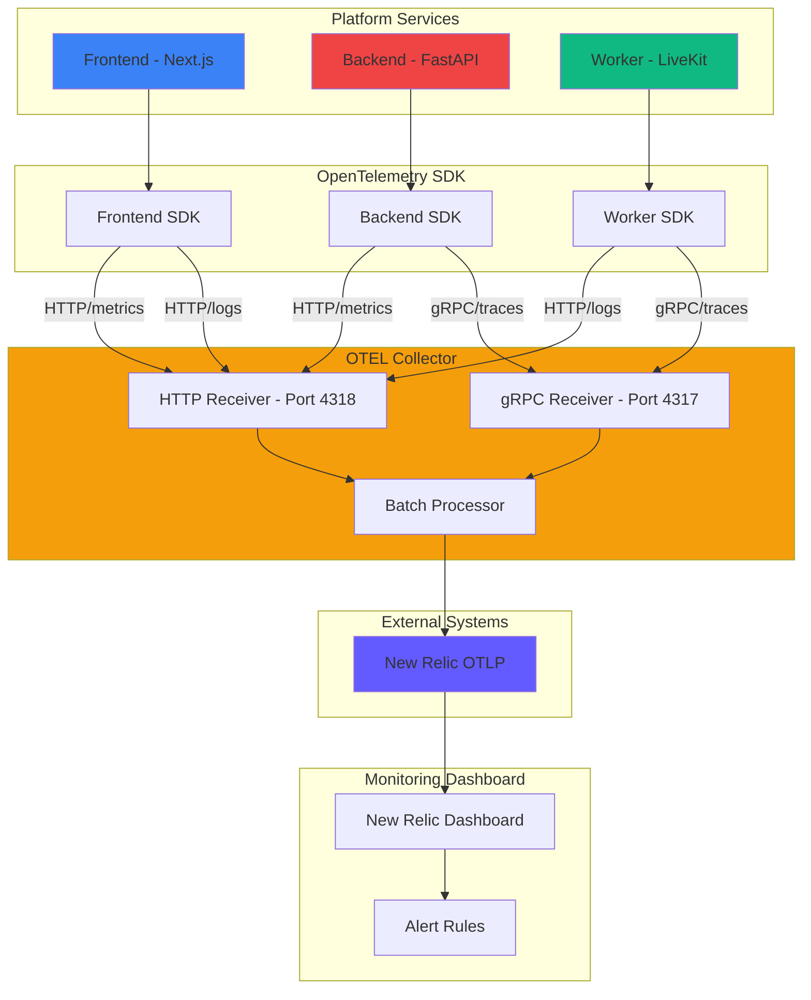
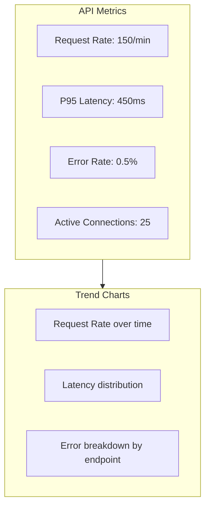
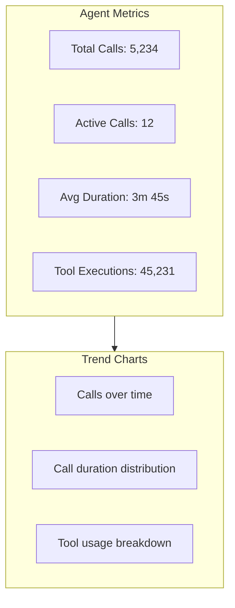

# Observability Feature

## Overview

The observability system provides comprehensive monitoring across all platform services using OpenTelemetry for traces, metrics, and logs. Data is exported to New Relic for visualization, alerting, and analysis.

## What It Provides

- ✅ **Distributed Tracing**: Trace requests across services
- ✅ **Metrics Collection**: Performance and business metrics
- ✅ **Log Aggregation**: Centralized logging with correlation IDs
- ✅ **Real-Time Monitoring**: Live dashboards and alerts
- ✅ **Error Tracking**: Automatic error detection and reporting
- ✅ **Performance Insights**: Identify bottlenecks and slow operations
- ✅ **New Relic Integration**: Professional monitoring dashboard
- ✅ **Manual Instrumentation**: Precise control over telemetry data

## Architecture



## Core Concepts

### Traces

A trace represents the entire journey of a request through the system:

**Example: Voice Agent Call**
```
[Incoming Call] → [Backend Validation] → [LiveKit Room] → [Worker Processing] → [Tool Execution] → [Response]
```

Each step is a **span** with:
- Start and end timestamps
- Parent/child relationships
- Attributes (tags, metadata)
- Events (logs within span)
- Status (OK, error)

### Metrics

Metrics measure numeric values over time:

**Types**:
- **Counter**: Monotonically increasing value (e.g., requests_total)
- **Gauge**: Arbitrary value that goes up/down (e.g., active_connections)
- **Histogram**: Distribution of values (e.g., request_duration_ms)

**Examples**:
```python
# Counter
request_counter.add(1, {"endpoint": "/api/v1/agents", "method": "GET"})

# Gauge
gauge.set(active_calls, {"service": "worker"})

# Histogram
histogram.record(request_duration_ms, {"operation": "tool_execution"})
```

### Logs

Structured logs with correlation to traces:

**Structured Log Example**:
```json
{
    "timestamp": "2026-01-06T18:30:00Z",
    "level": "INFO",
    "trace_id": "abc123",
    "span_id": "def456",
    "service": "backend",
    "message": "Agent configuration loaded",
    "agent_id": "550e8400-e29b-41d4-a716-446655440000",
    "duration_ms": 45
}
```

## Service Instrumentation

### Frontend (Next.js)

**Setup** (`src/lib/opentelemetry.ts`):
```typescript
import { trace, context } from '@opentelemetry/api'
import { OTLPTraceExporter } from '@opentelemetry/exporter-trace-otlp-http'
import { WebTracerProvider } from '@opentelemetry/sdk-trace-web'
import { Resource } from '@opentelemetry/resources'

// Configure exporter
const exporter = new OTLPTraceExporter({
    url: process.env.NEXT_PUBLIC_OTEL_EXPORTER_OTLP_TRACES_ENDPOINT,
})

// Configure provider
const provider = new WebTracerProvider({
    resource: new Resource({
        'service.name': 'frontend',
        'service.version': process.env.NEXT_PUBLIC_APP_VERSION,
        'deployment.environment': process.env.NEXT_PUBLIC_ENVIRONMENT,
    }),
})

provider.addSpanProcessor(new SimpleSpanProcessor(exporter))
trace.setGlobalTracerProvider(provider)

// Create tracer
export const tracer = trace.getTracer('frontend')
```

**Manual Tracing**:
```typescript
import { tracer } from '@/lib/opentelemetry'

async function createAgent(data: AgentCreate) {
    const span = tracer.startSpan('createAgent', {
        attributes: {
            'agent.name': data.name,
            'org.id': data.organization_id,
        },
    })

    try {
        const response = await apiClient.post('/api/v1/agents', data)
        span.setStatus({ code: SpanStatusCode.OK })
        return response
    } catch (error) {
        span.recordException(error as Error)
        span.setStatus({ code: SpanStatusCode.ERROR, message: error.message })
        throw error
    } finally {
        span.end()
    }
}
```

### Backend (FastAPI)

**Setup** (`backend/config/opentelemetry.py`):
```python
from opentelemetry import trace
from opentelemetry.sdk.trace import TracerProvider
from opentelemetry.sdk.trace.export import BatchSpanProcessor
from opentelemetry.exporter.otlp.proto.grpc.trace_exporter import OTLPSpanExporter
from opentelemetry.sdk.resources import Resource

# Configure resource
resource = Resource.create({
    "service.name": "backend",
    "service.version": settings.app_version,
    "deployment.environment": settings.environment,
})

# Configure exporter
exporter = OTLPSpanExporter(
    endpoint=settings.otel_exporter_otlp_traces_endpoint,
    insecure=True
)

# Configure provider
provider = TracerProvider(resource=resource)
processor = BatchSpanProcessor(exporter)
provider.add_span_processor(processor)
trace.set_tracer_provider(provider)

# Create tracer
tracer = trace.get_tracer(__name__)
```

**Manual Tracing**:
```python
from opentelemetry import trace

tracer = trace.get_tracer(__name__)

async def create_agent(agent_data: AgentCreate):
    with tracer.start_as_current_span("create_agent") as span:
        span.set_attribute("agent.name", agent_data.name)
        span.set_attribute("org.id", str(agent_data.organization_id))

        try:
            result = await db.create_agent(agent_data)
            span.set_status(Status(StatusCode.OK))
            return result
        except Exception as e:
            span.record_exception(e)
            span.set_status(Status(StatusCode.ERROR, str(e)))
            raise
```

**Decorator Pattern**:
```python
def trace_operation(operation_name: str):
    """Decorator to trace operations."""
    def decorator(func):
        async def wrapper(*args, **kwargs):
            with tracer.start_as_current_span(operation_name) as span:
                try:
                    result = await func(*args, **kwargs)
                    span.set_status(Status(StatusCode.OK))
                    return result
                except Exception as e:
                    span.record_exception(e)
                    span.set_status(Status(StatusCode.ERROR, str(e)))
                    raise
        return wrapper
    return decorator

# Usage
@trace_operation("agent.create")
async def create_agent(agent_data: AgentCreate):
    # Implementation
    pass
```

### Worker (LiveKit)

**Setup**:
```python
# Worker uses LiveKit's built-in OTEL support
# Configure via environment variables

import os

os.environ['OTEL_SERVICE_NAME'] = 'worker'
os.environ['OTEL_EXPORTER_OTLP_ENDPOINT'] = 'http://otel-collector:4317'
os.environ['OTEL_EXPORTER_OTLP_PROTOCOL'] = 'grpc'
```

**Manual Tracing**:
```python
from opentelemetry import trace

tracer = trace.get_tracer(__name__)

@tracer.start_as_current_span("execute_tool")
async def execute_tool(tool_name: str, context: RunContext, **kwargs):
    current_span = trace.get_current_span()

    # Add attributes
    current_span.set_attribute("tool.name", tool_name)
    current_span.set_attribute("tool.params", str(kwargs))

    try:
        result = await tool_function(context, **kwargs)
        current_span.set_status(Status(StatusCode.OK))
        return result
    except Exception as e:
        current_span.record_exception(e)
        current_span.set_status(Status(StatusCode.ERROR, str(e)))
        raise
```

## OpenTelemetry Collector

### Configuration (`otel-collector-config.yml`)

```yaml
receivers:
  otlp:
    protocols:
      grpc:
        endpoint: 0.0.0.0:4317
      http:
        endpoint: 0.0.0.0:4318

processors:
  batch:
    timeout: 5s
    send_batch_size: 10000

exporters:
  otlp/newrelic:
    # New Relic API Key
    apikey: ${NEW_RELIC_LICENSE_KEY}
    # Endpoint
    endpoint: otlp.nr-data.net:4317
    # Timeout
    timeout: 30s
    # Compression
    compression: gzip

service:
  pipelines:
    traces:
      receivers: [otlp]
      processors: [batch]
      exporters: [otlp/newrelic]
    metrics:
      receivers: [otlp]
      processors: [batch]
      exporters: [otlp/newrelic]
    logs:
      receivers: [otlp]
      processors: [batch]
      exporters: [otlp/newrelic]
```

### Docker Compose Setup

```yaml
services:
  otel-collector:
    image: otel/opentelemetry-collector-contrib:latest
    command: ["--config=/etc/otelcol-contrib/config.yaml"]
    volumes:
      - ./otel-collector-config.yml:/etc/otelcol-contrib/config.yaml
    ports:
      - "4317:4317"   # gRPC (traces, logs)
      - "4318:4318"   # HTTP (metrics)
    environment:
      - NEW_RELIC_LICENSE_KEY=${NEW_RELIC_LICENSE_KEY}
    depends_on:
      - backend-dev
      - worker-dev
      - frontend-dev
```

## Key Metrics to Track

### Performance Metrics

| Metric | Type | Description |
|--------|-------|-------------|
| `http.request.duration` | Histogram | HTTP request duration |
| `http.request.count` | Counter | Total HTTP requests |
| `http.request.errors` | Counter | HTTP request errors |
| `db.query.duration` | Histogram | Database query duration |
| `db.query.count` | Counter | Total database queries |

### Business Metrics

| Metric | Type | Description |
|--------|-------|-------------|
| `voice_agent.calls.total` | Counter | Total voice agent calls |
| `voice_agent.calls.duration` | Histogram | Call duration |
| `voice_agent.calls.active` | Gauge | Currently active calls |
| `tool.executions.total` | Counter | Total tool executions |
| `tool.executions.errors` | Counter | Failed tool executions |
| `credits.consumed` | Counter | Credits consumed |
| `organizations.created` | Counter | New organizations |
| `users.created` | Counter | New users |

### System Metrics

| Metric | Type | Description |
|--------|-------|-------------|
| `process.cpu.usage` | Gauge | CPU usage percentage |
| `process.memory.usage` | Gauge | Memory usage in bytes |
| `process.threads.count` | Gauge | Number of threads |
| `disk.io.bytes` | Counter | Disk I/O bytes |

## Tracing Best Practices

### Span Naming

Use clear, descriptive names:
```
✅ GOOD: "create_voice_agent"
✅ GOOD: "execute_google_calendar_tool"
❌ BAD: "handler"
❌ BAD: "operation"
```

### Span Attributes

Add meaningful context:
```python
span.set_attribute("agent.id", str(agent.id))
span.set_attribute("org.id", str(agent.organization_id))
span.set_attribute("user.id", str(user.id))
span.set_attribute("http.method", "POST")
span.set_attribute("http.status_code", "201")
```

### Span Events

Add events within spans:
```python
span.add_event("tool_loaded", {
    "tool.name": "GoogleCalendar",
    "tool.version": "1.0.0"
})
span.add_event("tool_authenticated", {
    "tool.name": "GoogleCalendar",
    "auth.type": "oauth2"
})
```

### Error Handling

Record exceptions properly:
```python
try:
    result = await risky_operation()
except ValueError as e:
    span.record_exception(e)
    span.set_status(Status(StatusCode.ERROR, "Invalid value"))
    raise
except Exception as e:
    span.record_exception(e)
    span.set_status(Status(StatusCode.ERROR, "Unexpected error"))
    raise
```

## Alerting

### Alert Rules

**High Error Rate**:
```
IF error_rate > 5%
FOR 5 minutes
THEN alert team
```

**Slow API Response**:
```
IF p95(request_duration_ms) > 1000ms
FOR 5 minutes
THEN alert team
```

**Payment Failure**:
```
IF stripe_webhook_errors > 10
FOR 1 minute
THEN alert team
```

**Low Credits**:
```
IF org.credit_balance < 500
FOR ANY organization
THEN alert org admins
```

### Alert Channels

- Email (team@company.com)
- Slack (#alerts)
- PagerDuty (on-call rotation)
- SMS (critical alerts)

## Configuration

### Environment Variables

```bash
# OpenTelemetry Configuration
OTEL_ENABLED=true
OTEL_SERVICE_NAME=ai-voice-agent-platform
OTEL_EXPORTER_OTLP_TRACES_ENDPOINT=http://otel-collector:4317
OTEL_EXPORTER_OTLP_TRACES_PROTOCOL=grpc
OTEL_EXPORTER_OTLP_METRICS_ENDPOINT=http://otel-collector:4318
OTEL_EXPORTER_OTLP_METRICS_PROTOCOL=http/protobuf
OTEL_EXPORTER_OTLP_LOGS_ENDPOINT=http://otel-collector:4318
OTEL_EXPORTER_OTLP_LOGS_PROTOCOL=http/protobuf

# New Relic Configuration
NEW_RELIC_LICENSE_KEY=your-license-key
NEW_RELIC_APP_NAME=AI Voice Agent Platform
NEW_RELIC_ACCOUNT_ID=your-account-id

# Sampling
OTEL_TRACES_SAMPLER=traceidratio
OTEL_TRACES_SAMPLER_ARG=1.0  # 100% sampling in dev
```

## Dashboard Examples

### API Performance Dashboard



### Voice Agent Dashboard



## Troubleshooting

### Missing Traces

**Check**:
1. OTEL_ENABLED=true in environment
2. Collector is running: `docker ps | grep otel-collector`
3. Endpoint URLs are correct
4. Network connectivity between services and collector
5. Exporter configuration matches protocol (gRPC vs HTTP)

### Missing Metrics

**Check**:
1. Metrics exporter is configured
2. Metrics are being emitted
3. Collector has metrics receiver enabled
4. Sampling rate is not too low
5. New Relic API key is correct

### High Sampling Rate

**Adjust**:
```bash
# Reduce sampling in production
OTEL_TRACES_SAMPLER=traceidratio
OTEL_TRACES_SAMPLER_ARG=0.1  # 10% sampling
```

### Slow Collector

**Check**:
1. Batch size is appropriate
2. Timeout is not too long
3. Exporter is responding
4. Network bandwidth is sufficient
5. Memory usage is not causing issues

## Best Practices

### General

1. **Enable Early**: Instrument from day one
2. **Use Structured Logging**: Add context to all logs
3. **Correlate Everything**: Use trace IDs across services
4. **Set Sensible Defaults**: Start with reasonable sampling rates
5. **Monitor Costs**: OTEL can generate a lot of data
6. **Secure Endpoints**: Protect collector endpoints
7. **Version Everything**: Track code versions in traces

### Performance

1. **Use Batching**: Don't export one span at a time
2. **Sample in Production**: 100% sampling can be expensive
3. **Choose Right Protocol**: gRPC for traces, HTTP for metrics
4. **Compress Data**: Use gzip for export
5. **Batch Logs**: Aggregate logs before export

### Alerting

1. **Set Meaningful Thresholds**: Based on actual performance
2. **Avoid Alert Fatigue**: Don't alert on minor blips
3. **Use Hierarchical Alerts**: Warning vs Critical
4. **Include Context**: Alert messages should include relevant details
5. **Test Alerts**: Verify alerts fire when expected
6. **Review Regularly**: Adjust thresholds as system evolves

## Related Documentation

- [OpenTelemetry Implementation](../../03_implementation/opentelemetry_implementation.md) - Implementation details
- [System Architecture](../../01_architecture/system_architecture.md) - Overall architecture
- [New Relic Documentation](https://docs.newrelic.com/) - External documentation
- [OpenTelemetry Documentation](https://opentelemetry.io/docs/) - OTEL reference

## Next Steps

1. **Set Up Collector**: Configure and deploy OTEL collector
2. **Instrument Services**: Add tracing to all services
3. **Create Dashboards**: Build New Relic dashboards
4. **Configure Alerts**: Set up alerting rules
5. **Monitor**: Regularly review metrics and traces
6. **Optimize**: Adjust based on insights from data

---

For detailed implementation guides, see [Development Guides](../../03_development/).
