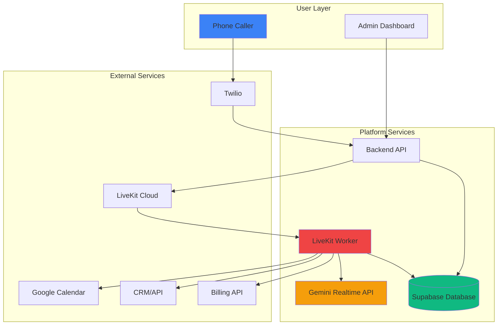
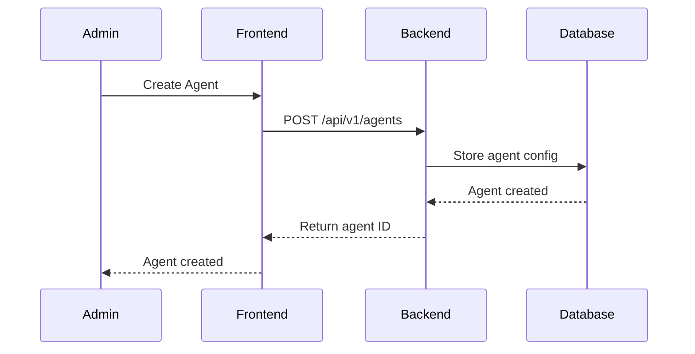
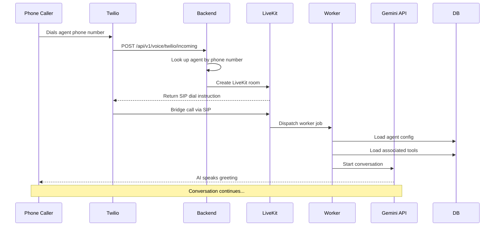
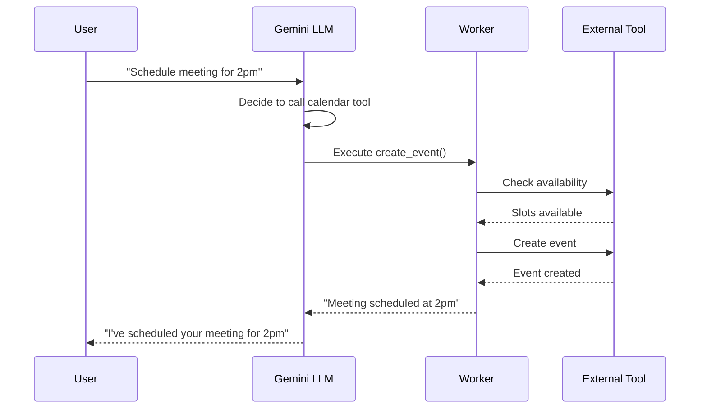
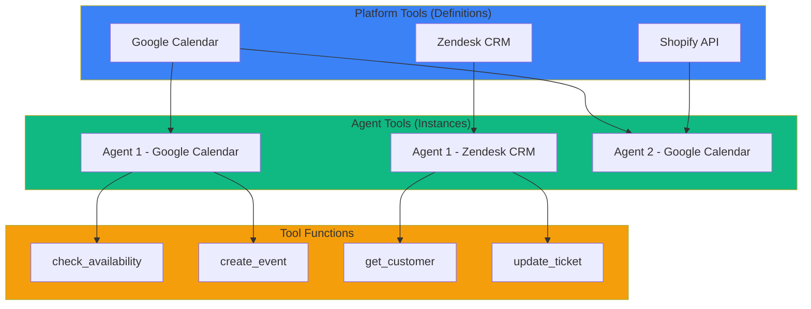
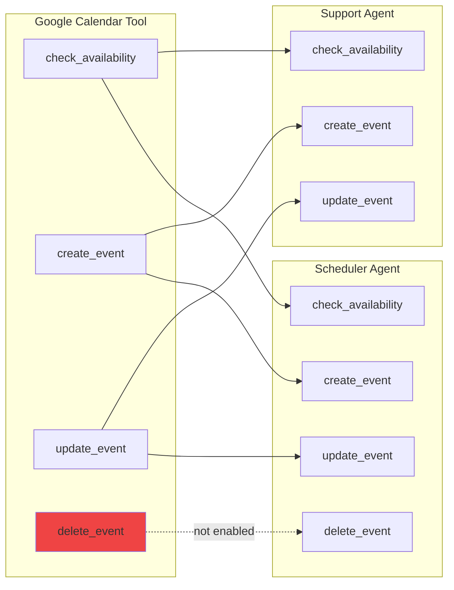

# Voice Agents Feature

## Overview

Voice agents are AI-powered assistants that handle real-time voice conversations using LiveKit and Large Language Models (LLMs). Agents can be configured with custom system prompts and integrated with external tools to perform actions like scheduling appointments, looking up customer information, or processing orders.

## What Makes It Work

### Core Components

1. **AI Model**: Google Gemini Realtime API for voice understanding and generation
2. **Real-Time Communication**: LiveKit for low-latency audio streaming
3. **Tool System**: Dynamic tool loading for external integrations
4. **Agent Configuration**: Per-agent system prompts and settings
5. **Session Management**: Call handling and state tracking

### Key Capabilities

- ✅ **Real-time voice conversations** with natural language understanding
- ✅ **Dynamic tool integration** - connect to external APIs and services
- ✅ **Custom system prompts** - define agent personality and behavior
- ✅ **Multi-agent support** - create different agents for different use cases
- ✅ **Phone number binding** - each agent can have dedicated phone number
- ✅ **Function-level tool control** - enable/disable specific tool functions per agent
- ✅ **OAuth integration** - secure authentication with external services (Google Calendar, etc.)
- ✅ **Agent greeting** - personalized greeting when agent enters conversation

## Architecture



## Voice Agent Lifecycle

### 1. Agent Creation

Admin user creates a voice agent through dashboard:



**Agent Configuration**:
- Name and description
- Organization assignment
- System prompt (personality, behavior)
- Phone number (optional)
- Tool associations
- Active/inactive status

### 2. Incoming Call Flow



**Key Steps**:
1. Caller dials Twilio phone number
2. Twilio webhook hits backend
3. Backend validates agent and creates LiveKit room
4. Twilio bridges call to LiveKit SIP trunk
5. LiveKit dispatches job to worker
6. Worker loads agent configuration and tools
7. Worker starts AI conversation with greeting
8. Call proceeds with real-time voice interaction

### 3. Tool Execution During Call



## Tool System

### What Are Tools?

Tools are modular components that enable agents to perform actions:

- **Google Calendar**: Check availability, create events, reschedule
- **CRM Integration**: Look up customer data, update records
- **E-commerce**: Check order status, process returns
- **Custom APIs**: Any HTTP endpoint you define

### Tool Architecture



### Tool Levels

1. **Platform Tool**: Tool definition available to all organizations
   - Name, description, configuration schema
   - Function definitions with parameters
   - OAuth requirements (if any)

2. **Agent Tool**: Instance of tool for specific agent
   - Per-agent configuration (e.g., calendar_id = "primary")
   - OAuth tokens (encrypted)
   - Function enable/disable flags
   - Active/inactive status

3. **Tool Function**: Individual callable method
   - Parameters and types
   - Description for LLM
   - Can be enabled/disabled per agent

### Two-Tier Tool Service

Different data for different security needs:

**API Layer (Frontend/Backend)**:
```python
# Returns safe metadata - NO secrets
tools = await tool_service.get_tools_by_organization(org_id, safe=True)
# Response: {name, description, config_schema, functions}
# Does NOT include: OAuth tokens, API keys
```

**Worker Layer (Execution)**:
```python
# Returns full tool instance WITH secrets
tool_instance = await tool_service.get_tool_instance(tool_id, org_id)
# Returns: Instantiated tool with:
# - config (calendar_id, etc.)
# - sensitive_config (access_token, refresh_token, etc.)
# - All methods callable by LLM
```

### Creating a New Tool

1. **Define Tool Class**:
   ```python
   from shared.voice_agents.tools.base.base_tool import BaseTool
   from livekit.agents import function_tool, RunContext

   class MyTool(BaseTool):
       @property
       def metadata(self):
           return ToolMetadata(
               name="MyTool",
               description="My tool description",
               requires_auth=True,
               auth_type="oauth2"
           )

        # Methods with RunContext parameter are considered as tools / functions for LLM Model
       async def my_action(
           self,
           context: RunContext,
           param1: str,
           optional_param: str | None = None
       ) -> dict:
           """Action description for LLM."""
           # Implementation
           return {"result": "..."}
   ```

2. **Place in Directory**: `shared/voice_agents/tools/implementations/`

3. **Auto-Registered**: Worker discovers tool automatically

4. **Sync to Database**: Backend startup syncs tool metadata to database

See [Tool System Documentation](tool_system.md) for detailed guide.

## LiveKit Tool Wrapping

### The Challenge

Tool methods have `self` parameter for instance state:
```python
async def check_availability(
    self,  # ❌ Can't pass to LiveKit
    context: RunContext,
    start_time: str
) -> dict:
    pass
```

LiveKit's `@function_tool` decorator cannot accept methods with `self`.

### The Solution

Create dynamic wrapper functions with exact same signature (excluding `self`):
```python
async def check_availability(
    context: RunContext,
    start_time: str
) -> dict:
    """Wrapper for check_availability."""
    kwargs = {'start_time': start_time}
    return await bound_method(context=context, **kwargs)
```

### Benefits

- ✅ Works with any tool method signature
- ✅ Preserves type hints for LLM schema
- ✅ Delegates to bound method with all parameters
- ✅ Generic and maintainable

See [LiveKit Tool Wrapping](livekit_tool_wrapping.md) for implementation details.

## Function-Level Control

### Enable/Disable Functions Per Agent

Each agent can have different functions enabled:



**Support Agent**: Can only check and create events (no deletions)
**Scheduler Agent**: Has full calendar management capabilities

### Implementation

Database stores `unselected_functions` array:
```sql
agent_tools.unselected_functions = ['delete_event']
```

Worker filters functions:
```python
if func_name in unselected_functions:
    continue  # Skip this function
```

Frontend UI shows checkboxes per function for easy toggling.

## Agent Greeting

### Automatic Greeting

Agents automatically greet users when entering room:

```python
class DynamicAgent(Agent):
    async def on_enter(self):
        """Agent greeting when entering room."""
        agent_name = self.session.userdata.get('agent_name', 'Assistant')
        await self.session.say(
            f"Hello, this is {agent_name}. How can I help you today?",
            allow_interruption=False
        )
```

### Benefits

- ✅ Eliminates awkward silence after connection
- ✅ Personalized with agent name
- ✅ Sets clear user expectation
- ✅ Improves user experience
- ✅ Configurable per agent

## Configuration

### Agent Configuration

**Fields**:
- `name`: Agent display name
- `organization_id`: Owner organization
- `system_prompt`: Personality and behavior instructions
- `phone_number`: Associated Twilio phone number (optional)
- `is_active`: Enable/disable agent

**Example System Prompt**:
```
You are a helpful customer support assistant for Acme Corp.
Be polite, professional, and empathetic.
Your role is to:
1. Understand customer issues
2. Look up order information
3. Provide helpful solutions
4. Escalate to human if needed

Always speak clearly and at a moderate pace.
```

### Tool Configuration

**Per-Agent Configuration**:
- Calendar ID (e.g., "primary", "work", "sales")
- API endpoints
- Authentication settings
- Function enable/disable flags

**OAuth Integration**:
- Admin clicks "Connect [Service Name]"
- Redirect to OAuth provider
- User authorizes access
- OAuth tokens stored encrypted in database
- Worker uses tokens for tool execution

## API Endpoints

### Agent Management

```
POST   /api/v1/agents                          Create agent
GET    /api/v1/agents/organization/{org_id}     List org agents
GET    /api/v1/agents/{agent_id}                Get agent details
PUT    /api/v1/agents/{agent_id}               Update agent
DELETE /api/v1/agents/{agent_id}               Delete agent
```

### Tool Management

```
POST   /api/v1/tools/platform                   Create platform tool (admin)
GET    /api/v1/tools/platform                  List platform tools
POST   /api/v1/tools/agent                    Configure tool for agent
GET    /api/v1/tools/agent/{agent_id}           Get agent tools
PUT    /api/v1/tools/agent/{agent_tool_id}      Update agent tool config
GET    /api/v1/tools/auth/{tool_name}           Start OAuth flow
GET    /api/v1/tools/callback                   Handle OAuth callback
```

### Voice Endpoints

```
POST   /api/v1/voice/twilio/incoming            Twilio webhook
```

## Use Cases

### Customer Support Agent

**Tools**:
- CRM integration (look up customer data)
- Order management API
- Knowledge base search
- Ticket creation

**System Prompt**: Focus on empathy, quick resolution, escalation when needed

**Phone Number**: Dedicated support line

### Appointment Scheduler

**Tools**:
- Google Calendar
- CRM integration (customer lookup)
- Email service (confirmation)

**System Prompt**: Focus on scheduling, confirmation, reminders

**Phone Number**: Booking line

### Lead Qualification Agent

**Tools**:
- CRM integration (create lead, update lead)
- Calendar integration (schedule demos)
- Sales routing

**System Prompt**: Focus on qualification criteria, routing to appropriate team

**Phone Number**: Inbound lead capture line

## Troubleshooting

### Agent Not Responding

**Check**:
1. Worker is running: `./start.sh logs worker-dev`
2. LiveKit connection is healthy
3. Agent is marked `is_active: true`
4. Phone number is correctly configured

### Tools Not Working

**Check**:
1. Tool is enabled for agent
2. Required functions are enabled
3. OAuth tokens are valid (not expired)
4. Tool configuration is correct

### Greeting Not Playing

**Check**:
1. Agent has a name set
2. Worker is correctly loading greeting from database
3. LiveKit room is created successfully

### Tool Calls Failing

**Check**:
1. Tool function signature is correct
2. Optional parameters use `type | None = None` pattern
3. External service is accessible from worker
4. OAuth tokens are valid

## Related Documentation

- [Tool System](tool_system.md) - Creating and managing tools
- [LiveKit Tool Wrapping](livekit_tool_wrapping.md) - Implementation details
- [System Architecture](../../01_architecture/system_architecture.md) - Overall architecture
- [Worker README](../../worker/README.md) - Worker service details
- [Shared Module](../../shared/README.md) - Shared code architecture

## Next Steps

1. **Create Your First Agent**: Use dashboard to create an agent
2. **Add Tools**: Connect Google Calendar or custom API
3. **Test Agent**: Make test call to verify functionality
4. **Customize**: Adjust system prompt and tool configuration
5. **Deploy**: Connect phone number and go live

---

For detailed implementation guides, see the [Development Guides](../../03_development/).
