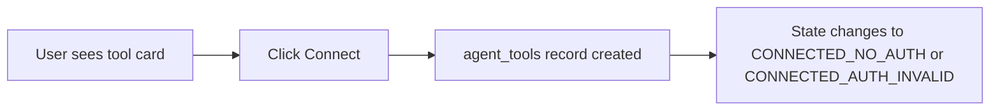
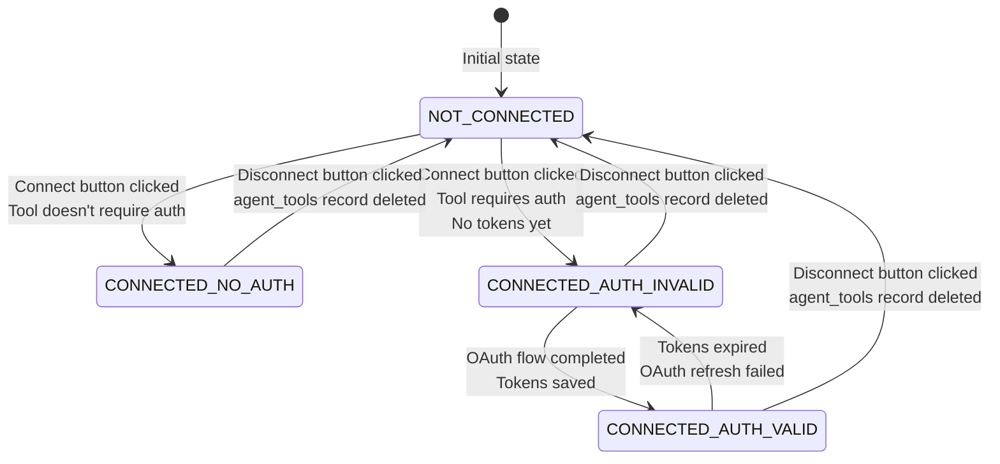

# Tool Connection States

## Overview

Tool connection states provide visual feedback to users about the authentication and configuration status of tools associated with voice agents. This system helps users quickly understand which tools are ready to use, which need authentication, and which are not connected at all.

## Four Connection States

### 1. NOT_CONNECTED
**Status**: Tool is not associated with the agent

**Visual**: White card, gray badge "Not connected"

**When shown**:
- Tool exists in `platform_tools` table
- No corresponding `agent_tools` record exists for this agent
- User needs to click "Connect" to associate the tool

**Actions**:
- "Connect" button creates `agent_tools` record

**Example**:


### 2. CONNECTED_NO_AUTH
**Status**: Tool is associated with agent but does not require authentication

**Visual**: Light green card, light green badge "Connected"

**When shown**:
- `agent_tools` record exists
- `tool.requires_auth = false` (from platform_tools)
- No authentication needed

**Actions**:
- "Edit Configuration" opens drawer to modify tool config
- Tool is ready to use immediately

**Example**:
- Simple tools like a weather API that only needs an API key
- Tools that use static configuration without OAuth

### 3. CONNECTED_AUTH_VALID
**Status**: Tool is connected with valid OAuth tokens

**Visual**: Light green card, light green badge "Authenticated"

**When shown**:
- `agent_tools` record exists
- `tool.requires_auth = true`
- `sensitive_config` contains valid OAuth tokens
- `agent_tools.auth_status = 'authenticated'`

**Actions**:
- "Edit Configuration" opens drawer
- Tool is ready to use

**Example**:
- Google Calendar with valid access token
- Gmail with valid access token
- Any OAuth-based service with fresh tokens

### 4. CONNECTED_AUTH_INVALID
**Status**: Tool is connected but authentication is invalid or missing

**Visual**: Light red card, light red badge "Authentication required"

**When shown**:
- `agent_tools` record exists
- `tool.requires_auth = true`
- OAuth tokens are missing, expired, or invalid
- `agent_tools.auth_status = 'unauthenticated'` or `null`

**Actions**:
- "Edit Configuration" opens drawer
- User must complete OAuth flow to get valid tokens
- Tool is not functional until authenticated

**Example**:
- Google Calendar with expired access token
- Gmail with no tokens yet
- OAuth flow was started but not completed

## Connection Flow



## Backend Implementation

### ConnectionStatus Enum

**File**: `shared/voice_agents/tool_models.py`

```python
class ConnectionStatus(str, Enum):
    NOT_CONNECTED = "not_connected"
    CONNECTED_NO_AUTH = "connected_no_auth"
    CONNECTED_AUTH_VALID = "connected_auth_valid"
    CONNECTED_AUTH_INVALID = "connected_auth_invalid"
```

### get_connection_status() Helper Function

**File**: `shared/voice_agents/tool_service.py`

```python
def get_connection_status(
    requires_auth: bool,
    auth_status: AuthStatus
) -> ConnectionStatus:
    """
    Derive connection status from tool requirements and auth state.

    Args:
        requires_auth: Whether tool requires OAuth authentication
        auth_status: Current authentication status

    Returns:
        ConnectionStatus enum value
    """
    if not requires_auth:
        return ConnectionStatus.CONNECTED_NO_AUTH
    if auth_status == AuthStatus.AUTHENTICATED:
        return ConnectionStatus.CONNECTED_AUTH_VALID
    return ConnectionStatus.CONNECTED_AUTH_INVALID
```

### Integration Points

**In `configure_agent_tool()`**:
```python
# Fetch tool to get requires_auth
platform_tool = await self.supabase.table("platform_tools").select("*").eq("id", tool_id).single()

# Calculate connection status
connection_status = get_connection_status(
    requires_auth=platform_tool["requires_auth"],
    auth_status=agent_tool["auth_status"]
)

# Add to response
return {
    "id": agent_tool["id"],
    "connection_status": connection_status.value,
    ...
}
```

**In `get_agent_tools()`**:
```python
# Join with platform_tools to get requires_auth
response = await self.supabase.table("agent_tools").select(
    "*, platform_tools(*)"
).eq("agent_id", agent_id).execute()

# Calculate connection status for each tool
for item in response.data:
    tool_data = item["platform_tools"]
    connection_status = get_connection_status(
        requires_auth=tool_data["requires_auth"],
        auth_status=item["auth_status"]
    )
    item["connection_status"] = connection_status.value
```

## Frontend Implementation

### ToolCard Visual States

**File**: `frontend/src/components/tools/tool-card.tsx`

```typescript
interface ToolCardProps {
  connectionStatus?: ConnectionStatus;
  isConfigured?: boolean;
  // ... other props
}

const getStatusConfig = (connectionStatus: ConnectionStatus) => {
  switch (connectionStatus) {
    case ConnectionStatus.NOT_CONNECTED:
      return {
        cardColor: "bg-white dark:bg-gray-800",
        badgeColor: "bg-gray-100 dark:bg-gray-700 text-gray-700 dark:text-gray-300",
        badgeText: "Not connected",
        icon: Wrench,
        actionText: "Connect"
      };
    case ConnectionStatus.CONNECTED_NO_AUTH:
      return {
        cardColor: "bg-green-50 dark:bg-green-900/30",
        badgeColor: "bg-green-100 dark:bg-green-800 text-green-700 dark:text-green-300",
        badgeText: "Connected",
        icon: ShieldCheck,
        actionText: "Edit Configuration"
      };
    case ConnectionStatus.CONNECTED_AUTH_VALID:
      return {
        cardColor: "bg-green-50 dark:bg-green-900/30",
        badgeColor: "bg-green-100 dark:bg-green-800 text-green-700 dark:text-green-300",
        badgeText: "Authenticated",
        icon: ShieldCheck,
        actionText: "Edit Configuration"
      };
    case ConnectionStatus.CONNECTED_AUTH_INVALID:
      return {
        cardColor: "bg-red-50 dark:bg-red-900/30",
        badgeColor: "bg-red-100 dark:bg-red-800 text-red-700 dark:text-red-300",
        badgeText: "Authentication required",
        icon: XCircle,
        actionText: "Edit Configuration"
      };
    default:
      return {
        cardColor: "bg-white dark:bg-gray-800",
        badgeColor: "bg-gray-100 dark:bg-gray-700 text-gray-700 dark:text-gray-300",
        badgeText: "Unknown",
        icon: Wrench,
        actionText: "Connect"
      };
  }
};
```

### Filter Pills

**File**: `frontend/src/components/tools/tool-filters.tsx`

```typescript
enum ToolFilterType {
  ALL = "all",
  CONNECTED = "connected",     // Has agent_tools record (any auth status)
  NOT_CONNECTED = "not_connected"  // No agent_tools record
}

// Filter logic
if (toolFilterType === "connected") {
  filtered = filtered.filter(
    (tool) => localAgentTools.find((at) => at.tool_id === tool.id) !== undefined,
  );
} else if (toolFilterType === "not_connected") {
  filtered = filtered.filter(
    (tool) => !localAgentTools.find((at) => at.tool_id === tool.id),
  );
}
```

## User Experience

### Connect Flow

1. User sees tool card with `NOT_CONNECTED` state
2. User clicks "Connect" button
3. Backend creates `agent_tools` record
4. State updates to:
   - `CONNECTED_NO_AUTH` if tool doesn't require auth
   - `CONNECTED_AUTH_INVALID` if tool requires auth (no tokens yet)
5. For auth-required tools, drawer opens automatically for OAuth

### Disconnect Flow

1. User clicks "Tools" button on tool card
2. Drawer opens showing tool configuration
3. User clicks "Disconnect" button
4. Confirmation dialog: "Are you sure you want to disconnect [Tool Name]?"
5. If confirmed, backend deletes `agent_tools` record
6. Tool card returns to `NOT_CONNECTED` state

### OAuth Flow

1. User clicks "Authenticate" in drawer (or after Connect for auth-required tools)
2. Redirect to OAuth provider (Google, etc.)
3. User authorizes access
4. OAuth callback saves tokens to `sensitive_config`
5. Updates `auth_status` to 'authenticated'
6. Tool card changes to `CONNECTED_AUTH_VALID`

## Dark Mode Support

All color definitions include dark mode variants:
- Light mode: `bg-*` without `dark:` prefix
- Dark mode: `dark:bg-*` variants

Example:
```typescript
cardColor: "bg-green-50 dark:bg-green-900/30"
badgeColor: "bg-green-100 dark:bg-green-800 text-green-700 dark:text-green-300"
```

## Benefits

1. **Clarity**: Users can see at a glance which tools are ready to use
2. **Actionable**: Clear indication of what needs to be done (Connect, Authenticate)
3. **Security Highlights**: Invalid auth state is prominently shown in red
4. **Reduced Support**: Users can self-diagnose tool connection issues
5. **Consistent**: All tools use the same state model and visual language

## Related Documentation

- [Tool System Architecture](./tool_system.md)
- [Tool Configuration Flow](./tool_configuration_flow.md)
- [OAuth Setup](../02_core_systems/oauth_setup.md)
- [Voice Agents Overview](../02_features/voice_agents/overview.md)
