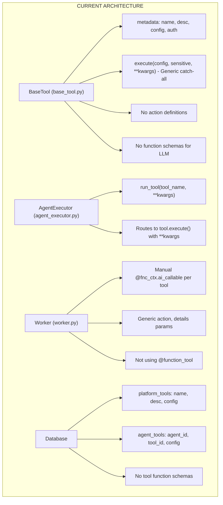
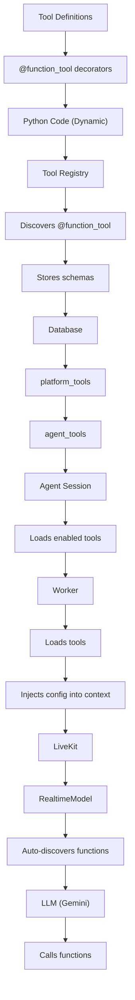

# Dynamic Tool Architecture for LiveKit Agents

## Executive Summary

This document proposes a refactoring to leverage LiveKit's native tool framework (`@function_tool`, `llm.tool`, MCP) to create a truly dynamic, flexible tool system where any tool with any number/type of arguments can be defined, registered as a platform tool, and associated with agents.

## Current Architecture Analysis

### What We Have



### Fundamental Problems

#### Problem 1: Not Using LiveKit's Tool Framework

**Current:**

```python
# Worker manually creates functions
@fnc_ctx.ai_callable(name="google_calendar", description="...")
async def call_tool(action: str, details: str):
    return await executor.run_tool("Google_calendar", action=action, details=details)
```

**Should be (LiveKit native):**

```python
# Define tools once with @function_tool
@function_tool()
async def list_events(
    context: RunContext,
    time_min: str,
    time_max: str,
    max_results: int = 10
) -> dict[str, Any]:
    """List calendar events within a time range."""
    # Implementation
    return {"events": [...]}

@function_tool()
async def create_event(
    context: RunContext,
    title: str,
    start_time: str,
    duration_minutes: int = 30,
    attendees: list[str] = None
) -> dict[str, Any]:
    """Create a new calendar event."""
    # Implementation
    return {"event_id": "..."}

**Impact:**
- We're reinventing what LiveKit already provides
- Type hints are ignored (all parameters become strings)
- No automatic schema generation
- No automatic LLM integration

#### Problem 2: Two Different Kinds of Schemas, Not Separated

**Currently conflated:**
```

config_schema (for UI) + Tool function schema (for LLM) → One blob

```

**Should be separated:**
```

platform_tools table:

- name: "Google_calendar"
- display_name: "Google Calendar"
- description: "..."
- config_schema: {calendar_id: string, default_duration: int} # For UI config
- auth_type: "oauth2"
- auth_config: {...}
- tool_functions_schema: [ # For LLM function calling
  {
  name: "list_events",
  description: "...",
  parameters: {...}
  },
  {
  name: "create_event",
  description: "...",
  parameters: {...}
  }
  ]

````

**Impact:**
- UI can render configuration forms
- LLM gets proper function schemas
- Clear separation of concerns

#### Problem 3: No Dynamic Tool Loading

**Current:**
- Tools are hard-coded in Python files
- Each tool = one Python class
- Can't load tools from database or MCP servers

**LiveKit supports:**
```python
# Create tools dynamically from schemas
from livekit.agents import function_tool

def create_tool_from_schema(schema: dict):
    async def handler(raw_arguments: dict[str, object], context: RunContext):
        # Extract from schema
        return {"result": "..."}

    return function_tool(
        name=schema["name"],
        description=schema["description"],
        parameters=schema["parameters"],
        execute=handler
    )

# Load from database/MCP
agent_tools = [
    create_tool_from_schema(tool_schema) for tool_schema in db_schemas
]
````

**Impact:**

- Can't define tools in database
- Can't use MCP servers for external tools
- Can't have tools defined by users/admins

#### Problem 4: Worker Does All of Work, Should Be Declarative

**Current:**

```python
# Worker manually:
# 1. Fetches agent tools from DB
# 2. Fetches tool class from registry
# 3. Manually creates @fnc_ctx.ai_callable
# 4. Registers them with FunctionContext
# 5. Creates RealtimeModel with function context
```

**Should be:**

```python
# Worker just:
# 1. Load agent's configured tools (schemas + implementations)
# 2. Pass to RealtimeModel with tools parameter
# 3. Let LiveKit handle function registration and LLM integration
```

**Impact:**

- Worker logic is complex and error-prone
- No separation between configuration and execution
- Hard to test tool registration independently

---

## Proposed Architecture

### High-Level Design



### Key Principles

1. **Declarative Over Imperative**

   - Define tools once with decorators
   - Configure tools in database
   - Worker just loads and uses

2. **Schema-Driven**

   - Tool functions have JSON schemas (or inferred from type hints)
   - Schemas stored in database
   - LLM sees same schemas that are defined

3. **Dynamic Loading**

   - Tools can be loaded from:
     - Python files with `@function_tool`
     - Database schemas (admin-defined tools)
     - MCP servers (external tool providers)

4. **Separation of Concerns**
   - **Tool Definition**: What tool does and its functions
   - **Tool Configuration**: UI settings (API keys, defaults)
   - **Agent Association**: Which tools are enabled for which agents
   - **Execution**: Runtime behavior with access to context/config

---

## Component-by-Component Design

### Component 1: Tool Definitions

#### Approach: LiveKit Native `@function_tool`

Define tools using LiveKit's decorator - this gives us:

- Automatic name extraction
- Automatic description from docstring
- Type hint extraction for parameters
- Native LLM integration

**File:** `shared/voice_agents/tools/implementations/google_calendar.py`

```python
import httpx
from datetime import datetime, timedelta
from livekit.agents import function_tool, RunContext
from typing import Any, Dict

# LiveKit will automatically:
# - Use "list_events" as function name
# - Use docstring as description
# - Extract types: time_min (str), time_max (str), max_results (int)
@function_tool()
async def list_events(
    context: RunContext,
    time_min: str,
    time_max: str | None = None,
    max_results: int = 10
) -> dict[str, Any]:
    """
    List calendar events within a time range.

    Args:
        time_min: Start of time range in ISO format (e.g., 2025-12-30T09:00:00Z)
        time_max: End of time range in ISO format (optional)
        max_results: Maximum number of events to return (default: 10)
    """
    # Get config from context
    # Context will have agent config injected
    calendar_id = context.userdata.get("calendar_id", "primary")
    access_token = context.userdata.get("access_token")

    headers = {
        "Authorization": f"Bearer {access_token}",
        "Content-Type": "application/json"
    }

    async with httpx.AsyncClient() as client:
        response = await client.get(
            f"https://www.googleapis.com/calendar/v3/calendars/{calendar_id}/events",
            headers=headers,
            params={
                "timeMin": time_min,
                "timeMax": time_max,
                "maxResults": max_results,
                "singleEvents": "true",
                "orderBy": "startTime"
            }
        )
        response.raise_for_status()
        data = response.json()
        return {"events": data.get("items", [])}

@function_tool()
async def create_event(
    context: RunContext,
    title: str,
    start_time: str,
    duration_minutes: int = 30,
    attendees: list[str] | None = None,
    description: str = ""
) -> dict[str, Any]:
    """
    Create a new calendar event.

    Args:
        title: Event title
        start_time: Event start time in ISO format
        duration_minutes: Duration in minutes (default: 30 from config)
        attendees: List of attendee email addresses (optional)
        description: Event description (optional)
    """
    calendar_id = context.userdata.get("calendar_id", "primary")
    access_token = context.userdata.get("access_token")
    default_duration = context.userdata.get("default_event_duration", 30)

    # Use provided duration or default from config
    duration = duration_minutes if duration_minutes != 30 else default_duration

    # Calculate end time
    start_dt = datetime.fromisoformat(start_time.replace('Z', '+00:00'))
    end_time = (start_dt + timedelta(minutes=duration)).isoformat()

    event = {
        "summary": title,
        "description": description,
        "start": {"dateTime": start_time},
        "end": {"dateTime": end_time}
    }

    if attendees:
        event["attendees"] = [{"email": email} for email in attendees]

    headers = {
        "Authorization": f"Bearer {access_token}",
        "Content-Type": "application/json"
    }

    async with httpx.AsyncClient() as client:
        response = await client.post(
            f"https://www.googleapis.com/calendar/v3/calendars/{calendar_id}/events",
            headers=headers,
            json=event
        )
        response.raise_for_status()
        return response.json()

@function_tool()
async def check_availability(
    context: RunContext,
    date: str,
    duration_minutes: int = 30
) -> dict[str, Any]:
    """
    Check if time slots are free.

    Args:
        date: Date and time to check in ISO format
        duration_minutes: Duration to check in minutes (default: 30)
    """
    calendar_id = context.userdata.get("calendar_id", "primary")
    access_token = context.userdata.get("access_token")

    # Calculate time range
    start_dt = datetime.fromisoformat(date.replace('Z', '+00:00'))
    end_dt = (start_dt + timedelta(minutes=duration_minutes)).isoformat()

    headers = {
        "Authorization": f"Bearer {access_token}",
        "Content-Type": "application/json"
    }

    async with httpx.AsyncClient() as client:
        response = await client.get(
            f"https://www.googleapis.com/calendar/v3/calendars/{calendar_id}/events",
            headers=headers,
            params={
                "timeMin": date,
                "timeMax": end_dt,
                "singleEvents": "true",
                "orderBy": "startTime"
            }
        )
        response.raise_for_status()
        data = response.json()

    has_conflict = len(data.get("items", [])) > 0
    return {
        "available": not has_conflict,
        "conflicts": data.get("items", [])
    }
```

**Key Change:**

- Each action is a separate function with `@function_tool`
- Type hints are real and respected
- `context.userdata` contains config (injected by worker)
- `RunContext` provides access to session, agent, state

#### Approach 2: Dynamic Tool Creation

For tools defined in database or loaded from MCP:

**File:** `shared/voice_agents/tools/dynamic_loader.py`

```python
"""
Dynamic tool loader for database-defined and MCP tools.
"""
from livekit.agents import function_tool, RunContext
from typing import Callable, Any, Dict
import httpx

async def create_function_from_schema(
    schema: Dict[str, Any],
    execute_handler: Callable
):
    """
    Create a LiveKit function_tool from a raw schema.
    Used for tools defined in database or loaded from MCP.
    """

    async def handler(raw_arguments: Dict[str, Any], context: RunContext):
        # Extract parameters from raw_arguments
        # raw_arguments contains values keyed by parameter names from schema
        return await execute_handler(raw_arguments, context)

    return function_tool(
        name=schema.get("name"),
        description=schema.get("description", ""),
        parameters=schema.get("parameters", {}),
        execute=handler
    )


async def create_http_tool(
    name: str,
    description: str,
    url_template: str,
    method: str = "GET"
):
    """
    Create a generic HTTP tool from a schema.
    Example: Admin defines a "get_weather" tool in database.
    """

    async def execute_handler(raw_arguments: Dict[str, Any], context: RunContext):
        # Substitute parameters in URL
        url = url_template
        for key, value in raw_arguments.items():
            url = url.replace(f"{{{key}}}", str(value))

        # Get API key from config
        api_key = context.userdata.get("api_key")

        headers = {"Authorization": f"Bearer {api_key}"}

        async with httpx.AsyncClient() as client:
            if method == "GET":
                response = await client.get(url, headers=headers)
            elif method == "POST":
                response = await client.post(url, headers=headers, json=raw_arguments)

            response.raise_for_status()
            return response.json()

    schema = {
        "name": name,
        "description": description,
        "parameters": {
            "type": "object",
            "properties": {}
        }
    }

    return create_function_from_schema(schema, execute_handler)
```

### Component 2: Tool Registry

**File:** `shared/voice_agents/tools/base/registry.py`

```python
"""
Registry for platform tools.
Supports both code-defined and dynamic tools.
"""
import importlib
import inspect
import pkgutil
import logging
from typing import Dict, Callable, List, Any
from livekit.agents import function_tool

logger = logging.getLogger(__name__)

class ToolRegistry:
    def __init__(self):
        self._code_tools: Dict[str, Callable] = {}  # name -> function
        self._schemas: Dict[str, Dict] = {}  # name -> full schema

    def register_tools_from_package(self, package_path: str):
        """
        Discover and register all @function_tool decorated functions.
        """
        package = importlib.import_module(package_path)
        for loader, module_name, is_pkg in pkgutil.walk_packages(
            package.__path__,
            package.__name__ + "."
        ):
            module = importlib.import_module(module_name)

            # Find all @function_tool decorated functions
            for name, obj in inspect.getmembers(module):
                if inspect.isfunction(obj) and hasattr(obj, "_is_function_tool"):
                    func = obj
                    tool_name = func.__name__

                    self._code_tools[tool_name] = func

                    # Extract schema (LiveKit stores metadata on function)
                    schema = {
                        "name": tool_name,
                        "description": func.__doc__ or "",
                        "parameters": getattr(func, "_parameters", {})
                    }
                    self._schemas[tool_name] = schema

                    logger.info(f"Registered tool: {tool_name}")

    def get_tool_functions(self) -> List[Callable]:
        """
        Get all registered tool functions.
        Returns actual @function_tool decorated functions.
        """
        return list(self._code_tools.values())

    def get_tool_schema(self, name: str) -> Dict[str, Any] | None:
        """
        Get schema for a specific tool function.
        """
        return self._schemas.get(name)

    def get_all_schemas(self) -> Dict[str, Dict]:
        """
        Get all tool schemas.
        """
        return self._schemas


# Global registry instance
tool_registry = ToolRegistry()
```

### Component 3: Database Schema Changes

#### Update platform_tools table

```sql
-- Add tool_functions_schema column
ALTER TABLE platform_tools ADD COLUMN tool_functions_schema JSONB;

-- For storing multiple function schemas per tool
-- Example structure:
-- {
--   "functions": [
--     {
--       "name": "list_events",
--       "description": "List calendar events...",
--       "parameters": {
--         "type": "object",
--         "properties": {
--           "time_min": {"type": "string", "description": "..."},
--           "time_max": {"type": "string", "description": "..."},
--           "max_results": {"type": "integer", "default": 10}
--         },
--         "required": ["time_min"]
--       }
--     },
--     {
--       "name": "create_event",
--       "description": "Create new calendar event...",
--       "parameters": {...}
--     }
--   ]
-- }
```

**New Models:**

```python
# shared/voice_agents/tool_models.py

class PlatformToolCreate(BaseModel):
    name: str
    description: str
    config_schema: Dict[str, Any]  # UI configuration (calendar_id, API keys, etc.)
    auth_type: Optional[str] = None
    auth_config: Optional[Dict[str, Any]] = None
    tool_functions_schema: Optional[Dict[str, Any]] = None  # NEW: Function schemas for LLM
```

### Component 4: Tool Service

**File:** `shared/voice_agents/tool_service.py`

```python
"""
Enhanced tool service with schema management.
"""

class ToolService:
    async def upsert_platform_tool(self, tool_data: PlatformToolCreate) -> tuple[Optional[PlatformTool], Optional[str]]:
        """
        Upsert a platform tool with its function schemas.
        """
        try:
            # Get function schemas from registry
            functions_schema = None
            if tool_data.name in tool_registry._schemas:
                # Tool defined in code - fetch from registry
                functions_schema = {"functions": [tool_registry.get_tool_schema(tool_data.name)]}
            elif tool_data.tool_functions_schema:
                # Tool defined in database - use provided schema
                functions_schema = tool_data.tool_functions_schema

            # Prepare data
            data = tool_data.model_dump()
            if functions_schema:
                data["tool_functions_schema"] = functions_schema

            # Check if exists
            existing = self.supabase.table("platform_tools")\
                .select("*")\
                .eq("name", tool_data.name)\
                .execute()

            if existing.data:
                response = self.supabase.table("platform_tools")\
                    .update(data)\
                    .eq("id", existing.data[0]["id"])\
                    .execute()
            else:
                response = self.supabase.table("platform_tools")\
                    .insert(data)\
                    .execute()

            if not response.data:
                return None, "Failed to upsert platform tool"

            return PlatformTool(**response.data[0]), None

        except Exception as e:
            logger.error(f"Error upserting platform tool: {e}")
            return None, str(e)

    async def get_agent_tools_with_functions(self, agent_id: UUID) -> tuple[List[Dict], Optional[str]]:
        """
        Get agent tools with their function schemas.
        Returns a list ready for passing to RealtimeModel.
        """
        try:
            # Get agent tool configurations
            response = self.supabase.table("agent_tools")\
                .select("*, platform_tools(*)")\
                .eq("agent_id", str(agent_id))\
                .execute()

            agent_tools = []
            for item in response.data:
                tool_data = item["platform_tools"]

                if not tool_data:
                    continue

                if not item["is_enabled"]:
                    continue

                # Get function schemas
                functions_schema = tool_data.get("tool_functions_schema")

                # If not in DB, try to get from registry (code-defined tools)
                if not functions_schema:
                    code_schema = tool_registry.get_tool_schema(tool_data["name"])
                    if code_schema:
                        functions_schema = {"functions": [code_schema]}

                if not functions_schema:
                    continue

                # Merge for LiveKit
                result = {
                    "tool_name": tool_data["name"],
                    "tool_id": item["tool_id"],
                    "config": item["config"] or {},
                    "sensitive_config": item["sensitive_config"],
                    "functions_schema": functions_schema
                }

                agent_tools.append(result)

            return agent_tools, None

        except Exception as e:
            logger.error(f"Error getting agent tools: {e}")
            return [], str(e)
```

### Component 5: Worker (Major Refactor)

**File:** `worker/src/worker.py`

```python
import logging
import os
import json
from typing import Dict, Any

from livekit.agents import (
    AutoSubscribe,
    JobContext,
    WorkerOptions,
    WorkerType,
    cli,
    RealtimeModel
)

from shared.voice_agents.service import voice_agent_service
from shared.voice_agents.tool_service import tool_service
from shared.voice_agents.tools.base.registry import tool_registry

logger = logging.getLogger("voice-worker")
logger.setLevel(logging.INFO)


async def entrypoint(ctx: JobContext):
    logger.info(f"Connecting to room {ctx.room.name}")
    await ctx.connect(auto_subscribe=AutoSubscribe.AUDIO_ONLY)

    # 1. Get agent from metadata
    metadata_str = ctx.room.metadata or ctx.job.metadata
    if not metadata_str:
        logger.error("No agent_id found in metadata")
        return

    metadata = json.loads(metadata_str)
    agent_id = metadata.get("agent_id")
    if not agent_id:
        logger.error("agent_id missing in metadata")
        return

    agent, error = await voice_agent_service.get_agent_by_id(agent_id)
    if error or not agent:
        logger.error(f"Failed to fetch agent {agent_id}: {error}")
        return

    logger.info(f"Starting Gemini S2S assistant for agent: {agent.name}")

    # 2. Get agent tools with function schemas
    agent_tools, error = await tool_service.get_agent_tools_with_functions(agent_id)
    if error or not agent_tools:
        logger.warning(f"No tools configured for agent {agent_id}")
        agent_tools = []

    # 3. Build LiveKit function list
    # Get tool functions from registry (code-defined tools)
    registered_functions = tool_registry.get_tool_functions()

    # Map tool names to functions
    # We need to inject config into context before calling

    function_map = {func.__name__: func for func in registered_functions}

    # 4. Create wrapper functions that inject config
    # LiveKit's userdata is how we pass config to tools
    wrapped_functions = []
    for tool_config in agent_tools:
        tool_name = tool_config["tool_name"]
        functions_schema = tool_config["functions_schema"]

        if not functions_schema or "functions" not in functions_schema:
            continue

        for func_schema in functions_schema["functions"]:
            func_name = func_schema["name"]

            if func_name not in function_map:
                logger.warning(f"Function {func_name} not found in registry")
                continue

            original_func = function_map[func_name]

            # Create wrapper that injects config into userdata
            async def wrapped_function(context, **kwargs):
                # Inject config and sensitive config into context userdata
                context.userdata.update({
                    "tool_config": tool_config["config"],
                    "sensitive_config": tool_config["sensitive_config"],
                    "agent_id": str(agent_id),
                    "agent_name": agent.name
                })

                # Call original function
                return await original_func(context, **kwargs)

            wrapped_functions.append(wrapped_function)

    # 5. Create RealtimeModel with tools
    model = RealtimeModel(
        model="gemini-2.5-flash-preview-native-audio-dialog",
        api_key=os.getenv("GEMINI_API_KEY"),
        voice="Puck",
        temperature=0.8,
        instructions=agent.system_prompt or "You are a professional AI assistant.",
        tools=wrapped_functions  # Pass functions directly!
    )

    # 6. Start session
    from livekit.agents import AgentSession
    session = AgentSession(llm=model)
    await session.start(room=ctx.room)
    logger.info("Agent session started")

    # 7. Cleanup
    @ctx.room.on("participant_disconnected")
    def on_participant_disconnected(participant):
        logger.info(f"Participant {participant.identity} disconnected, ending session")
        # Session cleanup happens automatically when AgentSession ends


if __name__ == "__main__":
    cli.run_app(
        WorkerOptions(
            entrypoint_fnc=entrypoint,
            worker_type=WorkerType.ROOM,
        )
    )
```

**Key Changes:**

1. **Load tools with schemas** - Use `get_agent_tools_with_functions()`
2. **Build function list** - Map agent tools to registered functions
3. **Inject config** - Wrap functions to add config to `context.userdata`
4. **Pass to RealtimeModel** - Just pass `tools=wrapped_functions`
5. **LiveKit handles the rest** - Automatic schema generation, LLM integration

### Component 6: Session Service (Minor Update)

**File:** `shared/voice_agents/session_service.py`

No changes needed - current session snapshot mechanism works fine with new architecture.

---

## How This Solves Your Requirements

### Define Any Tool with Any Arguments

**Code-defined tools:**

```python
@function_tool()
async def any_tool_you_want(
    context: RunContext,
    param1: str,
    param2: int,
    param3: list[str],
    param4: bool,
    **kwargs  # Additional arbitrary parameters
) -> dict:
    """Any description."""
    return {"result": "success"}
```

**Database-defined tools:**

```python
# Admin creates this in DB via UI
{
  "name": "custom_tool",
  "description": "A custom tool",
  "tool_functions_schema": {
    "functions": [{
      "name": "do_something",
      "parameters": {
        "type": "object",
        "properties": {
          "any_param": {"type": "string"},
          "another_param": {"type": "integer"}
        }
      }
    }]
  }
}

# Worker loads it and creates function dynamically
```

**MCP tools:**

```python
# Just add MCP server URL to session
session = AgentSession(
    mcp_servers=[
        mcp.MCPServerHTTP("https://your-mcp-server.com")
    ]
)
```

### Register as Platform Tool

**Code tools:**

- Auto-registered when application starts
- Stored in `platform_tools` table
- Can be configured via UI

**Dynamic tools:**

- Admin defines schema in UI
- Stored in `platform_tools` table
- Worker loads and registers them

### Associate with Agents

- `agent_tools` table maps `agent_id` → `tool_id`
- Each association has its own `config` (per-agent settings)
- Worker resolves and loads enabled tools

---

## Implementation Roadmap

### Phase 1: Core Foundation (1-2 days)

1. Update database schema

   - Add `tool_functions_schema` column to `platform_tools`

2. Create dynamic loader

   - `shared/voice_agents/tools/dynamic_loader.py`
   - Support `create_function_from_schema()`

3. Update models
   - Add `tool_functions_schema` to `PlatformToolCreate`
   - Update `tool_models.py`

### Phase 2: Refactor Existing Tools (1 day)

1. Refactor Google Calendar tool

   - Convert to `@function_tool` pattern
   - One function per action
   - Use `context.userdata` for config
   - Remove old `BaseTool` approach

2. Test tool registration
   - Verify schemas are extracted correctly
   - Verify functions work

### Phase 3: Update Tool Registry (1 day)

1. Add schema tracking
   - `get_tool_schema()` method
   - `get_all_schemas()` method
   - Discover `@function_tool` decorated functions

### Phase 4: Refactor Tool Service (1 day)

1. Add schema management
   - `upsert_platform_tool()` merges registry schemas
   - `get_agent_tools_with_functions()` returns complete data

### Phase 5: Refactor Worker (2 days)

1. Remove manual function creation

   - Delete `create_tool_func()` approach
   - Load tools with schemas
   - Wrap functions to inject config
   - Pass to `RealtimeModel(tools=...)`

2. Test worker
   - Verify tools are passed to LLM
   - Test function calling

### Phase 6: Frontend Updates (Optional, 1 day)

1. Tool management UI
   - Show available tools from `platform_tools`
   - Allow admin to add custom tools (define schemas)
   - Configure agent-tool associations

---

## Example: Adding a New Tool

### Email Tool (Code-Defined)

```python
# shared/voice_agents/tools/implementations/email_tool.py
from livekit.agents import function_tool, RunContext
from shared.voice_agents.tools.base.registry import tool_registry

@function_tool()
async def send_email(
    context: RunContext,
    to: str,
    subject: str,
    body: str,
    cc: list[str] | None = None
) -> dict[str, Any]:
    """
    Send an email to recipient(s).

    Args:
        to: Recipient email address
        subject: Email subject
        body: Email body content
        cc: CC recipients (optional)
    """
    smtp_server = context.userdata.get("smtp_server")
    smtp_port = context.userdata.get("smtp_port", 587)
    from_email = context.userdata.get("from_email")
    username = context.userdata.get("smtp_username")
    password = context.userdata.get("sensitive_config", {}).get("smtp_password")

    # Send email using SMTP
    # ... implementation ...

    return {"success": True, "message_id": "..."}


# Automatically registered when package is imported
# tool_registry will discover and register it
```

### Custom CRM Tool (Database-Defined)

**1. Admin defines in UI:**

- Name: "CRM Lookup"
- Description: "Lookup customer in our CRM"
- Functions:
  - `get_customer` (param: customer_id)
  - `update_customer` (params: customer_id, updates)

**2. Stored in DB:**

```json
{
  "name": "CRM_Lookup",
  "description": "CRM integration",
  "config_schema": {
    "api_url": { "type": "string", "default": "https://crm.example.com" }
  },
  "tool_functions_schema": {
    "functions": [
      {
        "name": "get_customer",
        "description": "Get customer by ID",
        "parameters": {
          "type": "object",
          "properties": {
            "customer_id": { "type": "string" }
          },
          "required": ["customer_id"]
        }
      }
    ]
  }
}
```

**3. Agent associates tool:**

- User goes to agent config
- Enables "CRM Lookup" tool
- Provides CRM API key as sensitive config
- Sets default URL in config

**4. Worker loads it:**

- Fetches from `agent_tools`
- Creates function from schema using `create_function_from_schema()`
- Wraps with config injection
- Passes to `RealtimeModel`

**5. LLM can call it:**

- User asks "What's the status of order 12345?"
- LLM sees `get_customer(customer_id: "12345")`
- Calls function
- Returns customer data

---

## MCP Integration (Future)

LiveKit has native MCP support. To enable:

```python
# worker/src/worker.py

from livekit.agents import mcp

async def entrypoint(ctx: JobContext):
    # ... get agent ...

    session = AgentSession(
        llm=model,
        mcp_servers=[
            # Load MCP servers from agent config
            mcp.MCPServerHTTP("https://mcp-server-1.com"),
            mcp.MCPServerHTTP("https://mcp-server-2.com"),
        ]
    )

    await session.start(room=ctx.room)
```

**Benefits:**

- Tools defined externally (no code changes)
- Hot-reload of tool definitions
- Standard protocol (Model Context Protocol)
- Shared tool ecosystem

---

## Summary

| Aspect                  | Current                              | Proposed                             |
| ----------------------- | ------------------------------------ | ------------------------------------ |
| **Tool Definition**     | BaseTool class with single execute() | `@function_tool` decorated functions |
| **Parameter Types**     | Generic `**kwargs`                   | Real Python type hints               |
| **Schema Management**   | config_schema only (for UI)          | tool_functions_schema (for LLM)      |
| **Dynamic Loading**     | No                                   | Yes (database + MCP)                 |
| **Worker Logic**        | Manual function creation             | Declarative (load + pass to LLM)     |
| **LiveKit Integration** | Low-level @fnc_ctx.ai_callable       | Native @function_tool                |
| **Config Injection**    | AgentExecutor passes config          | context.userdata injection           |
| **Flexibility**         | Limited (code-defined only)          | Unlimited (any tool, any schema)     |

This architecture gives you:

- **Maximum Flexibility**: Any tool, any parameters, any types
- **Native LiveKit**: Using `@function_tool` as intended
- **Dynamic Loading**: From code, database, or MCP servers
- **Schema-Driven**: Clear separation of UI config vs LLM function schemas
- **Agent Association**: Clean mapping in `agent_tools` table
- **Declarative Worker**: Worker just loads and passes tools
