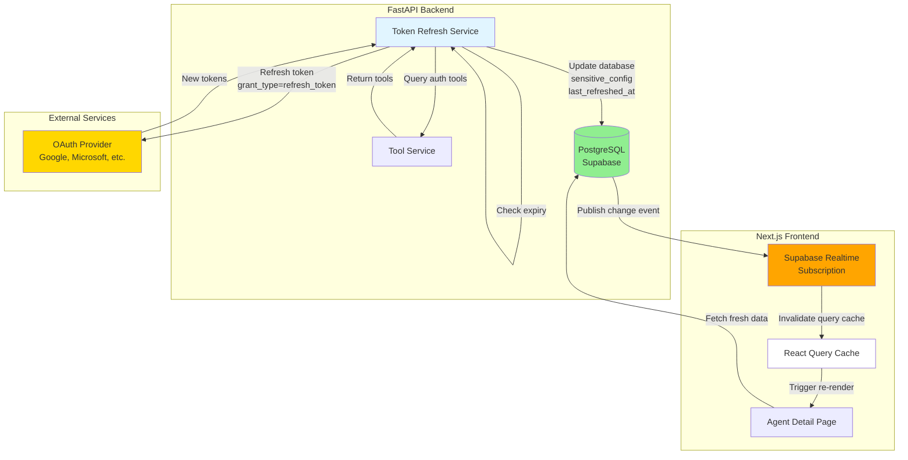
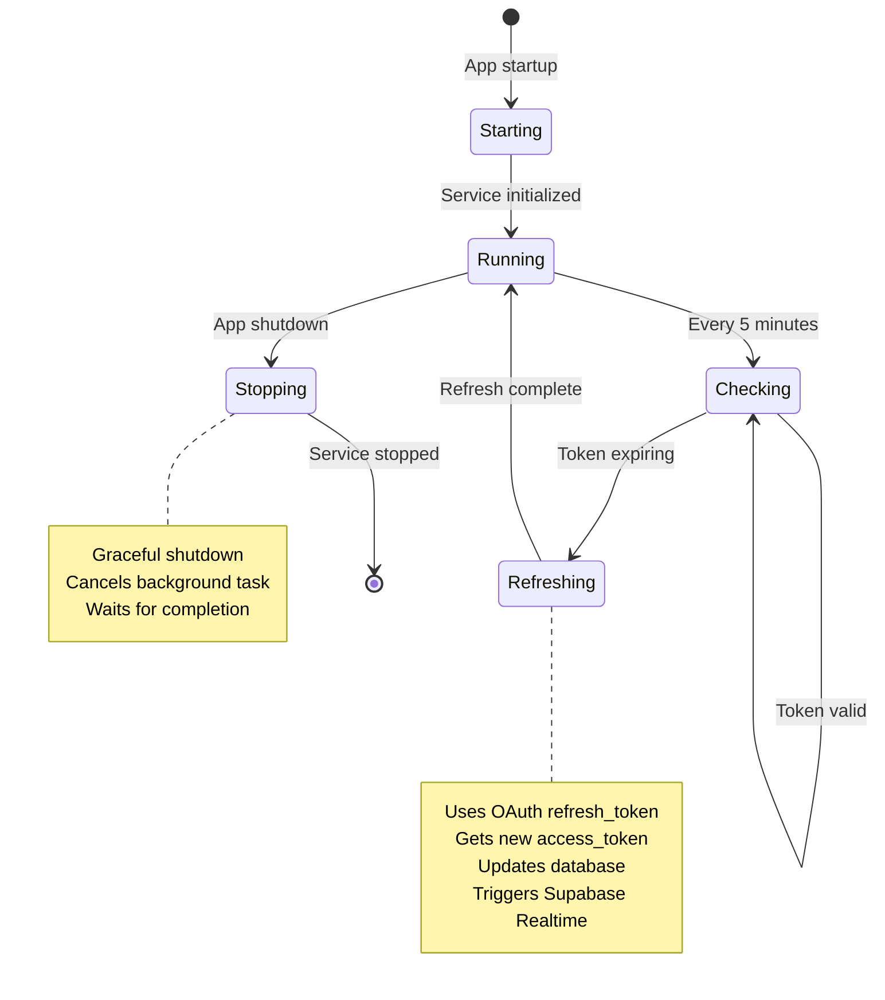
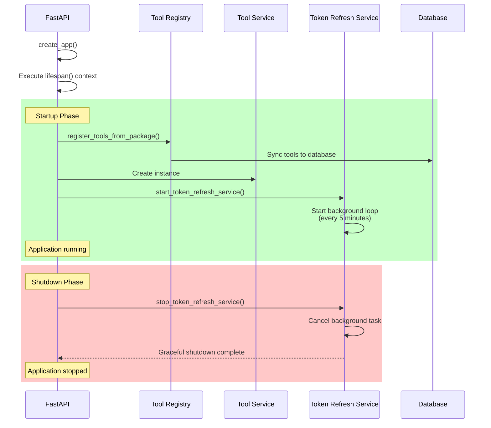
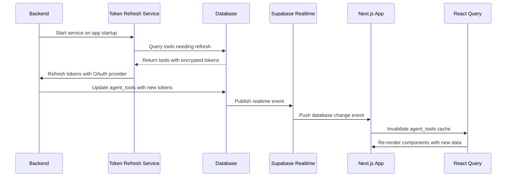
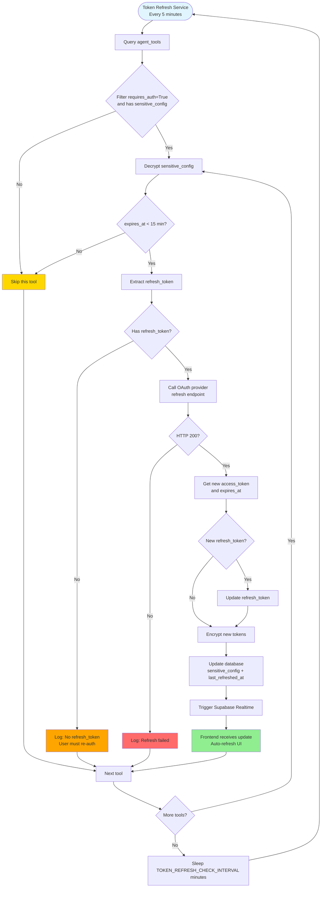
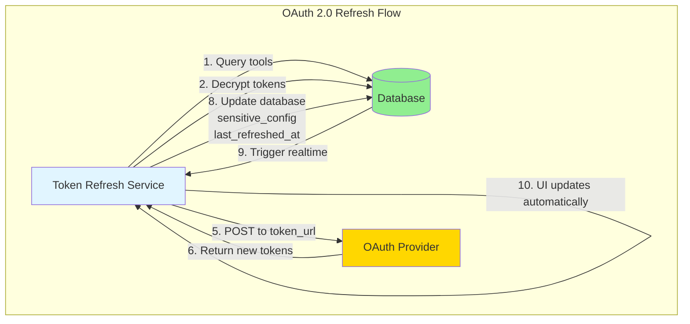

# Real-Time UI Synchronization & OAuth Token Auto-Refresh

## Overview

This feature ensures the frontend UI stays automatically synchronized with database and backend changes without requiring page refreshes. The implementation consists of two complementary components:

1. **Backend Token Refresh Service**: Automatically refreshes OAuth tokens before they expire
2. **Frontend Real-Time Subscriptions**: Automatically updates UI when database changes occur

### Primary Use Case

OAuth tokens for integrated tools (Gmail, Google Calendar, etc.) expire after approximately 1 hour. Without this feature, users would experience authentication failures until they manually refreshed the page or re-authenticated. Now, the system automatically refreshes tokens in the background and updates the UI in real-time.

### Key Benefits

- **Zero user action required**: Tokens refresh automatically before expiry
- **Real-time UI updates**: Changes appear instantly without page refresh
- **Provider-agnostic**: Works with any OAuth 2.0 provider
- **Environment-driven configuration**: Tunable refresh timing per deployment
- **Production-ready**: Clean architecture with proper error handling and logging

---

## Architecture

### High-Level System Flow



### Token Refresh Service Lifecycle



### Application Startup Sequence



### Real-Time Data Flow



---

## Key Design Decisions

### 1. Supabase Realtime vs Custom WebSockets

**Decision**: Use Supabase Realtime for database change notifications instead of building a custom WebSocket infrastructure.

**Rationale**:
- **Simplicity**: No backend WebSocket code to maintain
- **Infrastructure**: Supabase handles WebSocket scaling automatically
- **Use Case Alignment**: Current use cases are database-driven (token refresh, tool configuration)
- **Future-Proof**: Can add WebSockets later if needed for server-side events

**Trade-offs**:
- **Pro**: Zero backend WebSocket maintenance
- **Pro**: Automatic scaling with Supabase platform
- **Con**: Database changes only (no direct server-to-client notifications)
- **Mitigation**: All current use cases are database-driven, so this is acceptable

### 2. Provider-Agnostic OAuth Token Refresh

**Decision**: Build refresh service to work with ANY OAuth 2.0 provider without provider-specific code.

**Rationale**:
- **Extensibility**: New OAuth providers added via configuration, not code changes
- **Maintainability**: Single refresh service for all providers
- **Flexibility**: Supports Google, Microsoft, GitHub, and custom OAuth 2.0 providers
- **Dynamic Configuration**: Reads OAuth parameters from `platform_tools.auth_config` JSONB field

**Implementation**:
- Each tool's `AuthConfig` class defines: `token_url`, `client_id`, `client_secret`
- Refresh service reads these values dynamically
- Uses standard OAuth 2.0 refresh flow: `grant_type=refresh_token`

**Example Configuration**:
```python
# Google (Gmail, Calendar, etc.)
class AuthConfig(BaseAuthConfig):
    provider: str = "google"
    token_url: str = "https://oauth2.googleapis.com/token"
    client_id: str = "..."  # From environment
    client_secret: str = "..."  # From environment

# Microsoft (Outlook, OneDrive, etc.)
class AuthConfig(BaseAuthConfig):
    provider: str = "microsoft"
    token_url: str = "https://login.microsoft.com/oauth2/v2.0/token"
    client_id: str = "..."  # From environment
    client_secret: str = "..."  # From environment
```

### 3. Environment-Driven Configuration

**Decision**: Make token refresh timing configurable via environment variables with sensible defaults.

**Rationale**:
- **Different Environments**: Dev, staging, production have different needs
- **OAuth Provider Differences**: Different providers have different token lifetimes
- **Load-Based Tuning**: Higher intervals for high-traffic deployments
- **No Code Changes**: Adjust timing without recompiling

**Configuration Variables**:
```bash
# backend/.env

# Interval in minutes to check for tokens needing refresh (default: 5)
TOKEN_REFRESH_CHECK_INTERVAL_MINUTES=5

# Window in minutes before expiry to refresh tokens (default: 15)
TOKEN_REFRESH_EXPIRY_WINDOW_MINUTES=15
```

**Validation**:
- Check interval: 1-60 minutes (via Pydantic `ge=1, le=60`)
- Expiry window: 1-60 minutes (via Pydantic `ge=1, le=60`)
- Application fails to start with invalid values

**Docker Configuration Priority** (highest to lowest):
1. `.env` file (explicit values)
2. Docker Compose defaults (`${VAR:-default}` syntax)

### 4. Lifespan Context Manager vs Startup Event

**Decision**: Use FastAPI's modern `lifespan` context manager instead of `@app.on_event("startup")`.

**Rationale**:
- **Better Cleanup**: Shutdown logic guaranteed to run with `yield` pattern
- **Resource Management**: Context manager ensures proper resource lifecycle
- **Graceful Shutdown**: Can cancel background tasks and wait for completion
- **Testability**: Easier to test startup/shutdown sequences
- **Best Practice**: Recommended approach for FastAPI background services

**Implementation**:
```python
@asynccontextmanager
async def lifespan(app: FastAPI):
    # Startup logic
    await start_token_refresh_service(tool_service)
    yield
    # Shutdown logic
    await stop_token_refresh_service()

app = FastAPI(lifespan=lifespan)
```

### 5. APScheduler vs Celery for Single-Instance Deployment

**Decision**: Use APScheduler for current single-instance deployment, with documented migration path to Celery + Redis.

**Rationale**:
- **Simplicity**: APScheduler has no external dependencies (Redis not needed)
- **Fast Implementation**: Faster to integrate with FastAPI
- **Perfect for Current Scale**: Works for single backend instance
- **Known Migration Path**: Documented TODO for when scaling to multiple instances

**Current Limitation**: When scaling to multiple backend instances, each instance will independently refresh tokens, causing race conditions.

**Future Migration** (documented in code):
```python
# TODO: Future Enhancement
# When scaling to multiple backend instances, migrate to Celery + Redis
# for distributed task queue with proper locking.
```

---

## Implementation Components

### 1. Database Changes

#### Supabase Realtime Setup

**File**: `docs/04_setup/supabase_realtime_setup.sql`

**Purpose**: Enables real-time updates on database tables for automatic UI synchronization.

**Tables Enabled**:
- `agent_tools` - Tool status, authentication, enabled/disabled states
- `agents` - Agent configuration changes

**What Script Does**:
1. Adds tables to Supabase's `supabase_realtime` publication
2. Creates RLS policies allowing authenticated users to subscribe to changes
3. Includes verification query to confirm setup

**How to Apply**:
1. Go to Supabase Dashboard → SQL Editor
2. Copy entire SQL file content
3. Run script
4. Run verification query to confirm tables are in publication

#### Alembic Migration for Token Refresh Tracking

**File**: `backend/alembic/versions/20260118000001_add_last_refreshed_at_to_agent_tools.py`

**Purpose**: Tracks when OAuth tokens were last auto-refreshed.

**What Migration Does**:
- Adds `last_refreshed_at` column to `agent_tools` table
- Column type: `DateTime(timezone=True)`
- Nullable (NULL until first refresh)
- Includes comment for documentation

**Why This Column**:
- Provides observability into token refresh activity
- Helps debug token refresh issues
- Allows monitoring of refresh frequency

**How to Apply**:
```bash
cd backend
alembic upgrade head
```

**Rollback** (if needed):
```bash
alembic downgrade -1
```

### 2. Backend Implementation

#### Token Refresh Service

**File**: `backend/src/services/token_refresh_service.py`

**Key Features**:
- Background task using APScheduler
- Checks all tools with OAuth authentication
- Refreshes tokens expiring within configurable window (default: 15 minutes)
- Provider-agnostic OAuth refresh flow
- Updates database with new encrypted tokens
- Sets `last_refreshed_at` timestamp
- Comprehensive logging for observability

**Service Architecture**:



**How Token Refresh Works**:



**Configuration** (via environment variables):

| Environment Variable | Default | Range | Description |
|-------------------|---------|-------|-------------|
| `TOKEN_REFRESH_CHECK_INTERVAL_MINUTES` | 5 | 1-60 | How often to check for expiring tokens |
| `TOKEN_REFRESH_EXPIRY_WINDOW_MINUTES` | 15 | 1-60 | Refresh tokens expiring within this window |

**Recommended Settings**:
- **Development**: 5 min check, 15 min window (default)
- **Production**: 10 min check, 20 min window (fewer API calls)
- **High-Traffic**: 15 min check, 30 min window (reduce load)
- **Testing**: 1 min check, 5 min window (verify quickly)

**Error Handling**:
- Skips tools without `refresh_token` (logs warning)
- Continues with other tools if one fails
- Logs all exceptions with stack traces
- Waits before retry on transient errors

**Security**:
- Tokens always encrypted in database using Fernet encryption
- Tokens never logged (only success/failure messages)
- OAuth credentials (`client_secret`) stored in environment, not database
- Uses standard OAuth 2.0 refresh flow

#### Lifespan Integration

**File**: `backend/main.py`

**Changes**:
1. Removed `@app.on_event("startup")` decorator
2. Created `lifespan()` context manager function
3. Updated `create_app()` to use `lifespan=lifespan`
4. Added APScheduler dependency to `requirements.txt`

**Startup Sequence**:
1. Register tools using LiveKit native registry
2. Sync tools to database
3. Start token refresh service
4. Application begins handling requests

**Shutdown Sequence**:
1. Stop token refresh service
2. Cancel background task
3. Wait for completion
4. Application exits

### 3. Frontend Implementation

#### Real-Time Service Module

**File**: `frontend/src/lib/realtime.ts`

**Purpose**: Manages Supabase Realtime subscriptions and React Query cache invalidation.

**Key Features**:
- Subscribes to database table changes (INSERT, UPDATE, DELETE)
- Automatically invalidates React Query cache on changes
- Handles subscription lifecycle (subscribe/unsubscribe/cleanup)
- Filters updates by `agent_id` to prevent unnecessary cache invalidations
- Singleton pattern ensures single instance across app

**Public API**:
```typescript
class RealtimeService {
  subscribe(options: RealtimeOptions): SupabaseChannel
  unsubscribe(subscriptionId: string): void
  unsubscribeAll(): void
  invalidateQuery(table: string): void
  invalidateQueryForRecord(table: string, recordId: string): void
}
```

**React Hook**

**File**: `frontend/src/hooks/use-realtime.ts`

**Purpose**: React hook for subscribing to real-time database updates.

**Key Features**:
- Manages subscription lifecycle with `useEffect` cleanup
- Provides callbacks for INSERT, UPDATE, DELETE events
- Returns subscription status and error state
- Exposes `refetch()` method for manual refresh (useful for testing)

**Usage Example**:
```typescript
import { useRealtime } from "@/hooks/use-realtime";

function AgentDetailPage({ params }: { params: { agentId: string } }) {
  const { agentId } = params;

  // Enable real-time updates for this agent's tools
  useRealtime(agentId, {
    tables: ['agent_tools', 'agents'],
  });

  const { data: agent } = useAgent(agentId);
  const { data: tools } = useAgentTools(agentId);

  // Component renders with automatic updates
}
```

#### Agent Detail Page Integration

**File**: `frontend/src/app/(dashboard)/agents/[agentId]/page.tsx`

**Changes Made**:
1. Added `useRealtime` import
2. Added minimal real-time subscription call (2 lines of code)

**What This Enables**:
- When tool is added/updated/deleted → UI automatically refreshes
- When OAuth token is auto-refreshed → UI automatically reflects new status
- When agent configuration changes → UI automatically updates
- No page refresh required

---

## Configuration

### Environment Variables

#### Backend Configuration

**File**: `backend/.env`

```bash
# Token Refresh Service Configuration
TOKEN_REFRESH_CHECK_INTERVAL_MINUTES=5  # Check every 5 minutes
TOKEN_REFRESH_EXPIRY_WINDOW_MINUTES=15  # Refresh tokens expiring within 15 minutes

# OAuth Provider Configuration
GOOGLE_OAUTH_TOOL_CLIENT_ID=your-client-id
GOOGLE_OAUTH_TOOL_CLIENT_SECRET=your-client-secret
GOOGLE_OAUTH_TOOL_REDIRECT_URI=http://localhost:3000/auth/callback
```

**Docker Compose Configuration**:

```yaml
# docker-compose.dev.yml & docker-compose.yml
services:
  backend:
    environment:
      - TOKEN_REFRESH_CHECK_INTERVAL_MINUTES=${TOKEN_REFRESH_CHECK_INTERVAL_MINUTES:-5}
      - TOKEN_REFRESH_EXPIRY_WINDOW_MINUTES=${TOKEN_REFRESH_EXPIRY_WINDOW_MINUTES:-15}
      - GOOGLE_OAUTH_TOOL_CLIENT_ID=${GOOGLE_OAUTH_TOOL_CLIENT_ID}
      - GOOGLE_OAUTH_TOOL_CLIENT_SECRET=${GOOGLE_OAUTH_TOOL_CLIENT_SECRET}
      - GOOGLE_OAUTH_TOOL_REDIRECT_URI=${GOOGLE_OAUTH_TOOL_REDIRECT_URI}
```

#### Frontend Configuration

**File**: `frontend/.env.local` (or docker-compose.yml)

```bash
# Supabase Configuration
NEXT_PUBLIC_SUPABASE_URL=https://your-project.supabase.co
NEXT_PUBLIC_SUPABASE_ANON_KEY=your-anon-key
```

### Settings Validation

All settings validated via Pydantic:
- `ge=1` (greater than or equal to 1): Minimum value is 1 minute
- `le=60` (less than or equal to 60): Maximum value is 60 minutes
- Type-safe: Integer values only
- Clear error messages on startup if invalid

---

## Testing & Verification

### Manual Testing Steps

#### 1. Backend Token Refresh Service

```bash
# Start backend
cd backend
python main.py

# Check logs for startup
# Expected output:
# Backend application starting up
# Syncing tools to database using LiveKit native registry...
# Tools synchronized with database
# Starting token refresh service...
# Token refresh service started
# Token refresh loop: checking every 5 minutes, refreshing tokens expiring within 15 minutes
```

**Verify Token Refresh**:
1. Authenticate a tool (e.g., Gmail) in the UI
2. Wait for token to expire (or manually adjust expiry in database)
3. Wait for token refresh service to detect expiry (within configured window)
4. Check backend logs: `Token refreshed successfully for tool Gmail`
5. Verify database: `last_refreshed_at` column is updated
6. Verify frontend: Tool status automatically updates to "authenticated"

#### 2. Frontend Real-Time Subscriptions

```bash
# Start frontend
cd frontend
npm run dev

# Navigate to agent detail page
# http://localhost:3000/agents/{agentId}
```

**Verify Real-Time Updates**:
1. Open browser DevTools Console
2. Make a database change:
   - Option A: Enable/disable a tool in UI (triggers database update)
   - Option B: Wait for token refresh (backend updates database)
   - Option C: Manually update database via SQL
3. Verify console log: `Tool updated in database: { eventType: 'UPDATE', table: 'agent_tools', ... }`
4. Verify UI updates automatically:
   - Tool status badge changes without page refresh
   - Token expiry time updates
   - Tool configuration reflects new state

#### 3. End-to-End Integration

**Complete Flow Test**:
1. Navigate to agent detail page
2. Authenticate a tool (e.g., Gmail)
3. Observe tool status: "authenticated"
4. Wait for token expiry (or simulate by adjusting `expires_at` in database)
5. Wait for token refresh service to run (within 5 minutes)
6. Verify backend logs: Refresh successful
7. Verify UI: Tool status remains "authenticated" without page refresh
8. Verify database: `last_refreshed_at` updated

### Automated Testing (Future Sprint)

**Unit Tests**:
- Token refresh service logic
- OAuth token refresh HTTP calls
- Database update methods
- Real-time service subscription management
- React Query cache invalidation logic

**Integration Tests**:
- End-to-end: OAuth → refresh → database update → real-time notification → UI update
- Token expiry detection
- Error scenarios (invalid `refresh_token`, network errors)
- Multiple simultaneous refreshes

---

## Future Enhancements

### Distributed Task Queue

**Problem**: Current APScheduler approach runs in each backend instance, causing race conditions when scaling to multiple instances.

**Solution**: Migrate to Celery + Redis for distributed task queue with proper locking.

**Timeline**: When deploying to multiple backend instances (Google Cloud Run / Kubernetes)

### Real-Time Notifications

**Current**: Database updates trigger Supabase Realtime (frontend auto-refreshes)

**Future Enhancement**: Add WebSocket events for better observability and server-side notifications.

### Metrics & Observability

**Current**: Logs all refresh activities for debugging

**Future Enhancement**: Add OpenTelemetry metrics for:
- Token refresh success/failure rate
- Average refresh duration
- Token expiry distribution
- Real-time subscription health

### Per-Provider Configuration

**Current**: Single configuration for all OAuth providers

**Future Enhancement**: Per-provider refresh windows (different OAuth providers have different token lifetimes).

---

## Files Modified/Created

### Backend Files
- `backend/src/services/token_refresh_service.py` - Token refresh service (new file)
- `backend/alembic/versions/20260118000001_add_last_refreshed_at_to_agent_tools.py` - Database migration (new file)
- `backend/main.py` - Added lifespan context manager
- `backend/requirements.txt` - Added APScheduler dependency
- `shared/config/settings.py` - Added configurable token refresh settings
- `shared/voice_agents/tool_models.py` - Added `last_refreshed_at` field
- `shared/voice_agents/tool_service.py` - Added `get_all_agent_tools_with_auth()` method
- `backend/.env.example` - Added token refresh environment variables

### Docker Files
- `docker-compose.dev.yml` - Added token refresh environment variables with defaults
- `docker-compose.yml` - Added token refresh environment variables with defaults

### Frontend Files
- `frontend/src/lib/realtime.ts` - Real-time service module (new file)
- `frontend/src/hooks/use-realtime.ts` - React hook for subscriptions (new file)
- `frontend/src/app/(dashboard)/agents/[agentId]/page.tsx` - Added real-time subscription

### Documentation Files
- `docs/04_setup/supabase_realtime_setup.sql` - Supabase Realtime setup SQL (new file)
- `README.md` - Added Supabase setup references

---

