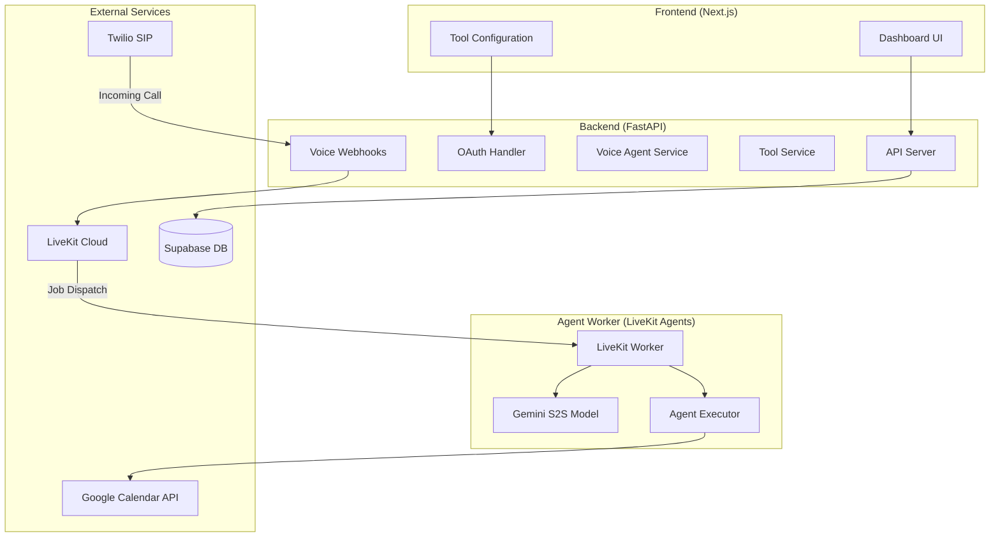
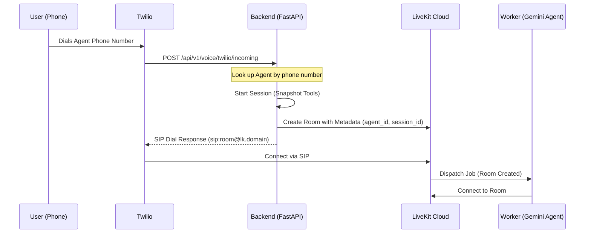
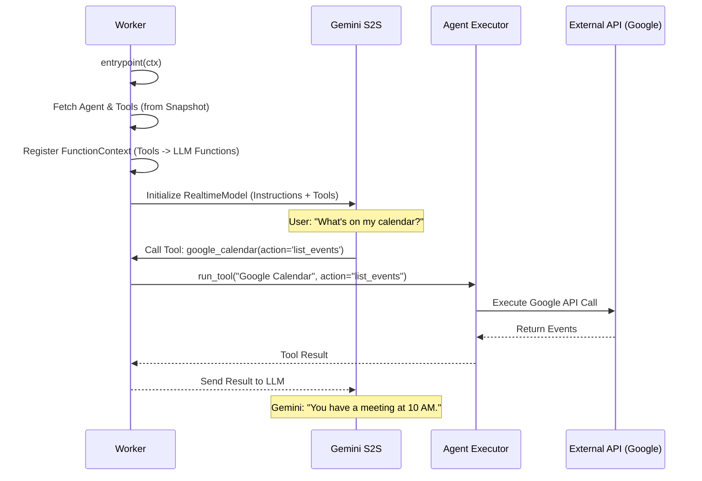

# AI Voice Agent Platform: Architectural Flow & Implementation Guide

This document provides a comprehensive walkthrough of how the platform works, from initial setup to a live AI agent handling a phone call and using tools.

## **1. High-Level Architecture**

The platform is built as a multi-tenant SaaS that bridges traditional telephony (Twilio) with modern AI (Gemini) and real-time communication (LiveKit).

---

## **2. The Flow: Step-by-Step**

### **Phase A: Tool Registration & Configuration**
Before an agent can do anything, tools must be defined in the code and configured by a business user.

1.  **Code Definition**: A developer creates a tool class (e.g., `GoogleCalendarTool`) inheriting from `BaseTool`. This class defines its `metadata` (name, description, config schema).
2.  **Registry**: The tool is registered in `registry.py` so the system knows it exists.
3.  **User Configuration**: 
    - The business user logs into the dashboard.
    - They see the available tools fetched via `tool_routes.py`.
    - For the **Google Calendar** tool, they click "Connect", which triggers an OAuth flow handled by `AuthService`.
    - The encrypted tokens are stored in the `agent_tools` table as `sensitive_config`.

### **Phase B: Incoming Call & Session Initialization**
This is where the "Real-time" magic happens.

**Key Classes/Methods:**
- `VoiceAgentService.get_agent_by_phone()`: Identifies which agent belongs to the dialed number.
- `SessionManager.start_session()`: Creates a "snapshot" of the agent's current tools. If you disable a tool *during* a call, the agent keeps using the snapshot until the call ends.
- `handle_twilio_incoming()`: Returns TwiML that tells Twilio to bridge the call into a LiveKit room via SIP.

### **Phase C: Agent Execution & Tool Usage**
The worker is now live and talking to the user.

**Detailed Logic in `worker.py`:**
- **Dynamic Tool Binding**: We loop through `agent_tools` and use `@fnc_ctx.ai_callable` to turn our Python tools into functions the LLM understands.
- **Closure Capture**: We use a `create_tool_func` helper to ensure that when the LLM calls a tool, it passes the correct `tool_name` to the `AgentExecutor`.
- **Gemini S2S**: The `RealtimeModel` handles audio directly. It doesn't convert speech-to-text; it *understands* the audio and generates a response.

---

## **3. Key Components Reference**

### **The Executor (`agent_executor.py`)**
The `AgentExecutor` is the bridge between the LLM and the tool implementations.
- It verifies if a tool is enabled.
- It injects both public `config` (like `calendar_id`) and `sensitive_config` (like OAuth tokens) into the tool's `execute` method.

### **The Session Manager (`session_service.py`)**
Prevents "mid-call configuration drift."
- **`start_session`**: Captures a list of all `AgentTool` objects.
- **`get_session`**: Used by the worker to retrieve the exact tool state the call started with.

### **The Tool Implementation (`google_calendar.py`)**
- **`metadata`**: Tells the UI how to render the config form and tells the LLM what the tool does.
- **`execute`**: The actual logic that talks to Google. It receives everything it needs (config + tokens) to perform the action.

---

## **Summary for New Developers**
To add a new capability to the agent:
1.  Define a new class in `tools/implementations/`.
2.  Add it to `tools/base/registry.py`.
3.  The UI will automatically show it.
4.  Once a user enables it, the `worker.py` will automatically register it as a "Function" for the Gemini model the next time a call comes in.
