# Database Schema

This document provides a comprehensive overview of the AI Voice Agent Platform database schema. The database uses PostgreSQL with Supabase and includes Row Level Security (RLS) for multi-tenant data isolation.

## Table of Contents

- [Database Overview](#database-overview)
- [Core Tables](#core-tables)
- [Voice Agent Tables](#voice-agent-tables)
- [Billing Tables](#billing-tables)
- [Notification Tables](#notification-tables)
- [Supabase Auth Tables](#supabase-auth-tables)
- [Indexes](#indexes)
- [Row Level Security (RLS)](#row-level-security-rls)
- [Entity Relationships](#entity-relationships)
- [Migration History](#migration-history)

---

## Database Overview

The database is designed as a multi-tenant SaaS platform with the following key characteristics:

- **Multi-tenancy**: Organizations are isolated tenants with their own users, agents, and data
- **RBAC**: Role-Based Access Control with platform admin, org admin, and regular user roles
- **RLS**: Row Level Security ensures users can only access data they're authorized to see
- **Real-time**: Supabase Realtime enabled on selected tables for live UI updates
- **OAuth Integration**: Secure storage of OAuth tokens for third-party tool integrations

### Key Design Decisions

1. **UUID Primary Keys**: All tables use UUIDs for primary keys for security and scalability
2. **Timestamps**: All tables include `created_at` and `updated_at` with timezone support
3. **Soft Deletes**: No soft deletes used - hard deletes with CASCADE are enforced
4. **JSONB Storage**: Flexible JSONB columns for configuration and metadata
5. **Encrypted Sensitive Data**: OAuth tokens and API keys are encrypted in `sensitive_config` columns

---

## Core Tables

### organizations

Stores tenant organization information. Each organization represents a separate customer/tenant.

| Column | Type | Constraints | Description |
|--------|------|-------------|-------------|
| id | UUID | PRIMARY KEY | Unique organization identifier |
| name | VARCHAR(100) | NOT NULL, UNIQUE | Organization display name |
| description | TEXT | NULLABLE | Organization description |
| slug | VARCHAR(100) | NOT NULL, UNIQUE | URL-friendly identifier |
| is_active | BOOLEAN | NOT NULL, DEFAULT TRUE | Organization active status |
| credit_balance | INTEGER | NOT NULL, DEFAULT 0 | Available credit balance |
| website | VARCHAR(255) | NULLABLE | Organization website URL |
| created_at | TIMESTAMPTZ | NOT NULL, DEFAULT NOW() | Creation timestamp |
| updated_at | TIMESTAMPTZ | NOT NULL, DEFAULT NOW() | Last update timestamp |

**Foreign Keys**: None
**RLS**: Enabled
**Indexes**: Unique on `name`, `slug`

---

### roles

Defines available roles in the system for RBAC.

| Column | Type | Constraints | Description |
|--------|------|-------------|-------------|
| id | UUID | PRIMARY KEY | Unique role identifier |
| name | VARCHAR(50) | NOT NULL, UNIQUE | Role name (e.g., platform_admin, org_admin) |
| description | TEXT | NULLABLE | Role description |
| is_system_role | BOOLEAN | NOT NULL, DEFAULT FALSE | System roles cannot be deleted |
| created_at | TIMESTAMPTZ | NOT NULL, DEFAULT NOW() | Creation timestamp |
| updated_at | TIMESTAMPTZ | NOT NULL, DEFAULT NOW() | Last update timestamp |

**Foreign Keys**: None
**RLS**: Enabled

**Predefined System Roles**:
- `platform_admin`: Full control over the entire platform
- `org_admin`: Administrator for a specific organization
- `regular_user`: Standard user with limited permissions

---

### permissions

Defines individual permissions that can be assigned to roles.

| Column | Type | Constraints | Description |
|--------|------|-------------|-------------|
| id | UUID | PRIMARY KEY | Unique permission identifier |
| name | VARCHAR(100) | NOT NULL, UNIQUE | Permission name (e.g., user:create) |
| description | TEXT | NULLABLE | Permission description |
| resource | VARCHAR(50) | NOT NULL | Resource type (e.g., user, organization) |
| action | VARCHAR(50) | NOT NULL | Action type (e.g., create, read, update, delete) |
| created_at | TIMESTAMPTZ | NOT NULL, DEFAULT NOW() | Creation timestamp |
| updated_at | TIMESTAMPTZ | NOT NULL, DEFAULT NOW() | Last update timestamp |

**Foreign Keys**: None
**RLS**: Enabled

---

### role_permissions

Junction table mapping roles to their permissions.

| Column | Type | Constraints | Description |
|--------|------|-------------|-------------|
| id | UUID | PRIMARY KEY | Unique junction record identifier |
| role_id | UUID | NOT NULL, FK → roles.id | Role identifier |
| permission_id | UUID | NOT NULL, FK → permissions.id | Permission identifier |
| created_at | TIMESTAMPTZ | NOT NULL, DEFAULT NOW() | Creation timestamp |

**Foreign Keys**:
- `role_id` → `roles.id` (CASCADE)
- `permission_id` → `permissions.id` (CASCADE)

**RLS**: Enabled
**Unique Constraint**: `(role_id, permission_id)`

---

### user_roles

Junction table mapping users to roles within organizations.

| Column | Type | Constraints | Description |
|--------|------|-------------|-------------|
| id | UUID | PRIMARY KEY | Unique junction record identifier |
| user_id | UUID | NOT NULL, FK → auth.users.id | User identifier (Supabase Auth) |
| role_id | UUID | NOT NULL, FK → roles.id | Role identifier |
| organization_id | UUID | NULLABLE, FK → organizations.id | Organization identifier |
| created_at | TIMESTAMPTZ | NOT NULL, DEFAULT NOW() | Creation timestamp |
| updated_at | TIMESTAMPTZ | NOT NULL, DEFAULT NOW() | Last update timestamp |

**Foreign Keys**:
- `user_id` → `auth.users.id` (CASCADE)
- `role_id` → `roles.id` (CASCADE)
- `organization_id` → `organizations.id` (CASCADE)

**RLS**: Enabled
**Unique Constraint**: `(user_id, organization_id)`

---

### invitations

Stores organization membership invitations sent to users.

| Column | Type | Constraints | Description |
|--------|------|-------------|-------------|
| id | UUID | PRIMARY KEY | Unique invitation identifier |
| email | TEXT | NOT NULL | Email address of invited user |
| organization_id | UUID | NOT NULL, FK → organizations.id | Organization identifier |
| invited_by | UUID | NOT NULL, FK → auth.users.id | User ID who sent invitation |
| token | VARCHAR(255) | NOT NULL, UNIQUE | Unique invitation token |
| status | VARCHAR(20) | NOT NULL, DEFAULT 'pending' | Status: pending, accepted, expired, cancelled |
| expires_at | TIMESTAMPTZ | NOT NULL | Invitation expiration time |
| created_at | TIMESTAMPTZ | NOT NULL, DEFAULT NOW() | Creation timestamp |
| accepted_at | TIMESTAMPTZ | NULLABLE | Acceptance timestamp |

**Foreign Keys**:
- `organization_id` → `organizations.id` (CASCADE)
- `invited_by` → `auth.users.id` (CASCADE)

**RLS**: Enabled
**Check Constraint**: `status IN ('pending', 'accepted', 'expired', 'cancelled')`

**Indexes**:
- `idx_invitations_email`
- `idx_invitations_token`
- `idx_invitations_organization_id`
- `idx_invitations_status`
- `idx_invitations_expires_at`

---

## Voice Agent Tables

### voice_agents

Stores voice agent configurations for each organization.

| Column | Type | Constraints | Description |
|--------|------|-------------|-------------|
| id | UUID | PRIMARY KEY | Unique voice agent identifier |
| organization_id | UUID | NOT NULL, FK → organizations.id | Organization identifier |
| name | VARCHAR(100) | NOT NULL | Voice agent display name |
| phone_number | VARCHAR(20) | NULLABLE | Associated phone number |
| system_prompt | TEXT | NULLABLE | AI system prompt configuration |
| is_active | BOOLEAN | NOT NULL, DEFAULT TRUE | Agent active status |
| created_at | TIMESTAMPTZ | NOT NULL, DEFAULT NOW() | Creation timestamp |
| updated_at | TIMESTAMPTZ | NOT NULL, DEFAULT NOW() | Last update timestamp |

**Foreign Keys**: `organization_id` → `organizations.id` (CASCADE)
**RLS**: Enabled
**Real-time**: Enabled

---

### platform_tools

System-wide tools available for integration with voice agents.

| Column | Type | Constraints | Description |
|--------|------|-------------|-------------|
| id | UUID | PRIMARY KEY | Unique platform tool identifier |
| name | VARCHAR(100) | NOT NULL, UNIQUE | Tool name (e.g., gmail, google_calendar) |
| description | TEXT | NULLABLE | Tool description |
| config_schema | JSONB | NULLABLE | JSON schema for tool configuration |
| tool_functions_schema | JSONB | NULLABLE | JSON schema for available functions |
| is_active | BOOLEAN | NOT NULL, DEFAULT TRUE | Tool active status |
| created_at | TIMESTAMPTZ | NOT NULL, DEFAULT NOW() | Creation timestamp |
| updated_at | TIMESTAMPTZ | NOT NULL, DEFAULT NOW() | Last update timestamp |

**Foreign Keys**: None
**RLS**: Not enabled (system-wide tools)

**OAuth Configuration in `config_schema`**:
```json
{
  "type": "object",
  "properties": {
    "requires_auth": { "type": "boolean" },
    "auth_type": { "type": "string", "enum": ["oauth2"] },
    "oauth_provider": { "type": "string", "enum": ["google"] },
    "scopes": { "type": "array", "items": { "type": "string" } }
  }
}
```

---

### agent_tools

Junction table mapping voice agents to platform tools with configuration.

| Column | Type | Constraints | Description |
|--------|------|-------------|-------------|
| id | UUID | PRIMARY KEY | Unique agent tool identifier |
| agent_id | UUID | NOT NULL, FK → voice_agents.id | Voice agent identifier |
| tool_id | UUID | NOT NULL, FK → platform_tools.id | Platform tool identifier |
| config | JSONB | NULLABLE | Non-sensitive tool configuration |
| sensitive_config | TEXT | NULLABLE | Encrypted OAuth tokens and API keys |
| unselected_functions | ARRAY(VARCHAR) | NULLABLE | Functions excluded from tool |
| is_enabled | BOOLEAN | NOT NULL, DEFAULT TRUE | Tool enabled for this agent |
| last_refreshed_at | TIMESTAMPTZ | NULLABLE | Last OAuth token refresh time |
| created_at | TIMESTAMPTZ | NOT NULL, DEFAULT NOW() | Creation timestamp |
| updated_at | TIMESTAMPTZ | NOT NULL, DEFAULT NOW() | Last update timestamp |

**Foreign Keys**:
- `agent_id` → `voice_agents.id` (CASCADE)
- `tool_id` → `platform_tools.id` (CASCADE)

**RLS**: Enabled
**Unique Constraint**: `(agent_id, tool_id)` named `uq_agent_tool`
**Real-time**: Enabled

**OAuth Token Storage in `sensitive_config`**:
```json
{
  "access_token": "encrypted_access_token",
  "refresh_token": "encrypted_refresh_token",
  "expires_at": 1234567890.0,
  "token_type": "Bearer",
  "scope": "https://www.googleapis.com/auth/gmail.readonly"
}
```

---

## Billing Tables

### subscription_plans

Defines available subscription tiers.

| Column | Type | Constraints | Description |
|--------|------|-------------|-------------|
| id | UUID | PRIMARY KEY | Unique plan identifier |
| name | VARCHAR(100) | NOT NULL, UNIQUE | Plan name (e.g., Basic, Pro, Enterprise) |
| description | TEXT | NULLABLE | Plan description |
| stripe_price_id | VARCHAR(255) | NOT NULL, UNIQUE | Stripe price identifier |
| stripe_product_id | VARCHAR(255) | NOT NULL, UNIQUE | Stripe product identifier |
| price_amount | INTEGER | NOT NULL | Price in cents |
| currency | VARCHAR(3) | NOT NULL, DEFAULT 'USD' | Currency code |
| interval | VARCHAR(20) | NOT NULL | Billing interval: monthly, annual |
| interval_count | INTEGER | NOT NULL, DEFAULT 1 | Number of intervals per billing cycle |
| included_credits | INTEGER | NOT NULL, DEFAULT 0 | Credits included per period |
| max_users | INTEGER | NULLABLE | Maximum users allowed |
| features | JSONB | NULLABLE | Plan features object |
| is_active | BOOLEAN | NOT NULL, DEFAULT TRUE | Plan active status |
| trial_period_days | INTEGER | NULLABLE | Trial duration in days |
| created_at | TIMESTAMPTZ | NOT NULL, DEFAULT NOW() | Creation timestamp |
| updated_at | TIMESTAMPTZ | NOT NULL, DEFAULT NOW() | Last update timestamp |

**Foreign Keys**: None
**RLS**: Enabled

---

### organization_subscriptions

Tracks organization subscription status.

| Column | Type | Constraints | Description |
|--------|------|-------------|-------------|
| id | UUID | PRIMARY KEY | Unique subscription identifier |
| organization_id | UUID | NOT NULL, FK → organizations.id | Organization identifier |
| subscription_plan_id | UUID | NULLABLE, FK → subscription_plans.id | Plan identifier |
| stripe_subscription_id | VARCHAR(255) | NULLABLE, UNIQUE | Stripe subscription identifier |
| stripe_customer_id | VARCHAR(255) | NOT NULL | Stripe customer identifier |
| status | VARCHAR(50) | NOT NULL | Status: trial, active, past_due, cancelled, expired |
| current_period_start | TIMESTAMPTZ | NULLABLE | Current billing period start |
| current_period_end | TIMESTAMPTZ | NULLABLE | Current billing period end |
| trial_start | TIMESTAMPTZ | NULLABLE | Trial start time |
| trial_end | TIMESTAMPTZ | NULLABLE | Trial end time |
| cancel_at_period_end | BOOLEAN | NOT NULL, DEFAULT FALSE | Auto-renewal flag |
| cancelled_at | TIMESTAMPTZ | NULLABLE | Cancellation timestamp |
| metadata | JSONB | NULLABLE | Additional metadata |
| created_at | TIMESTAMPTZ | NOT NULL, DEFAULT NOW() | Creation timestamp |
| updated_at | TIMESTAMPTZ | NOT NULL, DEFAULT NOW() | Last update timestamp |

**Foreign Keys**:
- `organization_id` → `organizations.id` (CASCADE)
- `subscription_plan_id` → `subscription_plans.id` (SET NULL)

**RLS**: Enabled
**Unique Constraints**: `(organization_id)`, `(stripe_subscription_id)`

**Indexes**:
- `idx_org_subscriptions_org_id`
- `idx_org_subscriptions_stripe_sub_id`

---

### credit_events

Defines events and their credit costs.

| Column | Type | Constraints | Description |
|--------|------|-------------|-------------|
| id | UUID | PRIMARY KEY | Unique event identifier |
| name | VARCHAR(100) | NOT NULL, UNIQUE | Event name |
| description | TEXT | NULLABLE | Event description |
| credit_cost | INTEGER | NOT NULL | Credit cost per event |
| category | VARCHAR(50) | NOT NULL | Category: api_call, storage, compute, etc. |
| is_active | BOOLEAN | NOT NULL, DEFAULT TRUE | Event active status |
| metadata | JSONB | NULLABLE | Additional metadata |
| created_at | TIMESTAMPTZ | NOT NULL, DEFAULT NOW() | Creation timestamp |
| updated_at | TIMESTAMPTZ | NOT NULL, DEFAULT NOW() | Last update timestamp |

**Foreign Keys**: None
**RLS**: Enabled

---

### credit_transactions

Tracks all credit movements.

| Column | Type | Constraints | Description |
|--------|------|-------------|-------------|
| id | UUID | PRIMARY KEY | Unique transaction identifier |
| organization_id | UUID | NOT NULL, FK → organizations.id | Organization identifier |
| transaction_type | VARCHAR(50) | NOT NULL | Type: earned, purchased, consumed, expired |
| amount | INTEGER | NOT NULL | Positive for credits added, negative for consumed |
| balance_after | INTEGER | NOT NULL | Balance after transaction |
| source | VARCHAR(50) | NOT NULL | Source: subscription, purchase, event_consumption, expiry |
| source_id | UUID | NULLABLE | Reference to source record |
| credit_event_id | UUID | NULLABLE, FK → credit_events.id | Event identifier (for consumption) |
| expires_at | TIMESTAMPTZ | NULLABLE | Expiration timestamp for subscription credits |
| stripe_payment_intent_id | VARCHAR(255) | NULLABLE | Stripe payment intent identifier |
| description | TEXT | NULLABLE | Transaction description |
| metadata | JSONB | NULLABLE | Additional metadata |
| created_at | TIMESTAMPTZ | NOT NULL, DEFAULT NOW() | Creation timestamp |

**Foreign Keys**:
- `organization_id` → `organizations.id` (CASCADE)
- `credit_event_id` → `credit_events.id` (SET NULL)

**RLS**: Enabled

**Indexes**:
- `idx_credit_transactions_org_id`
- `idx_credit_transactions_created_at`

---

### credit_products

Defines standalone credit purchase products.

| Column | Type | Constraints | Description |
|--------|------|-------------|-------------|
| id | UUID | PRIMARY KEY | Unique product identifier |
| name | VARCHAR(100) | NOT NULL, UNIQUE | Product name |
| description | TEXT | NULLABLE | Product description |
| stripe_price_id | VARCHAR(255) | NOT NULL, UNIQUE | Stripe price identifier |
| stripe_product_id | VARCHAR(255) | NOT NULL, UNIQUE | Stripe product identifier |
| credit_amount | INTEGER | NOT NULL | Credits included |
| price_amount | INTEGER | NOT NULL | Price in cents |
| currency | VARCHAR(3) | NOT NULL, DEFAULT 'USD' | Currency code |
| is_active | BOOLEAN | NOT NULL, DEFAULT TRUE | Product active status |
| created_at | TIMESTAMPTZ | NOT NULL, DEFAULT NOW() | Creation timestamp |
| updated_at | TIMESTAMPTZ | NOT NULL, DEFAULT NOW() | Last update timestamp |

**Foreign Keys**: None
**RLS**: Enabled

---

### billing_history

Tracks payment history and invoices.

| Column | Type | Constraints | Description |
|--------|------|-------------|-------------|
| id | UUID | PRIMARY KEY | Unique billing record identifier |
| organization_id | UUID | NOT NULL, FK → organizations.id | Organization identifier |
| stripe_invoice_id | VARCHAR(255) | NULLABLE, UNIQUE | Stripe invoice identifier |
| stripe_payment_intent_id | VARCHAR(255) | NULLABLE | Stripe payment intent identifier |
| amount | INTEGER | NOT NULL | Amount in cents |
| currency | VARCHAR(3) | NOT NULL, DEFAULT 'USD' | Currency code |
| status | VARCHAR(50) | NOT NULL | Status: pending, paid, failed, refunded |
| description | TEXT | NULLABLE | Transaction description |
| invoice_url | TEXT | NULLABLE | Stripe invoice URL |
| receipt_url | TEXT | NULLABLE | Stripe receipt URL |
| billing_reason | VARCHAR(50) | NULLABLE | Reason: subscription_create, subscription_cycle, manual |
| metadata | JSONB | NULLABLE | Additional metadata |
| paid_at | TIMESTAMPTZ | NULLABLE | Payment timestamp |
| created_at | TIMESTAMPTZ | NOT NULL, DEFAULT NOW() | Creation timestamp |
| updated_at | TIMESTAMPTZ | NOT NULL, DEFAULT NOW() | Last update timestamp |

**Foreign Keys**: `organization_id` → `organizations.id` (CASCADE)
**RLS**: Enabled

**Indexes**:
- `idx_billing_history_org_id`
- `idx_billing_history_stripe_invoice_id`

---

## Notification Tables

### notification_events

Defines events that can trigger notifications.

| Column | Type | Constraints | Description |
|--------|------|-------------|-------------|
| id | UUID | PRIMARY KEY | Unique event identifier |
| name | VARCHAR(100) | NOT NULL | Event display name |
| description | TEXT | NULLABLE | Event description |
| event_key | VARCHAR(100) | NOT NULL, UNIQUE | Unique event key (e.g., user.signup, subscription.created) |
| category | VARCHAR(50) | NOT NULL | Category: auth, billing, organization |
| is_enabled | BOOLEAN | NOT NULL, DEFAULT TRUE | Event enabled status |
| default_template_id | UUID | NULLABLE, FK → notification_templates.id | Default template |
| metadata | JSONB | NULLABLE | Additional configuration |
| created_at | TIMESTAMPTZ | NOT NULL, DEFAULT NOW() | Creation timestamp |
| updated_at | TIMESTAMPTZ | NOT NULL, DEFAULT NOW() | Last update timestamp |

**Foreign Keys**: `default_template_id` → `notification_templates.id` (SET NULL)
**RLS**: Enabled

**Indexes**:
- `idx_notification_events_event_key`
- `idx_notification_events_category`
- `idx_notification_events_is_enabled`

---

### notification_templates

Stores email templates.

| Column | Type | Constraints | Description |
|--------|------|-------------|-------------|
| id | UUID | PRIMARY KEY | Unique template identifier |
| name | VARCHAR(100) | NOT NULL, UNIQUE | Template name |
| description | TEXT | NULLABLE | Template description |
| subject | VARCHAR(255) | NOT NULL | Email subject |
| html_content | TEXT | NOT NULL | HTML email template with placeholders |
| text_content | TEXT | NULLABLE | Plain text fallback |
| from_email | VARCHAR(255) | NULLABLE | Override sender email |
| from_name | VARCHAR(100) | NULLABLE | Override sender name |
| template_variables | JSONB | NULLABLE | Available template variables |
| is_active | BOOLEAN | NOT NULL, DEFAULT TRUE | Template active status |
| created_at | TIMESTAMPTZ | NOT NULL, DEFAULT NOW() | Creation timestamp |
| updated_at | TIMESTAMPTZ | NOT NULL, DEFAULT NOW() | Last update timestamp |

**Foreign Keys**: None
**RLS**: Enabled

**Indexes**:
- `idx_notification_templates_is_active`

---

### notification_logs

Tracks all sent notifications.

| Column | Type | Constraints | Description |
|--------|------|-------------|-------------|
| id | UUID | PRIMARY KEY | Unique log identifier |
| notification_event_id | UUID | NOT NULL, FK → notification_events.id | Event identifier |
| notification_template_id | UUID | NULLABLE, FK → notification_templates.id | Template identifier |
| organization_id | UUID | NULLABLE, FK → organizations.id | Organization context |
| user_id | UUID | NULLABLE, FK → auth.users.id | User identifier |
| recipient_email | VARCHAR(255) | NOT NULL | Recipient email |
| recipient_name | VARCHAR(100) | NULLABLE | Recipient name |
| subject | VARCHAR(255) | NOT NULL | Email subject |
| status | VARCHAR(50) | NOT NULL | Status: pending, sent, failed, bounced |
| provider | VARCHAR(50) | NOT NULL, DEFAULT 'resend' | Email provider |
| provider_message_id | VARCHAR(255) | NULLABLE | Provider-specific message ID |
| error_message | TEXT | NULLABLE | Error details |
| sent_at | TIMESTAMPTZ | NULLABLE | Sent timestamp |
| metadata | JSONB | NULLABLE | Additional data |
| created_at | TIMESTAMPTZ | NOT NULL, DEFAULT NOW() | Creation timestamp |

**Foreign Keys**:
- `notification_event_id` → `notification_events.id` (CASCADE)
- `notification_template_id` → `notification_templates.id` (SET NULL)
- `organization_id` → `organizations.id` (CASCADE)
- `user_id` → `auth.users.id` (implicit from auth.users)

**RLS**: Enabled

**Indexes**:
- `idx_notification_logs_event_id`
- `idx_notification_logs_organization_id`
- `idx_notification_logs_user_id`
- `idx_notification_logs_status`
- `idx_notification_logs_created_at`
- `idx_notification_logs_recipient_email`

---

## Supabase Auth Tables

Supabase provides the following authentication tables managed by Supabase Auth:

### auth.users

| Column | Type | Description |
|--------|------|-------------|
| id | UUID | Unique user identifier (used as FK in other tables) |
| email | TEXT | User email address |
| email_confirmed_at | TIMESTAMPTZ | Email confirmation timestamp |
| encrypted_password | TEXT | Encrypted password |
| invited_at | TIMESTAMPTZ | Invitation timestamp |
| recovery_sent_at | TIMESTAMPTZ | Password recovery sent timestamp |
| last_sign_in_at | TIMESTAMPTZ | Last login timestamp |
| raw_app_meta_data | JSONB | Application metadata |
| raw_user_meta_data | JSONB | User metadata |
| is_super_admin | BOOLEAN | Super admin flag |
| created_at | TIMESTAMPTZ | Creation timestamp |
| updated_at | TIMESTAMPTZ | Last update timestamp |

**Note**: This table is managed by Supabase Auth and should not be modified directly.

### auth.identities

Stores user identities from various authentication providers (email, OAuth, etc.).

### auth.sessions

Stores active user sessions for JWT token management.

---

## Row Level Security (RLS)

Row Level Security is enabled on most application tables to enforce multi-tenant data isolation. Below is a summary of key RLS policies:

### Organizations Table

- **Platform admins**: Can manage all organizations
- **Org admins**: Can manage their own organization
- **Users**: Can view organizations they belong to

### Voice Agents Table

- **Platform admins**: Full access to all voice agents
- **Org admins**: Full access to voice agents in their organization
- **Regular users**: Read-only access to voice agents in their organization

### Agent Tools Table

- **Platform admins**: Full access to all agent tools
- **Org admins**: Full access to tools for agents in their organization
- **Regular users**: Read-only access to tools for agents in their organization

### User Roles Table

- **Platform admins**: Can manage all user roles
- **Org admins**: Can manage roles within their organization
- **Users**: Can view their own roles

---

## Entity Relationships

```mermaid
erDiagram
    organizations {
        uuid id
        varchar name
        text description
        varchar slug
        boolean is_active
        integer credit_balance
        varchar website
        timestamptz created_at
        timestamptz updated_at
    }

    voice_agents {
        uuid id
        uuid organization_id
        varchar name
        varchar phone_number
        text system_prompt
        boolean is_active
        timestamptz created_at
        timestamptz updated_at
    }

    platform_tools {
        uuid id
        varchar name
        text description
        jsonb config_schema
        jsonb tool_functions_schema
        boolean is_active
        timestamptz created_at
        timestamptz updated_at
    }

    agent_tools {
        uuid id
        uuid agent_id
        uuid tool_id
        jsonb config
        text sensitive_config
        varchar[] unselected_functions
        boolean is_enabled
        timestamptz last_refreshed_at
        timestamptz created_at
        timestamptz updated_at
    }

    auth {
        uuid id
        varchar email
        text encrypted_password
        timestamptz email_confirmed_at
        timestamptz last_sign_in_at
        jsonb raw_app_meta_data
        jsonb raw_user_meta_data
        boolean is_super_admin
        timestamptz created_at
        timestamptz updated_at
    }

    roles {
        uuid id
        varchar name
        text description
        boolean is_system_role
        timestamptz created_at
        timestamptz updated_at
    }

    permissions {
        uuid id
        varchar name
        text description
        varchar resource
        varchar action
        timestamptz created_at
        timestamptz updated_at
    }

    user_roles {
        uuid id
        uuid user_id
        uuid role_id
        uuid organization_id
        timestamptz created_at
        timestamptz updated_at
    }

    role_permissions {
        uuid id
        uuid role_id
        uuid permission_id
        timestamptz created_at
    }

    invitations {
        uuid id
        varchar email
        uuid organization_id
        uuid invited_by
        varchar token
        varchar status
        timestamptz expires_at
        timestamptz created_at
        timestamptz accepted_at
    }

    subscription_plans {
        uuid id
        varchar name
        text description
        varchar stripe_price_id
        varchar stripe_product_id
        integer price_amount
        varchar currency
        varchar interval
        integer included_credits
        integer max_users
        jsonb features
        boolean is_active
        integer trial_period_days
        timestamptz created_at
        timestamptz updated_at
    }

    organization_subscriptions {
        uuid id
        uuid organization_id
        uuid subscription_plan_id
        varchar stripe_subscription_id
        varchar stripe_customer_id
        varchar status
        timestamptz current_period_start
        timestamptz current_period_end
        timestamptz trial_start
        timestamptz trial_end
        boolean cancel_at_period_end
        timestamptz cancelled_at
        jsonb metadata
        timestamptz created_at
        timestamptz updated_at
    }

    credit_events {
        uuid id
        varchar name
        text description
        integer credit_cost
        varchar category
        boolean is_active
        jsonb metadata
        timestamptz created_at
        timestamptz updated_at
    }

    credit_transactions {
        uuid id
        uuid organization_id
        varchar transaction_type
        integer amount
        integer balance_after
        varchar source
        uuid source_id
        uuid credit_event_id
        timestamptz expires_at
        varchar stripe_payment_intent_id
        text description
        jsonb metadata
        timestamptz created_at
    }

    credit_products {
        uuid id
        varchar name
        text description
        varchar stripe_price_id
        varchar stripe_product_id
        integer credit_amount
        integer price_amount
        varchar currency
        boolean is_active
        timestamptz created_at
        timestamptz updated_at
    }

    billing_history {
        uuid id
        uuid organization_id
        varchar stripe_invoice_id
        varchar stripe_payment_intent_id
        integer amount
        varchar currency
        varchar status
        text description
        text invoice_url
        text receipt_url
        varchar billing_reason
        jsonb metadata
        timestamptz paid_at
        timestamptz created_at
        timestamptz updated_at
    }

    notification_events {
        uuid id
        varchar name
        text description
        varchar event_key
        varchar category
        boolean is_enabled
        uuid default_template_id
        jsonb metadata
        timestamptz created_at
        timestamptz updated_at
    }

    notification_templates {
        uuid id
        varchar name
        text description
        varchar subject
        text html_content
        text text_content
        varchar from_email
        varchar from_name
        jsonb template_variables
        boolean is_active
        timestamptz created_at
        timestamptz updated_at
    }

    notification_logs {
        uuid id
        uuid notification_event_id
        uuid notification_template_id
        uuid organization_id
        uuid user_id
        varchar recipient_email
        varchar recipient_name
        varchar subject
        varchar status
        varchar provider
        varchar provider_message_id
        text error_message
        timestamptz sent_at
        jsonb metadata
        timestamptz created_at
    }

    organizations ||--o{ voice_agents : "has many"
    voice_agents ||--o{ agent_tools : "has many"
    platform_tools ||--o{ agent_tools : "used by"

    auth ||--o{ user_roles : "has many"
    organizations ||--o{ user_roles : "has many"
    roles ||--o{ user_roles : "assigned to"
    roles ||--o{ role_permissions : "has many"
    permissions ||--o{ role_permissions : "assigned to"

    organizations ||--o{ invitations : "has many"
    auth ||--o{ invitations : "sent by"

    organizations ||--|| organization_subscriptions : "has one"
    organizations ||--o{ credit_transactions : "has many"
    organizations ||--o{ billing_history : "has many"
    organizations ||--o{ notification_logs : "has many"

    subscription_plans ||--o{ organization_subscriptions : "defines"
    credit_events ||--o{ credit_transactions : "applied to"
    credit_products ||--o{ credit_transactions : "purchased"

    auth ||--o{ notification_logs : "recipient of"
    notification_events ||--o{ notification_logs : "triggers"
    notification_templates ||--o{ notification_events : "default for"
    notification_templates ||--o{ notification_logs : "used in"
```



---

## Migration History

### Migration Order

1. `91759229c32b` - Add initial RBAC tables (organizations, roles, permissions, etc.)
2. `20251124111200` - Simplify organization fields
3. `20250902100001` - Change organization unique constraints
4. `a1b2c3d4e5f6` - Add website field to organization
5. `b1c2d3e4f5g6` - Add billing and subscription tables
6. `c1d2e3f4g5h6` - Add notification system tables
7. `d1e2f3g4h5i6` - Add email verification tokens
8. `8275d5d05e2c4110` - Add invitations table
9. `20251220000000` - Add voice agents and tools
10. `20251230000002` - Add tool functions schema and unselected functions
11. `20260111000001` - Add auth columns to platform tools
12. `20260118000001` - Add last_refreshed_at to agent_tools

---

## Real-time Tables

The following tables have Supabase Realtime enabled for automatic UI synchronization:

- `voice_agents`
- `agent_tools`

These tables are configured in `scripts/setup-supabase-realtime.sql` and allow the frontend to receive live updates when data changes (e.g., when OAuth tokens are refreshed, when tools are configured/disabled).

---

## Security Notes

### OAuth Token Storage

- OAuth tokens and API keys are stored in the `sensitive_config` column of `agent_tools` table
- The `sensitive_config` field is encrypted using Fernet encryption
- Only backend services (FastAPI, Worker) can decrypt these values
- Frontend API endpoints exclude `sensitive_config` from responses

### Row Level Security

- RLS policies ensure users can only access data they're authorized to see
- Platform admins have full access to all data
- Org admins have full access within their organization
- Regular users have read-only access within their organization

### Database Encryption

- Passwords are hashed and stored in `auth.users.encrypted_password`
- Sensitive configuration (OAuth tokens) is encrypted in `agent_tools.sensitive_config`
- All tables use RLS for data isolation

---

## Performance Considerations

### Indexes

Key indexes have been created for:

- Foreign key columns (organization_id, user_id, agent_id, tool_id, etc.)
- frequently queried columns (status, is_active, event_key)
- Timestamp columns (created_at, expires_at)
- Unique constraints (email, token, stripe_subscription_id)

### Query Patterns

- Use `organization_id` for filtering tenant-specific data
- Use `user_id` from `auth.uid()` for RLS policy checks
- Join with `user_roles` and `roles` for permission checks
- Use `created_at` timestamps for time-based queries

---

## Maintenance

### Running Migrations

```bash
cd backend
source .venv/bin/activate
alembic upgrade head
```

### Creating New Migrations

```bash
cd backend
source .venv/bin/activate
alembic revision --autogenerate -m "description of changes"
```

### Setting Up Real-time

```bash
# Run in Supabase SQL Editor
cat scripts/setup-supabase-realtime.sql
```

---

## Schema Change Policy

When making schema changes:

1. **Create a migration**: Always use Alembic migrations for schema changes
2. **Update documentation**: Update this document when schema changes are made
3. **Add indexes**: Add appropriate indexes for new foreign keys and frequently queried columns
4. **Update RLS policies**: Ensure RLS policies cover new tables and columns
5. **Test migrations**: Test migrations on staging environment before production
6. **Document deprecations**: Note deprecated columns and tables

---

## References

- [Alembic Documentation](https://alembic.sqlalchemy.org/)
- [Supabase Auth Guide](https://supabase.com/docs/guides/auth)
- [Supabase Row Level Security](https://supabase.com/docs/guides/auth/row-level-security)
- [Supabase Realtime](https://supabase.com/docs/guides/realtime)
- [PostgreSQL JSONB](https://www.postgresql.org/docs/current/datatype-json.html)

---

**Last Updated**: 2025-01-19
