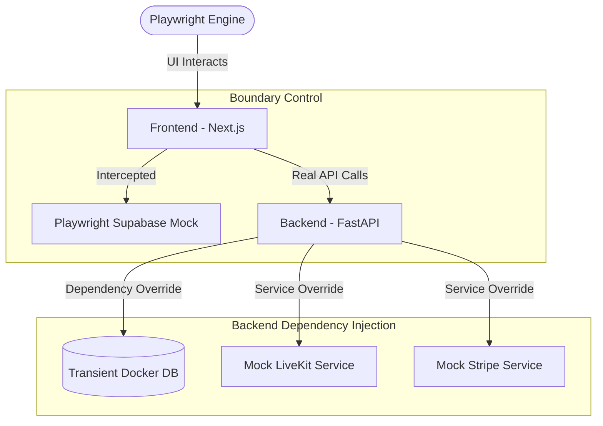

# End-to-End (E2E) Testing Strategy

This document outlines the hybrid testing architecture for the AI Voice Agent Platform. Our goal is to achieve high-confidence E2E coverage while maintaining a clean, deterministic, and cost-effective testing environment.

## 1. Core Principles

- **Zero Side Effects**: Tests must not touch production or staging data/APIs.
- **Deterministic**: Tests should produce the same results every time.
- **Transient Infrastructure**: Data and state should be nuked after test execution.
- **Service Isolation**: We test our code, not third-party reliability.

---

## 2. The Hybrid Architecture

We use a "Grey Box" approach where the Frontend and Backend are real, but external boundaries are controlled.



### A. Frontend: Authentication Mocking (Supabase)
Since the frontend communicates directly with Supabase, we bypass the cloud using **Playwright Network Interception**.
- **Mechanism**: `page.route('**/auth/v1/**', ...)`
- **Benefit**: 
    - Eliminates "429 Rate Limit" issues.
    - No real emails are sent.
    - Instant "login" for test users.

### B. Backend: External API Mocking
We use FastAPI's `dependency_overrides` to swap real service classes with mock implementations when the app is running in test mode.
- **Target Services**: 
    - `LiveKitService`: Returns fixed room tokens and simulated status.
    - `StripeService`: Simulates successful/failed checkout sessions without network calls.
- **Activation**: Triggered by `APP_ENV=test` environment variable.

### C. Data Management: Transient Database
To ensure we test actual SQL queries and migrations without polluting our dev database:
- **Strategy**: A dedicated Docker container (or a separate database name) is used.
- **Lifecycle**:
    1.  **Start**: Spin up fresh Postgres container.
    2.  **Migrate**: Run `alembic upgrade head`.
    3.  **Execute**: Run E2E tests.
    4.  **Teardown**: Drop database / Stop container.

---

## 3. Implementation Details

### Mocking Example (Playwright)
```python
# e2e/conftest.py
def mock_supabase_auth(page):
    page.route("**/auth/v1/signup", lambda route: route.fulfill(
        status=200,
        content_type="application/json",
        body='{"id": "test-uuid", "email": "test@gmail.com"}'
    ))
```

### Mocking Example (FastAPI)
```python
# backend/src/main.py
if settings.APP_ENV == "test":
    app.dependency_overrides[get_livekit_service] = MockLiveKitService
```

---

## 4. Workflow for Developers

To run the full suite locally:
1.  **Initialize**: `./scripts/setup-test-db.sh`
2.  **Start Services**: `source ./test-env.sh && uvicorn main:app` (in test mode)
3.  **Run Tests**: `pytest e2e/`
4.  **Cleanup**: Automatically handled by teardown scripts.

---

## 5. Future Enhancements
- **Inbucket Integration**: If we ever need to test real email content/links, we will use a local Inbucket (SMTP mock) container.
- **Visual Regression**: Adding Playwright snapshot testing to ensure UI components don't drift.
