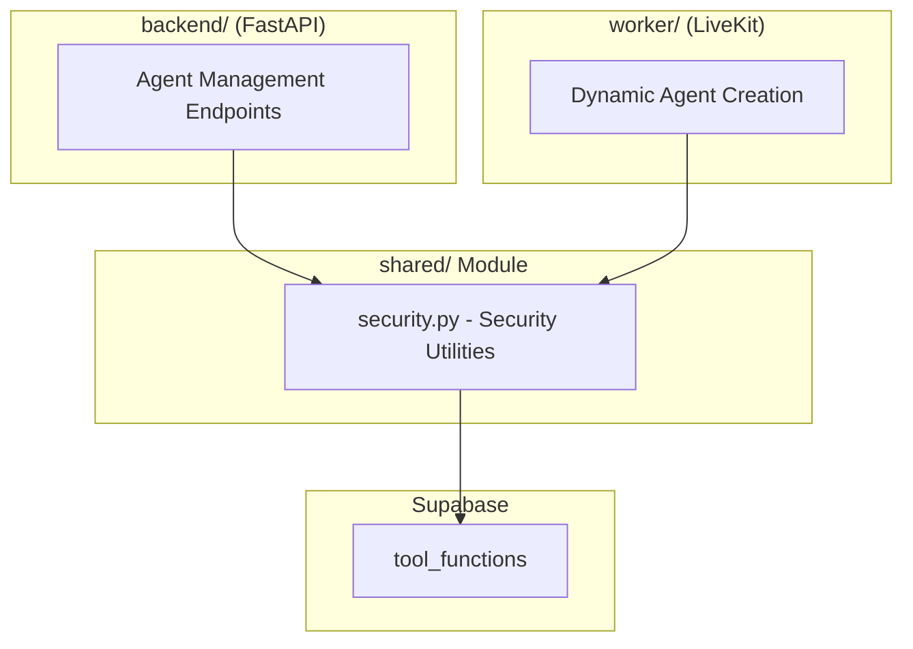

# Shared Code - Voice Agents Platform

This directory contains code shared between the backend and worker services, specifically for the voice agents system.

## 🏗️ Architecture

### Purpose

The shared module allows both the backend (for API endpoints) and worker (for voice agent execution) to use the same:

- **Data models**: Pydantic models for tools, agents, and configurations
- **Business logic**: Service layer for tool and agent management
- **Tool implementations**: Reusable tool classes
- **Type definitions**: Consistent types across services



## 📁 Directory Structure

```
shared/
├── voice_agents/
│   ├── service.py           # Voice agent CRUD operations
│   ├── tool_service.py      # Tool CRUD and query operations
│   ├── tool_models.py       # Pydantic models for tools
│   ├── livekit_service.py  # LiveKit room creation
│   ├── models.py           # Voice agent data models
│   ├── tools/             # Tool implementation framework
│   │   ├── base/
│   │   │   ├── base_tool.py            # Base class for tools
│   │   │   ├── action_models.py        # Action function models
│   │   │   ├── registry_livekit.py    # Tool registry for worker
│   │   │   └── __init__.py
│   │   └── implementations/            # Concrete tool implementations
│   │       └── google_calendar.py      # Google Calendar tool
│   └── __init__.py
├── config/
│   ├── opentelemetry.py   # OpenTelemetry setup
│   ├── settings.py        # Environment-based settings
│   ├── supabase.py       # Supabase client initialization
│   └── __init__.py
├── common/
│   ├── errors.py          # Common error classes
│   ├── security.py        # Security utilities
│   └── __init__.py
└── __init__.py
```

## 🔑 Key Components

### 1. Voice Agent Service (`voice_agents/service.py`)

**Purpose**: CRUD operations for voice agents

**Key Methods**:

- `create_voice_agent()`: Create new voice agent
- `get_voice_agent()`: Get voice agent by ID
- `update_voice_agent()`: Update agent configuration
- `delete_voice_agent()`: Delete agent
- `list_voice_agents()`: List agents (with filters)

**Usage**:

```python
from shared.voice_agents.service import voice_agent_service

# Create agent
agent = await voice_agent_service.create_voice_agent(
    VoiceAgentCreate(
        name="Support Agent",
        organization_id=org_id,
        system_prompt="You are a helpful support agent...",
        is_active=True
    )
)

# Get agent with tools
agent_with_tools = await voice_agent_service.get_voice_agent(agent_id, include_tools=True)
```

### 2. Tool Service (`voice_agents/tool_service.py`)

**Purpose**: Two-tier service for tool management

#### For Backend (API Layer)

Returns **safe responses** without sensitive data:

```python
# Get tools for API response (no OAuth tokens)
tools = await tool_service.get_tools_by_organization(org_id, safe=True)
# Each tool has: id, name, description, config_schema, metadata
# Does NOT have: sensitive_config, OAuth tokens
```

#### For Worker (Agent Execution)

Returns **full tool objects** with all configuration:

```python
# Get tool for worker (includes OAuth tokens)
tool_instance = await tool_service.get_tool_instance(tool_id, org_id)
# Returns: Tool class instance with:
# - config (public config)
# - sensitive_config (OAuth tokens, secrets)
# - All methods callable by LLM
```

**Key Methods**:

- `create_tool()`: Register new platform tool
- `get_tool()`: Get tool metadata
- `get_tool_instance()`: Instantiate tool with full config (for worker)
- `get_tools_by_organization()`: List tools (safe mode for API)
- `associate_tool_with_agent()`: Link tool to agent
- `get_tools_for_agent()`: Get all tools for an agent

### 3. Tool Models (`voice_agents/tool_models.py`)

**Purpose**: Pydantic models for tools

**Key Models**:

- `ToolMetadata`: Tool name, description, config schema, auth info
- `ToolConfig`: Public configuration for tool (calendar ID, etc.)
- `ToolSensitiveConfig`: Sensitive data (OAuth tokens, API keys)
- `ToolFunctionMetadata`: Metadata about tool methods
- `ToolCreate/Update`: Request models for tool CRUD
- `ToolInstanceResponse`: Safe response for API (no secrets)

**Usage**:

```python
from shared.voice_agents.tool_models import ToolMetadata, ToolConfig

# Tool metadata
metadata = ToolMetadata(
    name="Google_calendar",
    description="Manage Google Calendar events...",
    requires_auth=True,
    auth_type="oauth2",
    config_schema={"type": "object", "properties": {...}}
)

# Tool config
config = ToolConfig(
    calendar_id="primary",
    default_event_duration=30
)
```

### 4. Base Tool Class (`voice_agents/tools/base/base_tool.py`)

**Purpose**: Abstract base class for all tool implementations

**Structure**:

```python
class BaseTool(ABC):
    @property
    @abstractmethod
    def metadata(self) -> ToolMetadata:
        """Tool metadata for LLM and UI."""
        pass

    async def test_tool(self, context: RunContext) -> dict[str, Any]:
        """Test tool configuration."""
        pass

    # Implementations add their own methods
    async def check_availability(self, context: RunContext, ...) -> dict:
        pass

    async def create_event(self, context: RunContext, ...) -> dict:
        pass
```

**Implementing a Tool**:

```python
from shared.voice_agents.tools.base.base_tool import BaseTool

class MyTool(BaseTool):
    class Config(BaseConfig):
        my_param: str = "default"

    class SensitiveConfig(BaseSensitiveConfig):
        api_key: str = ""

    @property
    def metadata(self) -> ToolMetadata:
        return ToolMetadata(
            name="MyTool",
            description="My tool description",
            # ...
        )

    async def my_action(
        self,
        context: RunContext,
        param1: str,
        optional_param: str | None = None
    ) -> dict[str, Any]:
        """Action description for LLM."""
        # Implementation
        return {"result": "..."}
```

### 5. Tool Registry (`voice_agents/tools/base/registry_livekit.py`)

**Purpose**: Auto-discover and register tool implementations

**Process**:

1. Scan `shared.voice_agents.tools.implementations` package
2. Import all tool classes
3. Register each tool class in `_tools` dictionary
4. Provide methods to instantiate tools

**Usage**:

```python
from shared.voice_agents.tools.base.registry_livekit import livekit_tool_registry

# Register tools (done by worker on startup)
livekit_tool_registry.register_tools_from_package("shared.voice_agents.tools.implementations")

# Get tool class
tool_class = livekit_tool_registry.get_tool_class("Google_calendar")

# Instantiate tool
tool_instance = tool_class(config, sensitive_config)
```

### 6. LiveKit Service (`voice_agents/livekit_service.py`)

**Purpose**: Create LiveKit rooms for voice agent sessions

**Key Method**:

```python
async def create_agent_room(
    agent_id: str,
    phone_number: str
) -> dict[str, Any]:
    """
    Create a LiveKit room for a voice agent session.

    Room name format: agent-{agent_id}-{phone_number}
    """
    # Create room via LiveKit API
    # Return room details (room_name, room_sid, etc.)
```

**Integration Flow**:

1. Backend validates agent and initiates call
2. Backend calls `create_agent_room()` to create LiveKit room
3. LiveKit dispatch creates job for worker
4. Worker extracts phone from room name
5. Agent connects and starts session

### 7. Configuration (`config/`)

**opentelemetry.py**: OpenTelemetry initialization

- Sets up tracing, metrics, logging
- Configures OTLP exporter
- Registers instrumentation

**settings.py**: Environment-based configuration

- Database URL
- LiveKit credentials
- OAuth settings
- Feature flags

**supabase.py**: Supabase client initialization

- Creates async Supabase client
- Provides table access methods

### 8. Common Utilities (`common/`)

**errors.py**: Custom error classes

- `ToolNotFoundError`
- `AgentNotFoundError`
- `ConfigurationError`
- etc.

**security.py**: Security utilities

- Token validation
- Secret handling
- Sanitization

## 🔑 Key Design Patterns

### 1. Two-Tier Service

**Rationale**: Different security requirements for API vs. worker

**Backend (API Layer)**:

```python
# Get tools for display in UI - NO secrets
tools = await tool_service.get_tools_by_organization(org_id, safe=True)
# Returns: Tool name, description, config schema (for form inputs)
# Does NOT return: OAuth tokens, API keys, etc.
```

**Worker (Agent Execution)**:

```python
# Get tool for LLM execution - WITH secrets
tool_instance = await tool_service.get_tool_instance(tool_id, org_id)
# Returns: Fully instantiated tool with:
# - config (calendar_id, etc.)
# - sensitive_config (access_token, refresh_token, etc.)
# - All methods callable by LLM
```

### 2. No Session Manager

**Rationale**: Statelessness and simplicity

**Implementation**:

- Worker fetches tools directly from database each call
- No in-memory session manager
- Each call gets fresh configuration and OAuth tokens

**Benefits**:

- Simplified architecture
- No stale configuration
- Easy to scale (multiple workers)
- Configuration changes take effect immediately

### 3. Base Class Pattern

**Rationale**: Consistent tool interface

**Benefits**:

- All tools have same structure
- Auto-discovery via registry
- Type safety with Pydantic models
- Clear metadata for LLM and UI

### 4. Tool Registration

**Process**:

1. Tool classes defined in `shared.voice_agents.tools.implementations`
2. Worker imports package
3. Registry auto-discovers all tool classes
4. Worker queries database for enabled tools
5. Worker instantiates tools with config
6. Worker wraps methods for LiveKit compatibility

## 🔧 Using the Shared Module

### In Backend

```python
from shared.voice_agents.service import voice_agent_service
from shared.voice_agents.tool_service import tool_service

# API endpoint: List tools
@app.get("/api/tools")
async def list_tools(org_id: str):
    tools = await tool_service.get_tools_by_organization(org_id, safe=True)
    return {"tools": tools}
```

### In Worker

```python
from shared.voice_agents.service import voice_agent_service
from shared.voice_agents.tool_service import tool_service

# Get agent configuration
agent = await voice_agent_service.get_voice_agent(agent_id, include_tools=True)

# Instantiate tool (with OAuth tokens)
tool_instance = await tool_service.get_tool_instance(tool_id, org_id)
```

### Adding a New Tool

1. Create tool class in `shared.voice_agents/tools/implementations/`:

   ```python
   class MyTool(BaseTool):
       # Implementation
   ```

2. Tool is auto-registered by `registry_livekit.py`

3. Worker automatically discovers and uses it

4. Backend can query tool metadata for UI

## 📊 Database Schema

### Tables Used

**voice_agents**: Agent definitions

- id, name, organization_id, system_prompt, is_active, created_at, etc.

**agent_tools**: Agent-tool associations

- id, agent_id, tool_id, config, is_enabled, function_enables

**platform_tools**: Tool definitions

- id, name, description, requires_auth, auth_type, etc.

**tool_functions**: Tool function/method metadata

- id, tool_id, function_name, description, parameters, etc.

**tool_sensitive_configs**: Encrypted tool secrets

- id, tool_id, organization_id, config (encrypted)

## 🔐 Security Considerations

1. **OAuth Tokens**: Stored encrypted in database
2. **Two-Tier Service**: API never returns sensitive data
3. **Safe Mode**: Default mode for tool queries (no secrets)
4. **Worker Security**: Only worker has access to full tool instances
5. **Environment Variables**: All secrets in environment (not in code)

## 📚 Related Documentation

- [Worker Documentation](../worker/README.md)
- [Voice Agents Architecture](../docs/01_architecture/voice_agents.md)
- [LiveKit Tool Wrapping](../docs/02_implementation/livekit_tool_wrapping.md)
- [Platform Architecture](../docs/ARCHITECTURE.md)

## 🚧 Future Enhancements

- [ ] Tool versioning
- [ ] Tool dependencies
- [ ] Tool composition (multiple tools combined)
- [ ] Tool sandboxing
- [ ] Rate limiting per tool
- [ ] Tool health monitoring

---

For questions about the shared module:

- Check individual module files for docstrings
- Review examples in tool implementations
- Refer to service layer for usage patterns
