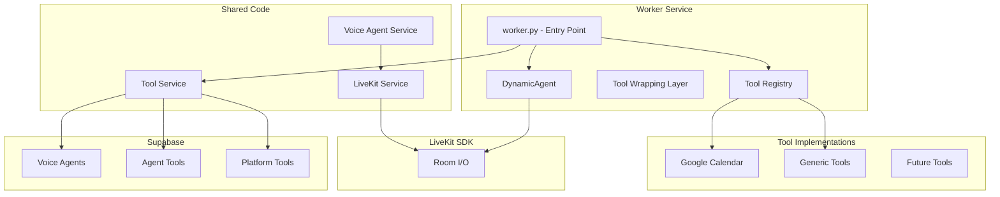

# Worker - LiveKit Voice Agent Worker

The worker service runs AI voice agents using LiveKit's real-time communication framework and LLM integration (Gemini Realtime).

## 🚀 Getting Started

### Prerequisites

- Python 3.11+
- Docker and Docker Compose
- Supabase database
- LiveKit Cloud or self-hosted LiveKit server

### Local Development

```bash
# Create virtual environment
python3 -m venv .venv
source .venv/bin/activate  # On Windows: .venv\Scripts\activate

# Install dependencies
pip install -r requirements.txt

# Copy environment configuration
cp .env.example .env

# Edit .env with your configuration
```

### Docker Development

The worker runs in a Docker container managed by the root `start.sh` script:

```bash
# Start worker (from root directory)
./start.sh start dev

# View worker logs
./start.sh logs dev

# Stop worker
./start.sh stop dev
```

## 🏗️ Architecture

### System Components



### Key Components

#### 1. Entry Point (`src/worker.py`)

- Initializes LiveKit AgentServer
- Registers all tool implementations from `shared/voice_agents/tools/implementations`
- Creates dynamic agent instances based on database configuration
- Handles agent lifecycle and tool registration

#### 2. Tool Wrapping Layer

The core innovation of this system - wraps tool methods for LLM compatibility:

**Challenge**: Tool methods have `self` parameter (for accessing instance state), but LiveKit's `@function_tool` decorator cannot accept bound methods.

**Solution**: Create standalone wrapper functions with exact same signature (excluding `self`), which delegate to bound methods.

```python
# Wrapper creation process:
1. Get bound method from tool instance
2. Extract parameter names and type hints
3. Create wrapper function dynamically using exec()
4. Set metadata (__name__, __qualname__, __doc__, __annotations__)
5. Register with LiveKit's @function_tool decorator
```

**Key Implementation**: See `_create_tool_wrapper()` in `src/worker.py`

#### 3. DynamicAgent Class

Extends LiveKit's `Agent` class with:

- Automatic greeting when agent enters room
- Dynamic system prompt from database
- Tool registration and management
- Session management

```python
class DynamicAgent(Agent):
    async def on_enter(self):
        """Agent greeting when entering room."""
        agent_name = self.session.userdata.get('agent_name', 'Assistant')
        await self.session.say(
            f"Hello, this is {agent_name}. How can I help you today?",
            allow_interruption=False
        )
```

#### 4. Tool Registry

Located in `shared/voice_agents/tools/base/registry_livekit.py`

- Discovers and registers tool implementations
- Maintains mapping of tool names to classes
- Provides metadata for LLM integration

## 📁 Project Structure

```
worker/
├── src/
│   ├── worker.py              # Main entry point and tool wrapping
│   └── default_system_prompt.py  # Default system prompt template
├── .docs/
│   └── livekit_tool_wrapping_architecture.md  # Tool wrapping details
├── test_livekit_wrapping.py  # Test file for wrapper approaches
├── requirements.txt           # Python dependencies
├── Dockerfile                # Production Docker config
├── Dockerfile.dev            # Development Docker config
└── .env.example             # Environment template
```

## 🔧 Tool Wrapping Architecture

### The Problem

When an LLM needs to call a tool method like `check_availability`:

```python
class GoogleCalendarTool(BaseTool):
    async def check_availability(
        self,                    # ❌ Can't pass this to LiveKit
        context: RunContext,     # LiveKit injects this
        start_time: str,
        duration_minutes: int = 30
    ) -> dict[str, Any]:
        # Implementation
```

**Issue**: `self` parameter makes this a bound method, which LiveKit's `@function_tool` cannot process.

### The Solution

Create a wrapper with exact same signature (excluding `self`):

```python
# Wrapper created dynamically
async def check_availability(
    context: RunContext,
    start_time: str,
    duration_minutes: int = 30
) -> dict[str, Any]:
    '''Wrapper for check_availability.'''
    kwargs = {'start_time': start_time, 'duration_minutes': duration_minutes}
    return await bound_method(context=context, **kwargs)
```

**Benefits**:

- ✅ Exact signature matches for Pydantic model creation
- ✅ Type hints preserved for LLM schema generation
- ✅ Delegates to bound method with all parameters
- ✅ Works with any tool method signature

### Implementation Details

**Critical Rules**:

1. **Use explicit parameters, not `**kwargs`** - Pydantic creates wrong model with `kwargs` field
2. **Optional parameters must use `type | None = None`** - Not `str = ""` which creates required field
3. **Name wrapper correctly** - Use `{func_name}` not `{func_name}_wrapper`
4. **Set all metadata** - `__name__`, `__qualname__`, `__doc__`, `__annotations__`

**For complete details**, see `worker/.docs/livekit_tool_wrapping_architecture.md`

## 🔌 Tool Implementation Pattern

### Creating a New Tool

1. **Inherit from BaseTool**:

   ```python
   from shared.voice_agents.tools.base.base_tool import BaseTool

   class MyTool(BaseTool):
       class Config(BaseConfig):
           my_param: str

       class SensitiveConfig(BaseSensitiveConfig):
           api_key: str
   ```

2. **Implement methods**:

   ```python
   async def my_action(
       self,
       context: RunContext,
       param1: str,
       optional_param: str | None = None
   ) -> dict[str, Any]:
       """Tool description for LLM."""
       # Implementation
       return {"result": "..."}
   ```

3. **Methods are auto-registered** by `registry_livekit.py`

### Important: Optional Parameter Pattern

**CORRECT** (truly optional):

```python
async def create_event(
    ...,
    description: str | None = None  # ✅ Optional field
):
    pass
```

**INCORRECT** (still required):

```python
async def create_event(
    ...,
    description: str = ""  # ❌ Required field with default
):
    pass
```

**Why**: In Pydantic 2.x, `str = ""` creates a required field, while `str | None = None` creates a truly optional field that LLMs can omit.

## 🔗 Integration Points

### Database Connection

- Fetches voice agent configuration from database
- Loads associated tools and functions
- Retrieves OAuth tokens for authenticated tools

### LiveKit Server

- Receives inbound calls via webhooks
- Creates rooms for voice sessions
- Connects agents to rooms
- Handles audio streaming

### Tool Services

- **Tool Service** (`shared/voice_agents/tool_service.py`): Fetches tools from database
- **LiveKit Service** (`shared/voice_agents/livekit_service.py`): Creates LiveKit rooms
- **Voice Agent Service** (`shared/voice_agents/service.py`): Manages voice agents

## 🧪 Testing

### Test File Structure

`test_livekit_wrapping.py` contains 6 different wrapper approaches:

- Test 1: `**kwargs` + annotations (❌ Failed)
- Test 2: Only context param (❌ Failed)
- Test 3: Explicit params matching (✅ Success)
- Test 4: Dynamic wrapper using exec (✅ Success - Production implementation)
- Test 5: inspect.unwrap() on bound method (❌ Failed)
- Test 6: Original method directly (❌ Failed)

### Running Tests

```bash
# From worker directory
python test_livekit_wrapping.py
```

## 🔧 Configuration

### Environment Variables

```bash
# LiveKit
LIVEKIT_URL=wss://your-livekit-project.livekit.cloud
LIVEKIT_API_KEY=your-api-key
LIVEKIT_API_SECRET=your-api-secret

# Database
DATABASE_URL=postgresql://postgres:[PASSWORD]@[PROJECT-REF].supabase.co:5432/postgres

# LLM (Gemini Realtime)
GOOGLE_API_KEY=your-google-api-key

# Debug
DEBUG=true  # Enable debug logging
```

### Worker Entry Point

The worker entrypoint is defined in `src/worker.py`:

```python
@cli.entrypoint
async def entrypoint(
    ctx: cli.JobContext,
    agent_id: str = cli.JobArgument(),
    phone_number: str = cli.JobArgument(),
) -> None:
    """Main entrypoint for voice agent worker."""
    # Load agent configuration
    # Create DynamicAgent instance
    # Start agent session
```

## 📊 Key Patterns

### No Session Manager

Worker fetches tools directly from database each call, no in-memory session manager.

### Two-Tier Tool Service

- **Frontend**: Gets safe tool metadata and config schemas
- **Worker**: Gets full tool objects with OAuth tokens

### LiveKit Room Creation

1. Backend validates agent and initiates call
2. LiveKit dispatch creates room with agent_id + phone_number
3. Worker extracts phone from room name
4. Agent connects and greets user

### Agent Greeting

- Automatic greeting when agent enters room
- Eliminates awkward silence
- Personalized with agent name from database

## 🔍 Debugging

### Enable Debug Logging

```bash
# In .env or environment
DEBUG=true
```

### View Worker Logs

```bash
# View all worker logs
./start.sh logs worker-dev

# Follow logs in real-time
docker logs -f ai-voice-agent-platform-worker-dev-1
```

### Common Issues

**Tool validation error**: Check optional parameters use `type | None = None` pattern
**Wrapper naming issue**: Ensure wrapper uses `func_name` not `func_name + _wrapper`
**Type hints missing**: Ensure all parameters have type annotations
**Import errors**: Verify shared module is in Python path

## 📚 Related Documentation

- [LiveKit Tool Wrapping Architecture](.docs/livekit_tool_wrapping_architecture.md)
- [Voice Agents Implementation](../shared/voice_agents/README.md)
- [Platform Architecture](../docs/01_architecture/voice_agents.md)
- [Development Guidelines](../AGENTS.md)

## 🚧 Future Enhancements

- [ ] Support for multiple LLM providers beyond Gemini
- [ ] Tool caching for performance
- [ ] Conversation state persistence
- [ ] Advanced error handling and recovery
- [ ] Multi-language support

---

For questions or issues:

- Check [LiveKit Tool Wrapping](.docs/livekit_tool_wrapping_architecture.md)
- Review [test_livekit_wrapping.py](test_livekit_wrapping.py)
- Examine worker logs with debug enabled
